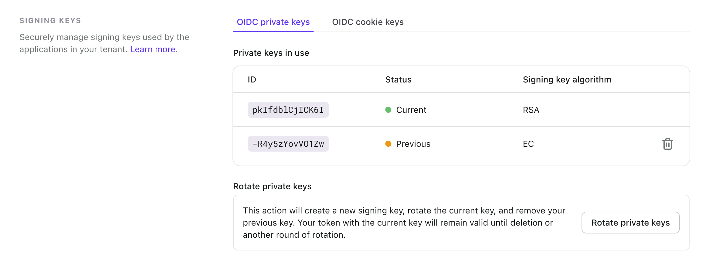
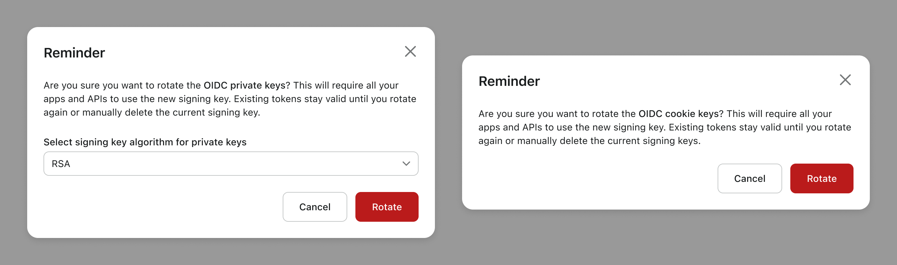

# 🔑 Signing keys

## What are signing keys in Logto?

Logto OIDC signing keys, as known as “OIDC private keys” and “OIDC cookie keys”, are the signing keys used to encrypt JWT tokens (access tokens and ID tokens) and browser cookies in Logto sign-in sessions. These signing keys are generated when seeding Logto database (open-source) or creating a new tenant (Cloud).

The signing keys are applied to the entire Logto instance (a Logto open-source instance or a Cloud tenant). Different Logto instances hold their own set of private keys and cookie keys, which can be managed through CLI (open-source), management APIs or Console UI (Cloud).

## How it works?

- **OIDC private key**: When initializing a Logto instance, a pair of public key and private key are automatically generated and are registered in the underlying OIDC provider. Thereby, when Logto issues a new JWT token (access token or ID token), the token is signed with the private key. In the meantime, any client application that receives a JWT token can use the paired public key to verify the token signature, in order to ensure the token is not tampered by any third-party. The private key is protected on the Logto server. The public key, however, as the name suggests, are public to everyone, and can be accessed through the `/oidc/jwks` interface of the OIDC endpoint.
  A signing key algorithm can be specified when generating the private key, and Logto uses EC (Elliptic Curve) algorithm by default. The admin users can change the default algorithm to RSA (Rivest–Shamir–Adleman) by rotating the private keys.

- **OIDC cookie key**: When user initiate a sign-in or sign-up flow, an “OIDC session” will be created on the server, as well as a set of browser cookies. With the help of the cookies, the users do not have to provide the sign-in credentials every time they launch Logto or other client applications protected by Logto. This feature is called “auto consent” in Logto terminology. The OIDC cookie key is used to sign these browser cookies.
  However, unlike the JWT tokens, the cookies are only signed and verified by Logto OIDC service itself, asymmetric cryptography measures are not required. Thus we don’t have paired public keys for cookie signing keys, nor asymmetric encryption algorithms.

## Signing keys rotation

:::info
If you are Logto open source user, please refer to [this tutorial](/docs/references/using-cli/rotate-signing-keys/) to generate new signing keys using CLI.
:::

Logto Cloud introduces a “Signing Keys Rotation” feature, which allows you to create a new OIDC private key and cookie key in your tenant.

Navigate to the tenant settings page and find the "Signing keys" section. From there, you can manage both OIDC private keys and OIDC cookie keys.

In this section, you'll find a table that lists all the signing keys in use.

| Status   | Description                                                                                                               |
| -------- | ------------------------------------------------------------------------------------------------------------------------- |
| Current  | This indicates that this key is currently in active use within your applications and APIs.                                |
| Previous | It refers to a key that was previously used but has been rotated out. Existing tokens with this signing key remain valid. |

:::note
You can delete the previous key, but you cannot delete the current one.
:::

To rotate the signing key, go to the appropriate tab. Click the "Rotate private keys" or "Rotate cookie keys" button. When rotating private keys, you have the option to change the signing algorithm.

Please remember that rotation involves the following three actions:

1. Creating a new signing key: This will require all your applications and APIs to adopt the new signing key.
2. Rotating the current key: The existing key will be designated as "previous" after the rotation and will not be utilized by newly created applications and APIs. However, tokens signed with this key will still remain valid.
3. Removing your previous key: Keys labeled as "previous" will be revoked and removed from the table.
