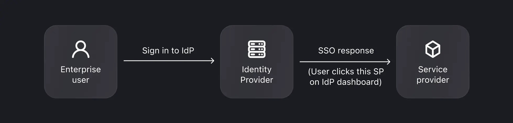
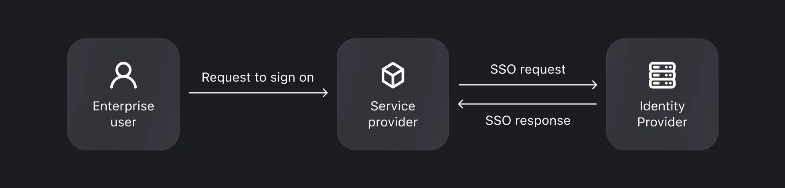

import Availability from '@components/Availability';

<head>
  <link rel="canonical" href="https://docs.logto.io/end-user-flows/enterprise-sso/" />
</head>

# ☁️ Enterprise SSO (SAML & OIDC)

<Availability cloud oss />

Single Sign-On (SSO) streamlines authentication for B2B services, especially for today's SaaS platforms, allowing enterprise clients to manage member access via their chosen identity providers. Logto enhances your service with SP-initiated SSO, facilitating connections with a wide range of identity providers using SAML and OIDC protocols, including Okta, Azure AD, Google Workspace, and more.

## What is SSO?

SSO allows users to access multiple services or applications with a single set of credentials. It simplifies access management and enhances security. For instance, an employee can use their company credentials to access various work-related applications.

### Key components

- **Identity Provider (IdP)**: A service that verifies user identities and manages their login credentials. After confirming a user's identity, the IdP generates authentication tokens or assertions and allows the user to access various applications or services without needing to log in again. Essentially, it's the go-to system for managing employee identities and permissions in your enterprise.
  Examples: Okta, Azure AD, Google Workspace, LastPass, OneLogin, Ping Identity, Cyberark, etc.
- **Service Provider (SP)**: A system or application that requires user authentication and relies on the Identity Provider (IdP) for authentication. The SP receives authentication tokens or assertions from the IdP, granting access to its resources without requiring separate login credentials.
  Examples: Slack, Shopify, Dropbox, Figma, Airbnb, etc…and your service.
- **Enterprise User Account**: Typically identified by their use of a company email domain for login. This enterprise email account finally belongs to the company.

### SSO workflows

- **IdP-Initiated SSO**: In IdP-initiated SSO, the Identity Provider (IdP) primarily controls the single sign-on process. This process begins when a user logs into the IdP's platform, such as a company portal or a centralized identity dashboard. Once authenticated, the IdP generates an authentication token or assertion, which is then used to seamlessly grant the user access to multiple connected services or applications (SPs) without requiring additional logins.

- **SP-Initiated SSO**: In SP-initiated SSO, the Service Provider (SP) takes the lead in initiating and managing the single sign-on process, often preferred in B2B scenarios. This scenario occurs when a user attempts to access a specific service or application (the SP) and is redirected to their IdP for authentication. Upon successful login at the IdP, an authentication token is sent back to the SP, granting the user access. Logto supports SP-initiated SSO for your B2B services.

### Standard protocols

- **SAML**: SAML, an XML-based protocol, is better suited for web-based applications, allowing secure communication between identity providers and service providers. This protocol is particularly adept at handling complex enterprise-level security requirements
- **OIDC**: OIDC is a simple identity layer on top of the OAuth 2.0 protocol. It employs JSON/REST for communication, making it more lightweight and better suited for modern application architectures, including mobile and single-page applications (SPAs). The protocol

## Logto support

- Support both SAML and OIDC to integrate with most enterprise identity providers.
- Ready-to-use connections with popular IdPs (e.g., Azure AD, Google Workspace, Okta).
- Simplified setup with a step-by-step guide.
- Customizable email domain and branding support.
- An out-of-box SSO experience, compatibility with your universal sign-in experience.

## Frequently asked

1. What are the limitations of Logto SSO features?

   - Supports SP-initiated SSO, not IdP-initiated SSO or Single Sign Out currently.
   - Organization mapping is upcoming.

2. Impact on existing users with SSO changes:
   - Adding SSO: The SSO identities will be linked to existing accounts if the email matches.
   - Removing SSO: Removes SSO identities linked to the account, but retains user accounts, and prompts users to set up alternative verification methods.
