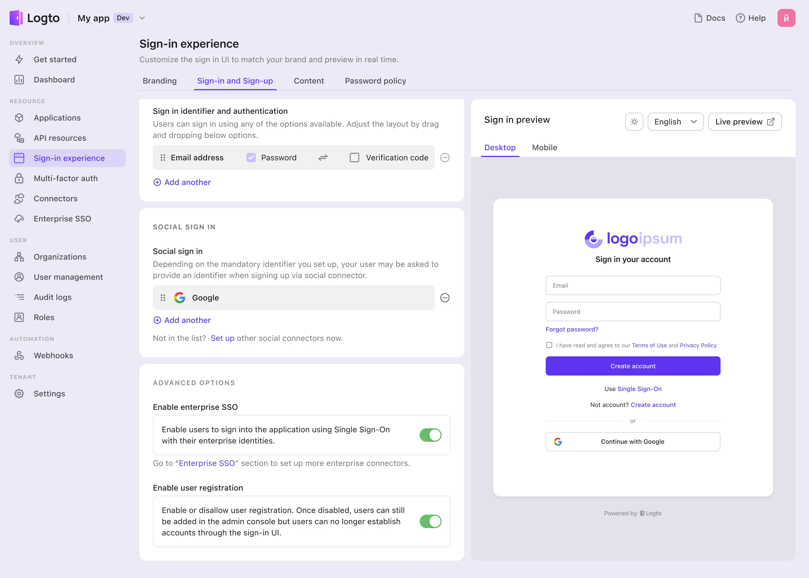
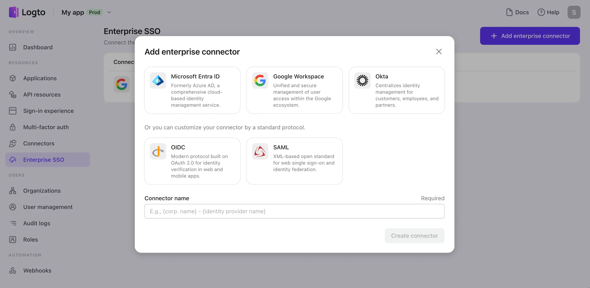
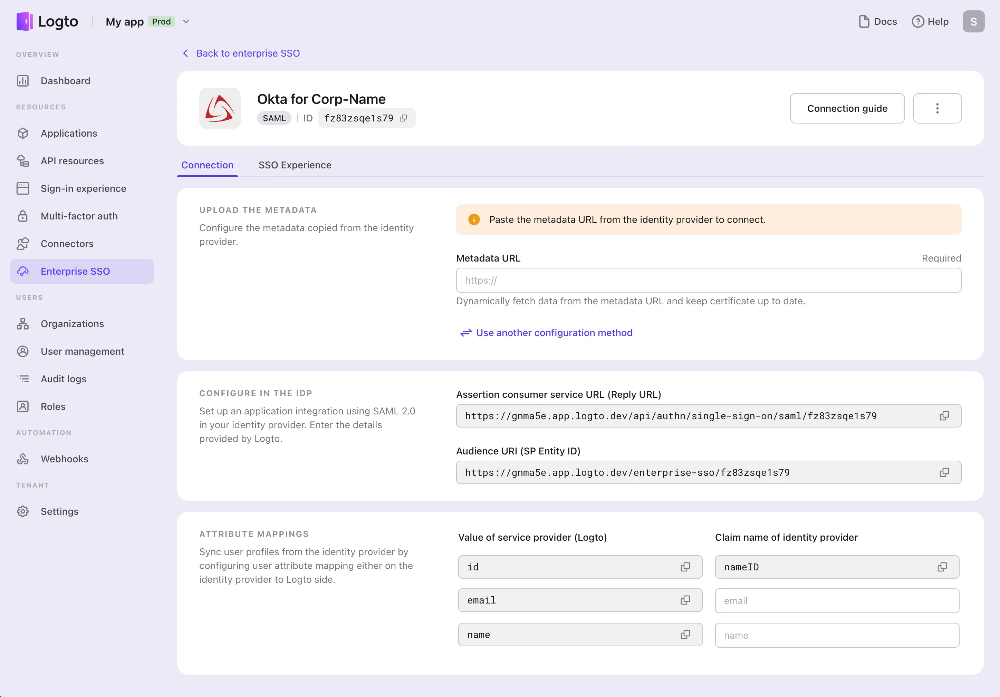
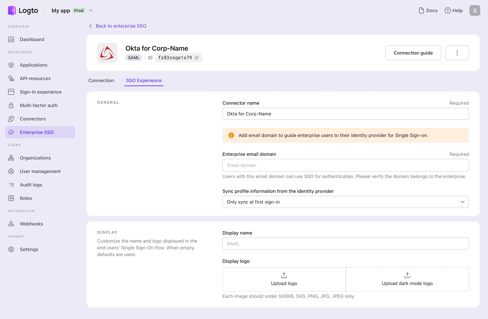

# Configure SSO

Enable Single Sign-On (SSO) to streamline access across your services for enterprise users. This guide outlines the steps for setting up SSO using the Logto console.

## Enabling SSO in sign-in experience

1. **Enable enterprise SSO**: Go to the Logto console, and navigate to “Sign-in experience > Sign-in and Sign-up”. Here, locate and enable the “Enterprise SSO” toggle. This action will display a “Use Single Sign-On” button in the right preview.

   Once enabled, enterprise users with SSO-enabled email domains can access your services using their enterprise identity providers (IdPs). This is achieved through email domain redirection. Read the next doc to learn more about the SSO experience.

2. **Save changes**: Ensure to save your settings to activate these changes.

## Configuring enterprise connectors

Enterprise connectors are crucial for enabling SSO for your different enterprise clients. These connectors facilitate the authentication process between your service and the enterprise IdPs.

### Step 1: Create a new enterprise connector

1. **Access Enterprise SSO section**: In the Logto Console, select “Enterprise SSO”.
2. **Add connector**: Click “Add enterprise connector“ and choose a suitable one. Preferred options include built-in connectors like Okta, Azure AD, and Google Workspace. Alternatively, select SAML or OIDC for other IdPs.
3. **Name and Create**: Assign a unique name to the connector (e.g., “IdP-name for Organization-name”) and click “Create”. Then you will access the configuration pages of this connector.

### Step 2: Configure connection with IdP

In the “Connection” tab, set up the connection between your service and the chosen IdP. For assistance, refer to the “Connection guide” or the documentation specific to each IdP in below. The system will auto-test the connection upon saving. Incorrect configurations will not be saved.

- SAML
- OIDC
- Azure AD
- Google workspace
- Okta

### Step 3: Customize SSO experience and email domain

In the “Experience” tab:

1. **Set email domain**: Define the enterprise email domain to direct users to their respective IdPs.
2. **User profile sync**: Choose how to sync user profiles. Options include syncing only at registration or at every sign-in. Note: Frequent syncing might overwrite user data in your application.
3. **Display customization**: Optionally, customize the display name and logo for the connector. This is useful when multiple connectors are associated with a single email domain.

:::caution
An enterprise connector becomes active in the authentication flow after completing the “Connection” settings and adding the “Enterprise email domain”.
:::
