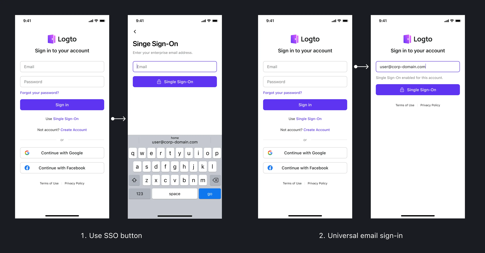

<head>
  <link rel="canonical" href="https://docs.logto.io/end-user-flows/enterprise-sso/sp-initiated-sso/#sp-initiated-sso-experience" />
</head>

# End-user SSO experience

Logto offers an integrated Single Sign-On (SSO) experience, seamlessly aligning with your existing sign-in configurations.

## Initiating SSO

SSO is activated when users attempt to sign in using an enterprise email domain configured for SSO. This process bypasses standard verification methods like passwords.

**Methods to Trigger SSO:**

1. **SSO button**: On the sign-in or sign-up page, users can click “Use Single Sign-On”. They are then prompted to enter their enterprise email. Email domain detection redirects users to their enterprise identity provider.
2. **Universal email sign-in**: If a user enters an enterprise email with an SSO-enabled email domain during a standard sign-in process, the “Sign in” button automatically changes to “Single Sign-On”. This premise is that the Email sign-in method is enabled in your service.

## Redirecting to the identity provider

When users use Single Sign-On, where they go next depends on how your enterprise email domains are set up in Logto:

1. **Single connector**: If a user's email domain is linked to only one enterprise connector, they'll go straight to the identity provider connected to that connector. There's no need for them to choose anything.
2. **Multiple connectors**: If a user's email domain is linked to more than one connector, they get to pick which identity provider they want to use from the options available to them.

## First-time SSO use

Logto syncs primary email addresses from the identity provider, accommodating both new and existing users:

1. **For new users**: If someone is signing in for the first time using their work email address, Logto automatically sets up a new account for them. This means they don't have to go through the usual account creation process.
2. **For existing users**: If the work email address used for SSO is already connected to an account in Logto, the system will recognize this and link the SSO sign-in to the existing account. This way, there's no need to create a new account or user ID - everything stays under the existing account.

Note: the situation could be different when SAML attribute mapping is not correctly configured or user email is not provided by the identity provider.

## Multi-Factor Authentication (MFA) and SSO

By default, MFA is bypassed for users signing in via Enterprise SSO. Clients always set MFA in the enterprise identity provider for their employees.

## Deleting an enterprise connector

When you remove a connector from Logto:

- **User accounts remain**: The user accounts themselves are not deleted. Only their connection to the enterprise identity provider is cut off.
- **Next time users sign in**: The next time these users try to sign in, they'll be asked to use a different way to log in. This could be the standard sign-in method you've set up in Logto, like signing in with an email and a password. If users haven't set a password previously, they will be guided to create one at this stage.
