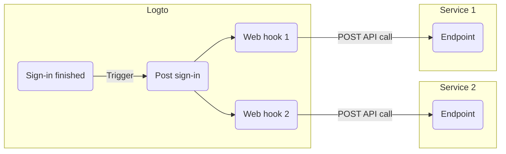

# 🪝 Web hooks

## Overview

With web hooks, Logto can enable the next level extensibility for developers to interact with other services in an event-based manner.

## Terms

### Hook event

When a specific action is done, it will trigger a hook event with a specific type. E.g. Logto will emit a `PostSignUp` hook event when user finished the sign-up process and created a new account.

### Hook

A single or series of actions that hook to a specific event. Action can be calling API, executing code snippet, etc.

### Web hook

A subtype of hook that indicates calling an API with the event payload.

Say a developer wants to send a notification when user signs in via a new device, the developer can add a web hook that calls his security service API to the `PostSignIn` event.

Here's an example of enabling two web hooks for `PostSignIn` event in Logto:



## Manage web hooks

For now, Logto only supports web hooks and managing them via Management API. See [🚝 Interact with Management API](/docs/recipes/interact-with-management-api/) for detailed instructions.

Standard REST APIs are available to manage hooks:

```
POST /api/hooks
GET /api/hooks
GET /api/hooks/:id
PATCH /api/hooks/:id
PUT /api/hooks/:id
DELETE /api/hooks/:id
```

Except `GET /api/hooks` will return an array of hook entities and `DELETE /api/hooks/:id` will return no content, other APIs will return a hook entity in the response body.

The full definition of a hook entity:

```ts
type Hook = {
  id: string;
  /** The event to trigger the hook. */
  event: HookEvent;
  config: HookConfig;
  createdAt: Date;
};

enum HookEvent {
  PostRegister = 'PostRegister',
  PostSignIn = 'PostSignIn',
  PostResetPassword = 'PostResetPassword',
}

type HookConfig = {
  /** The URL to send the request, method fixed to `POST`. */
  url: string;
  /** Additional headers that attach to the request. */
  headers?: Record<string, string>;
  /**
   * Retry times when hook response status >= 500.
   *
   * Must be less than or equal to `3`. Use `0` to disable retry.
   **/
  retries: number;
};
```

Every hook request carries two default headers:

- `user-agent` with predefined value
- `content-type: application/json`

You can overwrite them by passing `headers` with the same key.

### Create a hook

Use `POST /api/hooks` to create a hook. Only `event` and `config` is required. E.g.:

```bash
curl --location  \
  --request POST 'https://<your-logto-endpoint>/api/hooks' \
  --header 'Authorization: Bearer eyJhbGciOiJS...' \
  --header 'Content-Type: application/json' \
  --data-raw '{
    "event": "PostSignIn",
    "config": {
      "url": "https://another.service.endpoint/path/to/api",
      "retries": 3
    }
  }'
```

### Query hooks

Use `GET /api/hooks` to fetch all hooks, or `GET /api/hooks/:id` to fetch a single hook. E.g.:

```bash
# Fetch a single hook
curl --location
  --request GET 'https://<your-logto-endpoint>/api/hooks/2UT84OTmf9tT4F5vMhBnZ' \
  --header 'Authorization: Bearer eyJhbGciOiJS...'
```

### Update a hook

Use `PUT /api/hooks/:id` to perform data replacement or `PATCH /api/hooks/:id` to update data partially. E.g.:

```bash
# Partial update
curl --location  \
  --request PATCH 'https://<your-logto-endpoint>/api/hooks/2UT84OTmf9tT4F5vMhBnZ' \
  --header 'Authorization: Bearer eyJhbGciOiJS...' \
  --header 'Content-Type: application/json' \
  --data-raw '{
    "event": "PostRegister"
  }'
```

### Delete a hook

Use `DELETE /api/hooks/:id` to delete an existing hook.

## Web hook request

Once a valid hook event is emitted, Logto will find corresponding web hooks and send a `POST` request per hook config with the following JSON schema in the request body:

```ts
type HookEventPayload = {
  /** The identifier in Logto. */
  hookId: string;
  /** Which event that triggers this hook. */
  event: HookEvent;
  /** The create time of payload in ISO format. */
  createdAt: string;
  /** The Session ID (not Interaction ID) for this event, if applicable. */
  sessionId?: string;
  /** The user-agent for the request that triggers this hook. */
  userAgent?: string;
  /** The related User ID for this event, if applicable. */
  userId?: string;
  /** The related user entity for this event, if applicable. */
  user?: UserEntity;
  /** The related application info for this event, if applicable. */
  application?: Pick<Application, 'id' | 'type' | 'name' | 'description'>;
};
```

We pick the following fields from user data and compose them into `UserEntity`:

```ts
const fields = [
  'id',
  'username',
  'primaryEmail',
  'primaryPhone',
  'name',
  'avatar',
  'roleNames',
  'customData',
  'identities',
  'lastSignInAt',
  'createdAt',
  'applicationId',
  'isSuspended',
];
```

See [Users](/docs/references/users/) and [Applications](/docs/references/applications/) reference for detailed field explanations.
