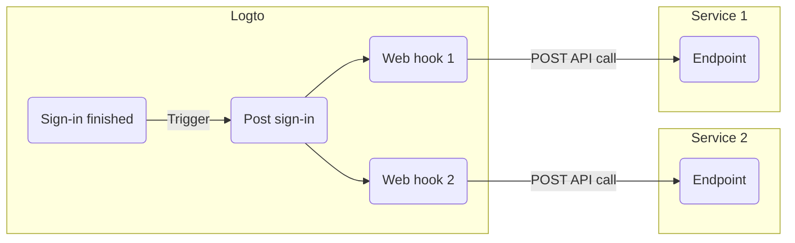

# 🪝 Webhooks

_Added in v1.5.0_

Logto Webhook enables you to effortlessly receive real-time updates regarding specific events, such as user registration, sign-in, or password reset. You no longer need to continuously poll for updates.

When an event is triggered, Logto sends an HTTP request to the Endpoint URL you provide, containing detailed information about the event, such as user ID, username, email, and other relevant details (for more about the data included in the payload and header, refer to [Webhook Request](./webhook-request.md)). Your application can process this request and take customized actions, like sending an email or updating a database.

We continuously add more events based on user needs. If you have specific requirements for your business, please let us know.

## Why use Webhook?

Webhooks offer real-time communication between applications, eliminating the need for polling and enabling immediate data updates. They simplify application integration and workflow automation without complex code or proprietary APIs.

Here are some examples of common usage scenarios for CIAM:

- **Send emails**: Configure a webhook to send a welcome email to new users upon registration or notify administrators when a user logs in from a new device or location.
- **Send notifications**: Configure a webhook to trigger a virtual assistant with your CRM system to provide real-time customer support when users sign up.
- **Perform additional API calls**: Configure a webhook to verify user access by checking their email domain or IP address and then use the Logto Management API to assign appropriate roles with resource permissions.
- **Data synchronization:** Configure webhooks to keep the application updated about changes such as user account suspensions or deletions.
- **Generate reports**: Set up a webhook to receive user login activity data and leverage it to create reports on user engagement or usage patterns.

## Terms

| Item    | Description                                                                                                                                                                                                                                                |
| :------ | :--------------------------------------------------------------------------------------------------------------------------------------------------------------------------------------------------------------------------------------------------------- |
| Event   | When a specific action is done, it will trigger a hook event with a specific type. E.g., Logto will emit a PostSignUp hook event when the user finished the sign-up process and created a new account.                                                     |
| Hook    | A single or series of actions that hook to a specific event. Action can be calling API, executing code snippets, etc.                                                                                                                                      |
| Webhook | A subtype of hook that indicates calling an API with the event payload. Say a developer wants to send a notification when user signs in via a new device, the developer can add a webhook that calls his security service API to the PostSignIn event. |

Here's an example of enabling two web hooks for `PostSignIn` event in Logto:

