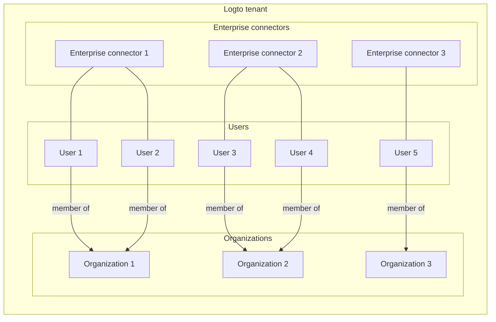
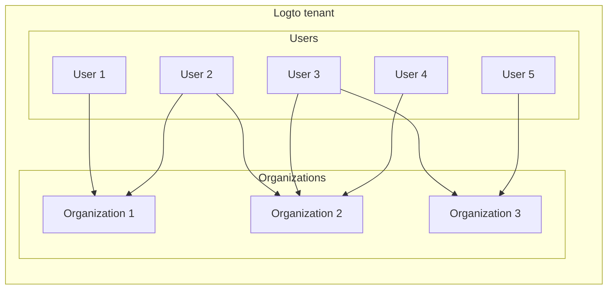

import Availability from '@components/Availability';

<head>
  <link rel="canonical" href="https://docs.logto.io/logto-cloud/tenant-settings/#production" />
</head>

# 🗂️ Tenants

<Availability cloud oss={false} />

A tenant is an isolated environment where you can manage user identities, applications, and all other Logto resources.

## Do I need more than one production tenant?

Usually, the answer is no. Logto is designed to support multiple applications and environments within a single tenant. In most cases, you only need one production tenant for all your applications.

:::note
Your business may have the concept of "tenants", but it may differ from the Logto tenant. In this page, "tenant" and "tenants" refer to the Logto tenant.
:::

### I have multiple enterprise customers

You can use [organizations](/docs/recipes/organizations/) with [enterprise SSO](/docs/recipes/single-sign-on/) to manage multiple enterprise customers within a single tenant. Since enterprise SSO is used, you can assign different organizations according to the enterprise connector that the user signs in with.

To automatically assign users to the correct organization, you can use [webhooks](/docs/recipes/webhooks/) to listen for user creation events and assign the user to the correct organization based on the enterprise connector.

> We are planning to provide the "just-in-time provisioning" feature to automatically assign users to the correct organization based on the enterprise connector. Upvote this feature on our [roadmap](https://logto.productlane.com/roadmap) if you are interested.

### I would like to build a SaaS application with multi-tenancy

If you are building a SaaS application with the concept of "workspace" or "organization" for each customer, you can use [organizations](/docs/recipes/organizations/) to manage each customer's workspace within a single tenant.

In this case, a user can be a member of multiple organizations. For example, a user can have a personal workspace and join the company's workspace.

### I have multiple applications

With Logto, you can manage multiple applications within a single tenant regardless of the application's type (web, mobile, desktop, etc.). Since Logto follows the [OpenID Connect](https://openid.net/connect/) and [OAuth 2.0](https://datatracker.ietf.org/doc/html/rfc6749) standards, you can integrate Logto with any application even if there's no Logto official SDK.

## Tenant region

When you create a tenant, you can choose the region where the tenant data is stored. It cannot be changed after the tenant is created. Here are the available regions:

- EU (Netherlands)
- US (West US)
- AU (East Australia)

Usually, you should choose the region closest to your customers to minimize latency and improve performance.

:::info
Logto leverages the global edge network to deliver the best performance and availability for your applications. The request routing is optimized to ensure that your users are always connected with the best-performing option.
:::

## Tenant types

There are two types of tenants in Logto Cloud: development and production. With this tenant differentiation, you can better manage your projects across different environments for efficiency and, at the same time, enjoy the full value of Logto.

Please be aware that you can only specify your tenant types during creation; the tenant type cannot be edited once it's created.

### Development

The development tenant (dev tenant) is primarily intended for testing purposes and should not be utilized in a production environment. These tenants allow access to premium and paid features available in paid plans, free of charge and without requiring a subscription. However, there are certain [limitations](#limitations-of-development-tenants) that apply to development tenants.

### Production

The production tenant is where end-users access the live app and you might need a paid subscription. You can subscribe to the Free plan or Pro plan to create a production tenant.

:::note
Each Logto Cloud account can join up to 10 Free plan tenants.
:::

## Limitations of development tenants

While you can use paid features for free in development tenants, there are a few limitations:

- Each Logto Cloud account can join up to 10 development tenants.
- A banner appears during the sign-in experience, indicating that the tenant is in development mode.
- Development tenants may have quota limits on specific features. These limits are explained on the feature details page, if applicable.
- Logto may update the development tenant's quota limits, and we will try our best to notify you in advance.
