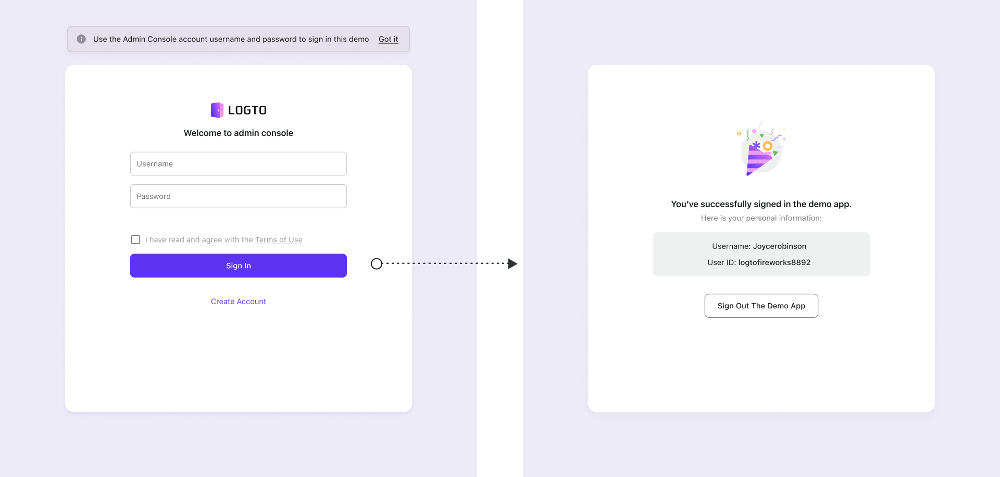

# Check out the demo app

In the "Get Started" tab, click the "Check out" button on the right, and the browser will open the demo app in a new tab. In this app, you can use your admin account credentials or create a new account to proceed.

Like how you created the admin account, Logto natively supports username-with-password Sign-in Experience without configuration.

:::note
Logto has only one user identity system as the single source of truth, so you can use the same identity to sign in across multiple apps.
:::

The app itself is pretty simple: a congrats page with your Username and User ID, followed by a sign-out button.

:::tip
Sign out the demo app before further explorations. After finishing the "Customize sign-in experience" section, open the demo app again to see the changes.
:::

## What's next

Now it's time to create and integrate your first application.
