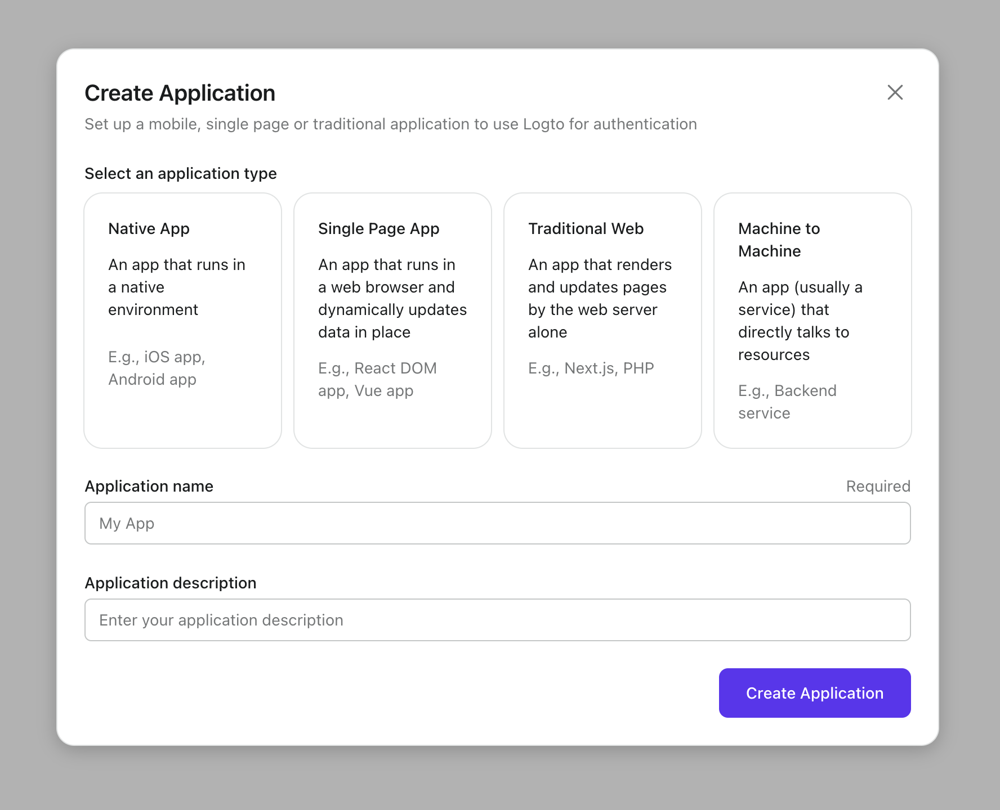

import Columns from '@components/Columns';

import ApplicationTypesIntro from '../../fragments/_application_types_intro.mdx';

# Create and integrate the first application

To begin, navigate to the "Get Started" tab and locate the "Create" button on the right-hand side. Clicking this button will redirect you to the Application tab. From there, click the "Create Application" button to proceed.

## Choose your application type

In the opening modal, choose which type of application you'd like to integrate:

<ApplicationTypesIntro />

We prepared different tutorials for available application types, and they'll be helpful if you choose the type properly.

## Enter application name

Enter the application name, e.g., "Bookstore," and click "Create Application."

## Integrate Logto

Ta-da! You just created your first application in Logto. You'll see a congrats page which includes a detailed integration guide. Follow the guide to see what the experience will be in your application.

:::note
If you skip the guide in Admin Console by accident, you can also pick the guide from the list below or click "Check Help Guide" in the application details page.
:::

### Integration guides

<Columns
  columns={[
    {
      title: 'Native App',
      items: [
        { key: 'iOS', link: '/docs/recipes/integrate-logto/ios' },
        { key: 'Android', link: '/docs/recipes/integrate-logto/android' },
      ],
    },
    {
      title: 'Single Page App',
      items: [
        { key: 'Vanilla JS', link: '/docs/recipes/integrate-logto/vanilla-js' },
        { key: 'React', link: '/docs/recipes/integrate-logto/react' },
        { key: 'Vue', link: '/docs/recipes/integrate-logto/vue' },
      ],
    },
    {
      title: 'Traditional Web App',
      items: [
        { key: 'Traditional Web', link: '/docs/recipes/integrate-logto/traditional' },
        { key: 'Next.js', link: '/docs/recipes/integrate-logto/next-js' },
        { key: 'Express', link: '/docs/recipes/integrate-logto/express' },
        { key: 'Go', link: '/docs/recipes/integrate-logto/go' },
      ],
    },
    {
      title: 'Machine to Machine',
      items: [
        {
          key: 'Machine to Machine',
          link: '/docs/recipes/integrate-logto/machine-to-machine',
        },
      ],
    },
  ]}
/>

## What's next

Let's take a step further and bring more customization to Sign-in Experience.
