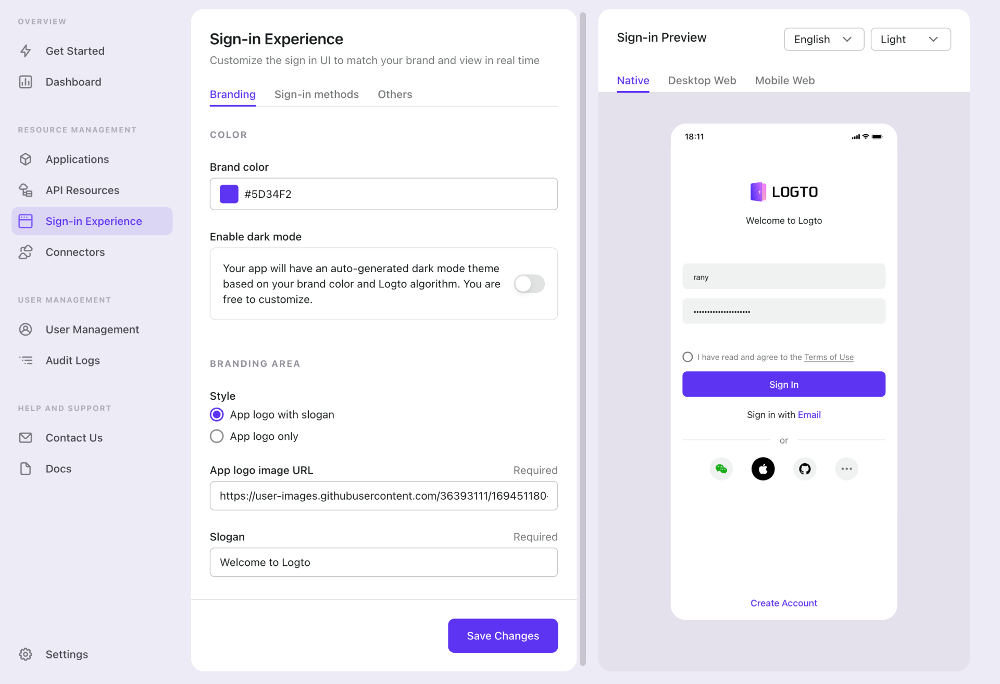

import DarkModeNote from '../../recipes/customize-sie/fragments/_dark-mode-note.md';

# Customize sign-in experience

In the "Get Started" tab, click the "Customize" button on the right, and the browser will redirect to the Sign-in Experience tab.

## Sign-in preview

:::tip Do you know...
You can preview the result in real-time! No matter what you update on the left, the right-side UI will immediately update to synchronize the change.
:::

The customer may use the app under different conditions, including platform, language, and appearance.

Feel free to change them to see the result of your combination.

## Branding

In this area, you can define several main elements of brand exposé: color, logo, and slogan.

- **Brand color** will affect the primary color of components, e.g., buttons and links.
- **Enable dark mode** controls if the UI has a "dark feeling" when Logto detects related system preference.
- Other options are pretty straightforward, so we skip them here.

<DarkModeNote />

## Others

Let's skip "Sign-in methods" for now and move to the "Others" tab.

### Terms of use

An app will likely have a Terms of Use in production, and it's mandatory to accept it before signing in or creating an account.

Toggle on "Enable terms of use" and enter the URL to enforce this process. Logto will load it via an `<iframe>`.

### Language

In most cases, it'll be fine to keep the default value unless:

- You want Logto to fall back to a different language when no language matches the user's system preference, or;
- You want Logto to fix a language to display.

## What's next

Yeah, yeah. Signing in without entering the password is the trend. Logto cannot miss it and has built-in support. Choose the one you like to continue:

- [Enable SMS or email passcode sign-in](./enable-passcode-sign-in.mdx)
- [Add a social connector and enable social sign-in](./enable-social-sign-in.mdx)
