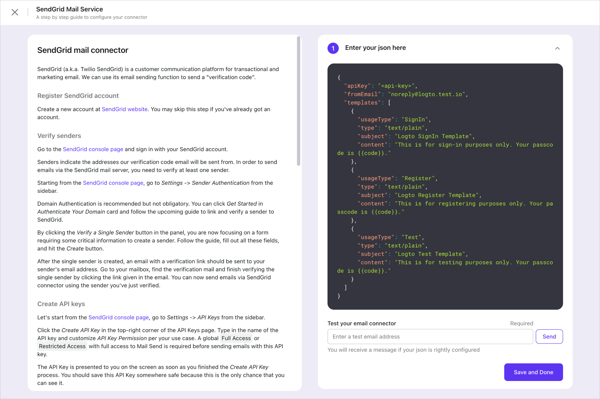
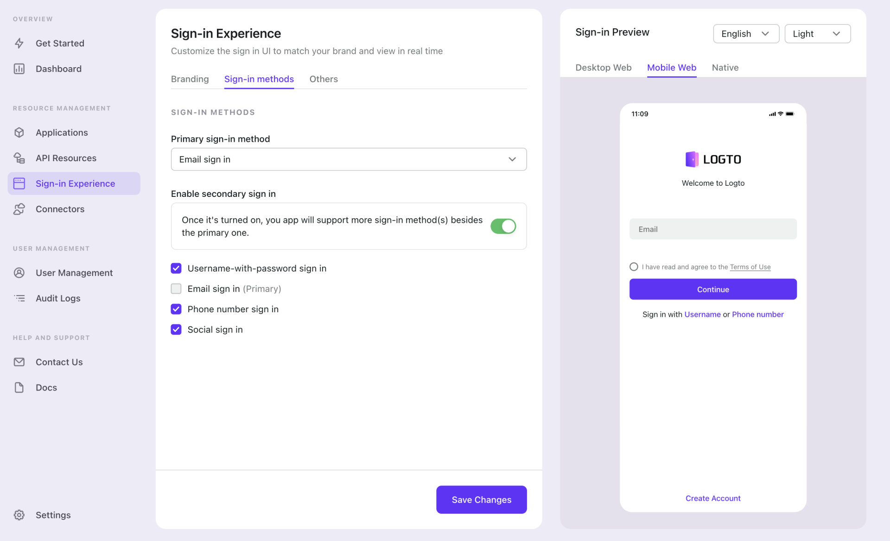

import ConnectorsIntro from './fragments/_connectors-intro.md';
import ConnectorsWip from './fragments/_connectors-wip.md';

# Enable SMS or email passcode sign-in

In the "Get Started" tab, click the "Enable" button on the right, and the browser will redirect to the "Connectors" -> "SMS and email connectors" tab.

The enabling process for SMS and email are very close, so we combine them into one tutorial.

<ConnectorsIntro />

## Choose a connector

Depending on what kind of connector you want to enable, click the "Set Up" button on the left of the Type column. The opening modal will ask you the specific connector you want to set up.

Logto has some built-in connectors which allows out-of-box usage:

> Twilio SMS, Aliyun SMS, AWS SES, Tecent SMS, SendGrid Mail, Aliyun DM, SMTP, ...

Visit our [connectors repo](https://github.com/logto-io/connectors/tree/master/packages) for all available connectors.

Choose the one that suits you, and click "Next" to continue.

<ConnectorsWip />

## Configure connector and test

A full-screen page will guide you through setting things up correctly. Follow the steps below to finish the setup:

1. Go through the README doc on the left, then follow the instructions inside.
2. Fill out the JSON that the connector needs in the editor on the right.
3. Click "Next", and in step 2, test if the connector works as expected.
4. Click "Done" to finish.

## Enable connector in sign-in experience

Switch to the "Sign-in Experience" tab by clicking the link in the very left section of the page, then click the "Sign-in Methods" tab.

If you didn't add any other sign-in methods before, "Enable secondary sign-in" should be off. Turn it on, and check "Phone number sign-in" or "Email sign-in" based on which connector you just set up.

Now you should see the text "Sign in with Phone number" or "Sign in with Email" under the big "Sign In" button in the preview.

Click "Save changes" to push the changes to go live.

:::tip
Open the demo app again to try out the new sign-in method.
:::

:::note
See [Configure sign-in methods](../../recipes/customize-sie/configure-sign-in-methods.mdx) for a complete picture of sign-in methods combinations.
:::

## What's next

- [Enable social sign-in](./enable-social-sign-in.mdx) (in case you haven't tried)
- [Further readings](./further-readings.md)
