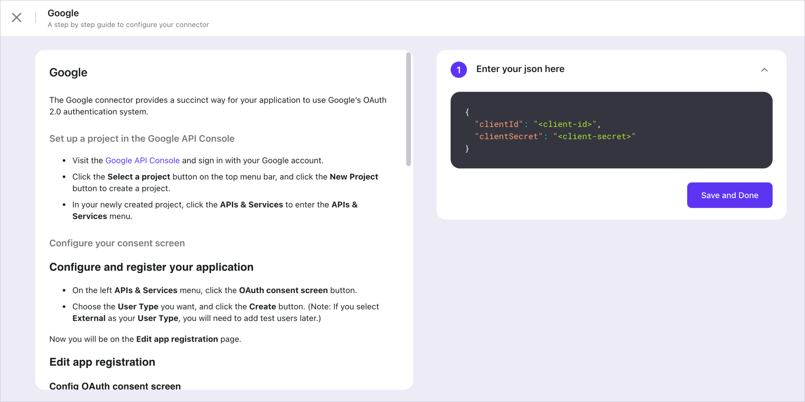

import ConnectorsIntro from './fragments/_connectors-intro.md';
import ConnectorsWip from './fragments/_connectors-wip.md';

# Enable social sign-in

In the "Get Started" tab, click the "Add" button on the right, and the browser will redirect to the "Connectors" -> "Social connectors" tab.

<ConnectorsIntro />

## Add a social connector

Click the "Add social connector" button to look for the connector you want. The opening modal shows the built-in connectors:

> Alipay, Apple, Azure AD, Discord, Facebook, GitHub, Google, Kakao, Naver, OAuth 2.0, OIDC, WeChat, ...

Visit our [connectors repo](https://github.com/logto-io/connectors/tree/master/packages) for all available connectors.

<ConnectorsWip />

## Configure social connector

A full-screen page will guide you through setting things up correctly. Follow the steps below to finish the setup:

1. Go through the README doc on the left, then follow the instructions inside.
2. Fill out the JSON that the connector needs in the editor on the right.
3. Click "Done" to finish.

## Enable connector in sign-in experience

Switch to the "Sign-in Experience" tab by clicking the link in the very left section of the page, then click the "Sign-in Methods" tab.

If you didn't add any other sign-in methods before, "Enable secondary sign-in" should be off. Turn it on, and check "Social sign-in".

On the table that just showed up, look for the connector you just added in the left column, "Social connectors". Then click the plus icon on the right.

You should see a logo representing the identity provider of the conncetor under the big "Sign In" button.

If you have multiple social connectors in use (in the right column), you can drag and drop them to reorder.

Click "Save changes" to push the changes to go live.

:::tip
Open the demo app again to try out the new sign-in method.
:::

:::note
See [Configure sign-in methods](../../recipes/customize-sie/configure-sign-in-methods.mdx) for a complete picture of sign-in methods combinations.
:::

## What's next

- [Enable SMS or email passcode sign-in](./enable-passcode-sign-in.mdx) (in case you haven't tried)
- [Further readings](./further-readings.md)
