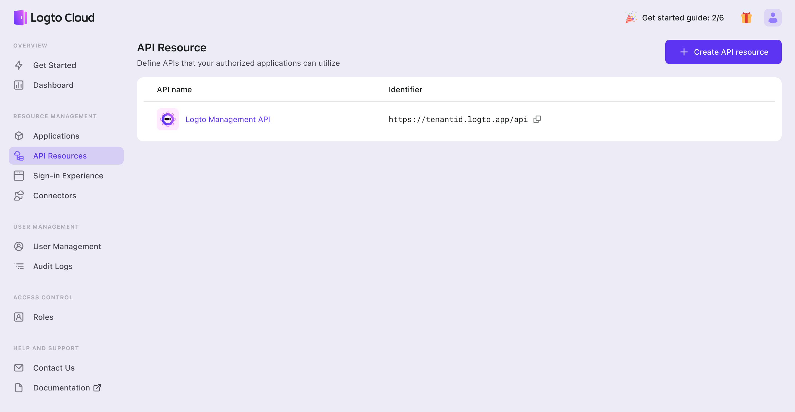

# Explore Management API

Although the Admin Console is a useful tool, it may not be suitable for every scenario, as some features are not currently available through it. In these cases, utilizing the Logto management API can be a helpful solution.

The Logto Management API is a comprehensive collection of APIs that empower administrators to manage a wide range of identity-related tasks, enforce security policies, and comply with regulations and standards. It offers extensive capabilities for Logto's identity-related back-end services, allowing you to use it as a foundation to build upon and customize to suit your specific needs, without requiring additional implementation.

Clicking the 'check out' button will take you to the API resource page. The management API is listed at the top of the resource list and cannot be deleted.

Before calling and using the management API, it's important to create a **machine-to-machine** app. To do so, navigate to the 'Applications' section and select 'Create Application.' We'll guide you through the process.

## Guide

1. To create a Machine to Machine app in the Admin Console, follow the tutorial [Create and integrate the first application](./create-and-integrate-the-first-app.mdx).
2. To obtain an access token for the `https://tenantid.logto.app/api` Management API and the `all` scope (which grants all permissions), follow the instructions in the [Machine to Machine: Auth with Logto](../../recipes/integrate-logto/machine-to-machine.mdx) guide.
3. Interact with the Management API using Bearer authorization and the Access Token.

:::note
Usually the Access Token has a short expiration. If you have a local cache, remember to check and fetch a new Access Token if needed before sending requests.
:::

To learn more about use cases and how to effectively utilize the management API, please refer to the 'Interact with Management API' recipe.
