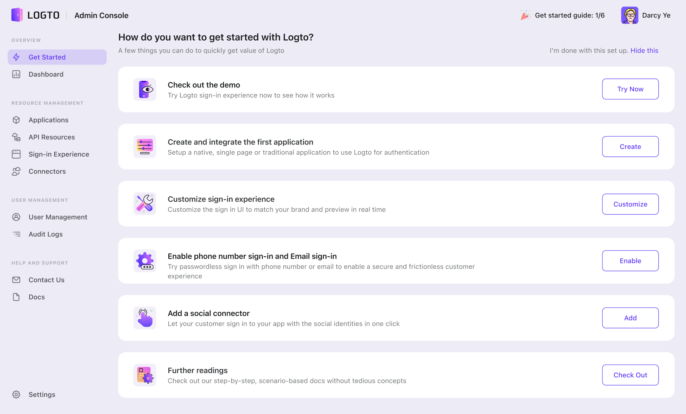

# Welcome to Logto

## Logto Console

After creating your account, you will be automatically redirected to the "Get Started" tab, which provides a quick overview of what Logto can do. The onboarding items provided include both actionable resources that can be immediately utilized, as well as those that may require some level of preparation beforehand.

Our doc tutorial will follow the same order as what you see in the "Get Started" tab. Overall, these items are meant to be explored and leveraged to help you achieve success.

Depending on whether you are an open-source user, an individual developer, or an enterprise user, you may see different recommendations and guiding content. It's important to note that these recommendations are not feature differentiations between segments but rather suggestions to help you navigate and make the most of Logto.

One of our goals is to ensure that the features are available to everyone, regardless of whether they are using the open-source or cloud version.

Let's review each item and explore what you can do in Logto!

## Join our community

Logto Discord server is an incredibly supportive and lively community that welcomes developers and businesses alike. Here, you can engage in discussions, seek knowledge, stay up-to-date with the latest features, participate in fun activities, and even provide feedback on our products. With a rapidly growing user base, we encourage you to join us and become part of our vibrant community. [Click here](https://discord.gg/UEPaF3j5e6) to join the community now.
