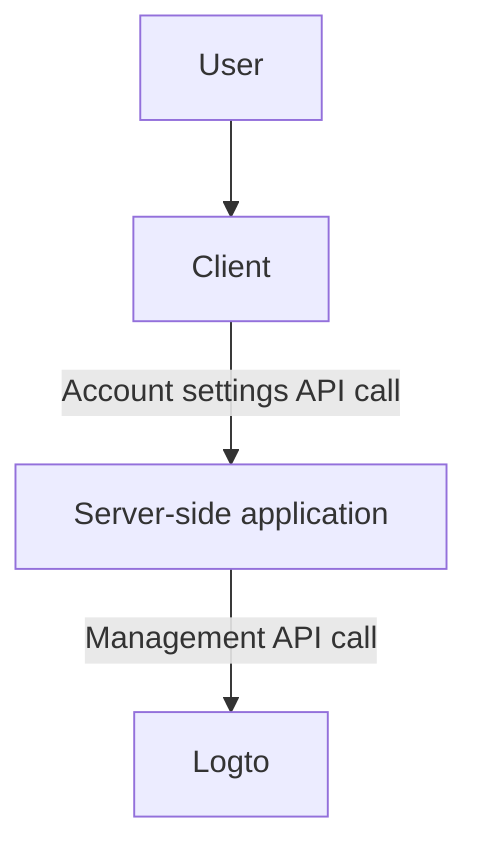
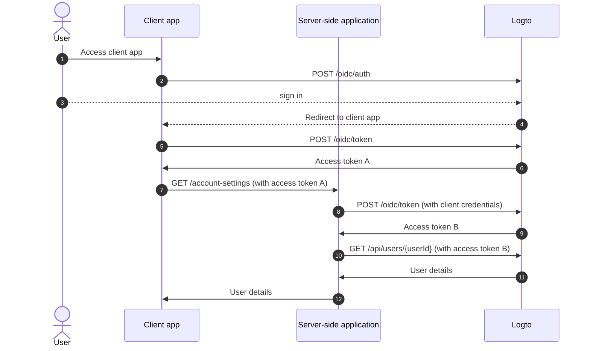
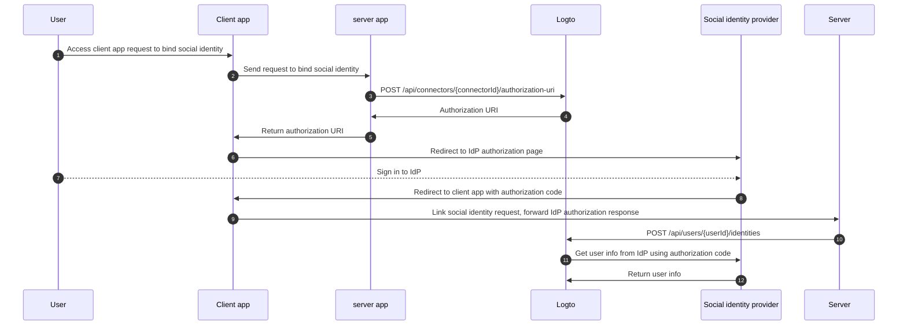

# Account settings by Management API

Logto provides various **Management APIs** to manage user accounts. You can use these APIs to build a self-serve account settings page for end-users.

## Architecture

1. **User**: Authenticated end-user who needs to access and manage their account settings.
2. **Client**: Your client application that serves the account settings page to the user.
3. **Server-side application**: Server-side application that provides the account settings API to the client. Interacts with the Logto **Management API**.
4. **Logto**: Logto as the authentication and authorization service. Provides the **Management API** to manage user accounts.

## Steps to implement

1. User accesses the client application.
2. Client application send the authentication request to Logto and redirects the user to the Logto sign-in page.
3. User signs in to Logto.
4. Authenticated user is redirected back to the client application with the authorization code.
5. Client application requests the access token from Logto for the self-hosted account settings API access.
6. Logto grants the access token to the client application.
7. The client application send the account settings request to Server-side application with the user access token.
8. Server-side application verifies the requester's identity and permission from the user access token. Then request for a Management API access token from Logto.
9. Logto grants the Management API access token to Server-side application.
10. Server-side application requests the user data from Logto using the Management API access token.
11. Logto verifies the server's identity and Management API permission and returns the user data.
12. Server-side application process the user data based on the requester's permission and returns the user account details to the client application.

## User Management APIs

### Integrate Management APIs

Check the [Management API](/integrate-logto/interact-with-management-api/) section to learn how to integrate the Management APIs with Server-side application-side application.

### User data schema

Check the [user data and custom data](/user-management/user-data/) section to learn more about the user schema in Logto.

### User profile and identifiers Management APIs

A user's profile and identifiers are essential for user management. You can use the following APIs to manage user profiles and identifiers.

| method | path                                                                                                     | description                               |
| ------ | -------------------------------------------------------------------------------------------------------- | ----------------------------------------- |
| GET    | [/api/users/\{userId\}](https://openapi.logto.io/operation/operation-getuser)                            | Get user details by user ID.              |
| PATCH  | [/api/users/\{userId\}](https://openapi.logto.io/operation/operation-updateuser)                         | Update user details.                      |
| PATCH  | [/api/users/\{userId\}/profile](https://openapi.logto.io/operation/operation-updateuserprofile)          | Update user profile fields by user ID.    |
| GET    | [/api/users/\{userId\}/custom-data](https://openapi.logto.io/operation/operation-listusercustomdata)     | Get user custom data by user ID.          |
| PATCH  | [/api/users/\{userId\}/custom-data](https://openapi.logto.io/operation/operation-updateusercustomdata)   | Update user custom data by user ID.       |
| PATCH  | [/api/users/\{userId\}/is-suspended](https://openapi.logto.io/operation/operation-updateuserissuspended) | Update user suspension status by user ID. |

### Email and phone number verification

In the Logto system, both email addresses and phone numbers can serve as user identifiers, making their verification essential. To support this, we provide a set of verification code APIs to help verify the provided email or phone number.

:::note
Make sure to verify the email or phone number before updating the user's profile with a new email or phone number.
:::

| method | path                                                                                                               | description                                        |
| ------ | ------------------------------------------------------------------------------------------------------------------ | -------------------------------------------------- |
| POST   | [/api/verification/verification-codes](https://openapi.logto.io/operation/operation-createverificationcode)        | Send email or phone number verification code.      |
| POST   | [/api/verification/verification-codes/verify](https://openapi.logto.io/operation/operation-verifyverificationcode) | Verify email or phone number by verification code. |

### User password management

| method | path                                                                                                     | description                                  |
| ------ | -------------------------------------------------------------------------------------------------------- | -------------------------------------------- |
| POST   | [/api/users/\{userId\}/password/verify](https://openapi.logto.io/operation/operation-verifyuserpassword) | Verify current user password by user ID.     |
| PATCH  | [/api/users/\{userId\}/password](https://openapi.logto.io/operation/operation-updateuserpassword)        | Update user password by user ID.             |
| GET    | [/api/users/\{userId\}/has-password](https://openapi.logto.io/operation/operation-getuserhaspassword)    | Check if the user has a password by user ID. |

:::note
Make sure to verify the user's current password before updating the user's password.
:::

### User social identities management

| method | path                                                                                                                              | description                                                                                                          |
| ------ | --------------------------------------------------------------------------------------------------------------------------------- | -------------------------------------------------------------------------------------------------------------------- |
| GET    | [/api/users/\{userId\}](https://openapi.logto.io/operation/operation-getuser)                                                     | Get user details by user ID. The social identities can be found in the `identities` field.                           |
| POST   | [/api/users/\{userId\}/identities](https://openapi.logto.io/operation/operation-createuseridentity)                               | Link a authenticated social identity to the user by user ID.                                                         |
| DELETE | [/api/users/\{userId\}/identities](https://openapi.logto.io/operation/operation-deleteuseridentity)                               | Unlink a social identity from the user by user ID.                                                                   |
| PUT    | [/api/users/\{userId\}/identities](https://openapi.logto.io/operation/operation-replaceuseridentity)                              | Directly update a social identity linked to the user by user ID.                                                     |
| POST   | [/api/connectors/\{connectorId\}/authorization-uri](https://openapi.logto.io/operation/operation-createconnectorauthorizationuri) | Get the authorization URI for a social identity provider. Use this URI to initiate a new social identity connection. |

1. User accesses the client application and requests to bind a social identity.
2. Client application sends a request to the server to bind a social identity.
3. Server sends a request to Logto to get the authorization URI for the social identity provider. You need to provide your own `state` parameter and `redirect_uri` in the request. Make sure to register the `redirect_uri` in the social identity provider.
4. Logto returns the authorization URI to the server.
5. Server returns the authorization URI to the client application.
6. Client application redirects the user to the IdP authorization URI.
7. User signs in to the IdP.
8. IdP redirects the user back to the client application using the `redirect_uri` with the authorization code.
9. Client application validates the `state` and forwards the IdP authorization response to the server.
10. Server sends a request to Logto to link the social identity to the user.
11. Logto gets the user information from the IdP using the authorization code.
12. IdP returns the user information to Logto and Logto links the social identity to the user.

:::note
There a few limitations to consider when linking new social identities to a user:

- Management API does not have any session context, any social connector that requires an active session to securely maintain the social authentication state cannot be linked via the Management API. Unsupported connectors include apple, standard OIDC and standard OAuth 2.0 connector.
- For the same reason, Logto can not verify the `state` parameter in the authorization response. Make sure to store the `state` parameter in you client app and validate it when the authorization response is received.
- You need to register the `redirect_uri` to the social identity provider in advance. Otherwise, the social IdP will not redirect the user back to your client app. Your social IdP must accept more than one callback `redirect_uri`, one for user sign-in, one for your own profile binding page.

:::

### User enterprise identities management

| method | path                                                                                                    | description                                                                                                                                                                                    |
| ------ | ------------------------------------------------------------------------------------------------------- | ---------------------------------------------------------------------------------------------------------------------------------------------------------------------------------------------- |
| GET    | [/api/users/\{userId\}?includeSsoIdentities=true](https://openapi.logto.io/operation/operation-getuser) | Get user details by user ID. The enterprise identities can be found in the `ssoIdentities` field. Add the `includeSsoIdentities=true` query parameter to the user details API to include them. |

Currently, the Management API does not support linking or unlinking enterprise identities to a user. You can only display the enterprise identities linked to a user.

### User MFA settings management

| method | path                                                                                                                                 | description                               |
| ------ | ------------------------------------------------------------------------------------------------------------------------------------ | ----------------------------------------- |
| GET    | [/api/users/\{userId\}/mfa-verifications](https://openapi.logto.io/operation/operation-listusermfaverifications)                     | Get user MFA settings by user ID.         |
| POST   | [/api/users/\{userId\}/mfa-verifications](https://openapi.logto.io/operation/operation-createusermfaverification)                    | Setup a user MFA verification by user ID. |
| DELETE | [/api/users/\{userId\}/mfa-verifications/\{verificationId\}](https://openapi.logto.io/operation/operation-deleteusermfaverification) | Delete a user MFA verification by ID.     |

### User account deletion

| method | path                                                                             | description               |
| ------ | -------------------------------------------------------------------------------- | ------------------------- |
| DELETE | [/api/users/\{userId\}](https://openapi.logto.io/operation/operation-deleteuser) | Delete a user by user ID. |
