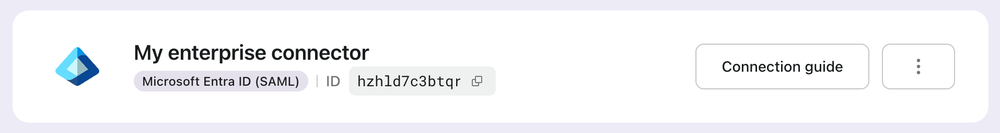

# Direct sign-in

Direct sign-in is a Logto-specific [authentication parameter](/end-user-flows/authentication-parameters) that enables you to initiate social sign-in or enterprise SSO directly, bypassing the default universal Logto sign-in page.

This feature is especially useful if you have a custom sign-in page or IdP login entry point embedded on your website (View use cases). By using direct sign-in, you can redirect users directly to the IdP’s login page.


## Social sign-in

Pass the `direct_sign_in` parameter with the value `social:<idp-name>` to directly initiate the social sign-in process.

### Where to find the connector IdP name

1. Navigate to <CloudLink to="/connectors/social">Console > Connectors > Social connectors</CloudLink>
2. Click on the [social connector](/connectors/social-connectors) you want to use.
3. Locate the identity provider name at the top of the connector settings page.


### Example

Build your own authentication request URL with the `direct_sign_in` parameter:

```sh
curl --location \
  --request GET 'https://[tenant-id].logto.app/oidc/auth?client_id=1234567890&...&direct_sign_in=social:google'
```

In supported Logto SDKs, you can set the `directSignIn` parameter when calling the `signIn` method:

```javascript
const authResult = await logto.signIn({
  redirectUri: 'https://your-app.com/callback',
  directSignIn: 'social:google',
});
```

## Enterprise SSO

Pass the `direct_sign_in` parameter with the value `sso:<connector-id>` to directly initiate the enterprise SSO sign-in process.

### Where to find the enterprise SSO connector ID

1. Navigate to <CloudLink to="/enterprise-sso">Console > Enterprise SSO</CloudLink>
2. Click on the [enterprise connector](/connectors/enterprise-connectors) you want to use.
3. Locate the connector ID at the top of the connector settings page.



### Example

Build your own authentication request URL with the `direct_sign_in` parameter:

```sh
curl --location \
  --request GET 'https://[tenant-id].logto.app/oidc/auth?client_id=1234567890&...&direct_sign_in=sso:1234567890'
```

In supported Logto SDKs, you can set the `directSignIn` parameter when calling the `signIn` method:

```javascript
logtoClient.signIn({
  redirectUri: 'https://your-app.com/callback',
  directSignIn: 'sso:1234567890',
});
```

## Fallback to the sign-in page

If the direct sign-in process fails, e.g. the connector is not found or enabled, the user will be redirected to the standard sign-in page.

:::note
We are gradually adding support for the direct_sign_in parameter to all Logto SDKs. If you don't see it in your SDK, please open an issue or contact us.
:::

## FAQs

<details>
  <summary>Is direct sign-in the same as API authentication?</summary>

No, direct sign-in is a user flow parameter that allows you to skip the default Logto sign-in page and redirect users directly to the social or enterprise SSO provider's login page. Unlike API based authentication, user still needs to be first redirected to the Logto authentication endpoint to initiate the sign-in process.

</details>
