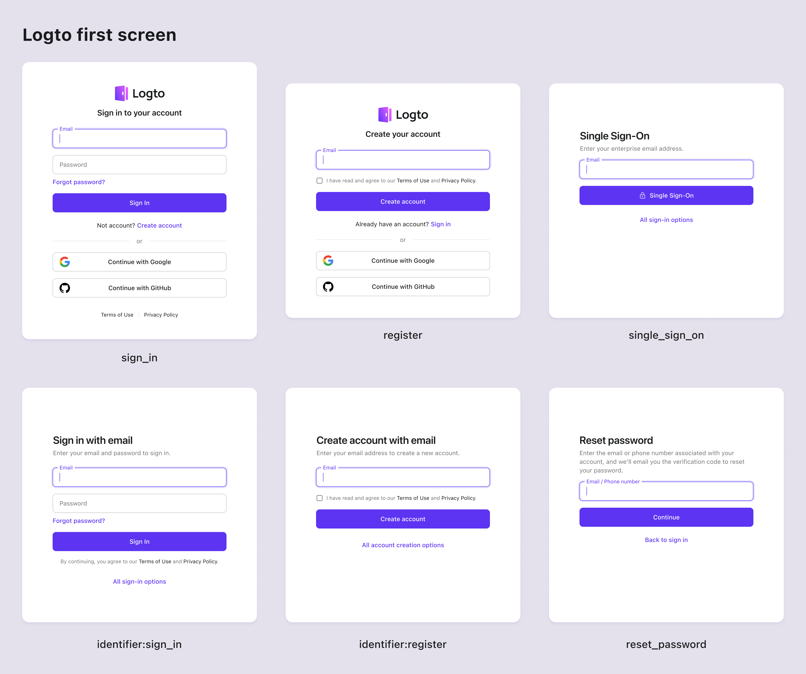

# First screen parameters

A set to custom authentication parameters that allow you to tailor the desired first screen experience for the end users.

- `first_screen`: Specifies the first screen that the user will see.
- `identifier`: Specifies the identifier types that the sign-in or sign-up form will accept.
- `login_hint`: Populates the identifier field with the user's email address or username. (This is a OIDC standard parameter)

## first_screen

The `first_screen` parameter is the key parameter that determines the first screen that the users will see when they redirect to the Logto's sign-in page. By default, the universal sign-in form will be displayed. Use this parameter to customize the first screen based on your application's requirements. Supported values are:

- `sign_in`: Displays the sign-in form. (Default)
- `register`: Displays the sign-up form.
- `reset_password`: Displays the password reset form.
- `single_sign_on`: Displays the enterprise SSO sign-in form. (A email address will be asked to determine the enabled SSO providers)
- `identifier:sign-in`: Displays a identifier specific sign-in form. The identifier type can be specified using the `identifier` parameter. This is useful when you have multiple identifier sign-in methods enabled.
- `identifier:register`: Displays a identifier specific sign-up form. The identifier type can be specified using the `identifier` parameter. This is useful when you have multiple identifier sign-up methods enabled.



For example, sending users directly to the enterprise SSO sign-in form:

```sh
curl --location \
--request GET 'https://<your-tenant>.logto.app/oidc/auth?client_id=<client_id>&...&first_screen=single_sign_on'
```

## identifier

The `identifier` parameter is used to specify the identifier types that the sign-in or sign-up form will take. This parameter is only applicable when the `first_screen` parameter is set to `identifier:sign-in`, `identifier:register`, or `reset_password`. Supported values are: `username`, `email`, and `phone`. Separate multiple values with a empty space to allow multiple identifier types.

For example, sending users directly to the email or phone number sign-up page:

```sh
curl --location \
--request GET 'https://<your-tenant>.logto.app/oidc/auth?client_id=<client_id>&...&first_screen=identifier:register&identifier=email phone'
```

All the identifier types specified in this parameter must be enabled in your sign-in or sign-up settings in the Logto Console.

Any unsupported or disabled identifier types will be ignored. If all specified identifiers are unsupported, the default sign-in experience configuration will be used.

## login_hint

The `login_hint` parameter, defined in the standard [OpenID Connect specification](https://openid.net/specs/openid-connect-core-1_0.html#AuthorizationEndpoint), is used to pre-populate the sign-in form with the user's identifier (such as an email, a phone number or username). With Logto, it can be combined with other sign-in screen parameters to enhance the user experience. This parameter is especially useful if you have a custom pre-authentication form that collects the user's identifier in advance, allowing them to skip re-entering it during sign-in.

For example, pre-populating the collected email address in the sign-in form:

```sh
curl --location \
--request GET 'https://<your-tenant>.logto.app/oidc/auth?client_id=<client_id>&...&first_screen=identifier:sign_in&identifier=email&login_hint=example@logto.io
```

## SDK support

In supported Logto SDKs, you can set the parameters when calling the `signIn` method:

```javascript
logtoClient.signIn({
  redirectUri: 'https://your-app.com/callback',
  firstScreen: 'identifier:register',
  identifier: ['email', 'phone'],
  loginHint: 'example@logto.io',
});
```

:::note
We are gradually adding support for the `first_screen`, `identifier`, and `login_hint` parameters to all Logto SDKs. If you don't see them in your SDK, please open an issue or contact us.

For [Logto OSS](/logto-oss) users, theses parameters are supported since version 1.15.0. If you are using an older version, please [upgrade](/logto-oss/upgrading-oss-version) to the latest version.
:::
