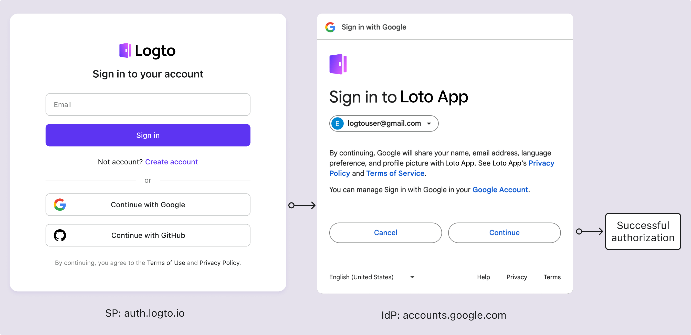
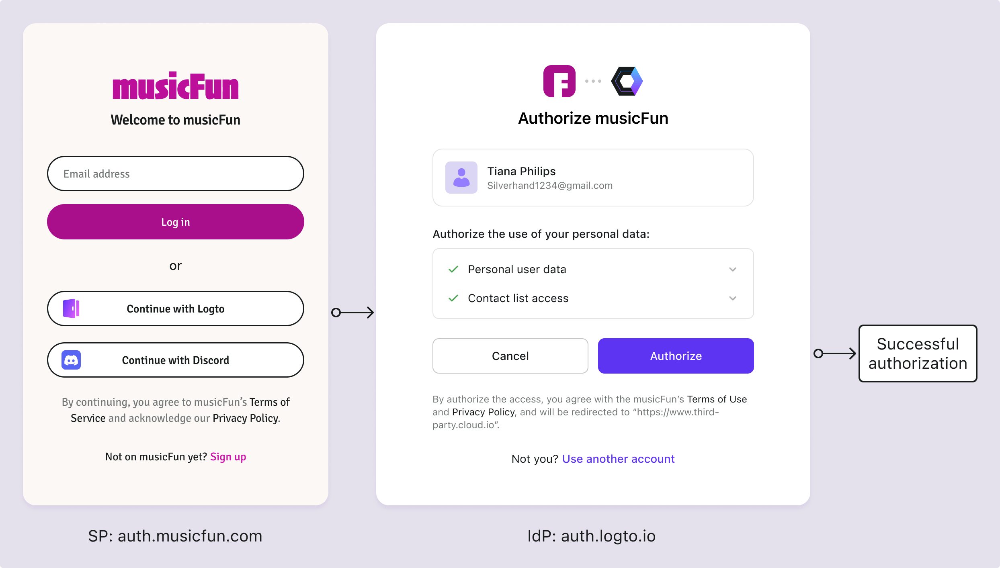

# Consent screen

## What is consent screen?

Imagine you are signing up to Logto using your Google account. When you click on the "Sign in with Google" button, you are redirected to Google's sign-in page. After you enter your Google credentials, you will be prompted to grant permission to Logto to access your Google account information. This is the user consent screen.

This page is what we call the user **consent screen** or **consent page**. It is a standard [OIDC / OAuth 2.0 flow](/integrate-logto/third-party-applications/oidc-oauth-third-party-applications) that allows users to grant permissions to [third-party applications](/integrate-logto/third-party-applications) to access their data on their behalf. Its primary purpose is to inform users about the collection, processing, and usage of their personal data and to seek their explicit agreement or consent for these activities.

On a consent screen, users are typically presented with [information](/integrate-logto/third-party-applications/oidc-oauth-third-party-applications/consent-screen-branding#customize-the-branding-information) about the types of data that will be collected, how it will be used, and whether it will be shared with third parties. This information is crucial for transparency, allowing users to make informed decisions about their privacy and data security.

Consent pages are particularly important in the context of privacy regulations such as the General Data Protection Regulation ([GDPR](https://gdpr-info.eu/art-4-gdpr/)) in the European Union or the California Consumer Privacy Act ([CCPA](https://oag.ca.gov/privacy/ccpa)) in the United States, which require organizations to obtain clear and affirmative consent from users before processing their personal information.

## When does user see the consent screen in Logto?

As previously mentioned, the consent screen appears when users sign in to Logto using a third-party identity provider (IdP) like Google, Facebook, or Apple. In this setup, Logto serves as the service provider (SP), requesting access to user information from the IdP. The consent screen is generally presented when the [SP](https://auth.wiki/service-provider) and [IdP](https://auth.wiki/identity-provider) are separate organizations, requiring user authorization to facilitate data sharing.

Similarly, in Logto, when Logto functions as the IdP, the consent screen is shown when users sign in to a [**OIDC / OAuth third-party application**](/integrate-logto/third-party-applications/oidc-oauth-third-party-applications) integrated with Logto. This screen informs users about the data the application is requesting and seeks their permission to proceed. Users can review the requested permissions and decide whether to grant authorization to the application.

## How to configure the consent screen?

The Logto consent flow allows you to authorize logins from third-party applications. You can customize the branding and permission requests for each OIDC third-party application.

Learn more about setting up the [third-party application](/integrate-logto/third-party-applications/) and configuring the [consent](/integrate-logto/third-party-applications/oidc-oauth-third-party-applications/consent-screen-branding/) screen in Logto.

## Related resources

<Url href="https://www.youtube.com/watch?v=sW-C7SRt9OM">
  Turn your service into a secure OIDC IdP equipped with consent screen.
</Url>
<Url href="https://blog.logto.io/user-consent-screen">Introduction to the user consent screen.</Url>
