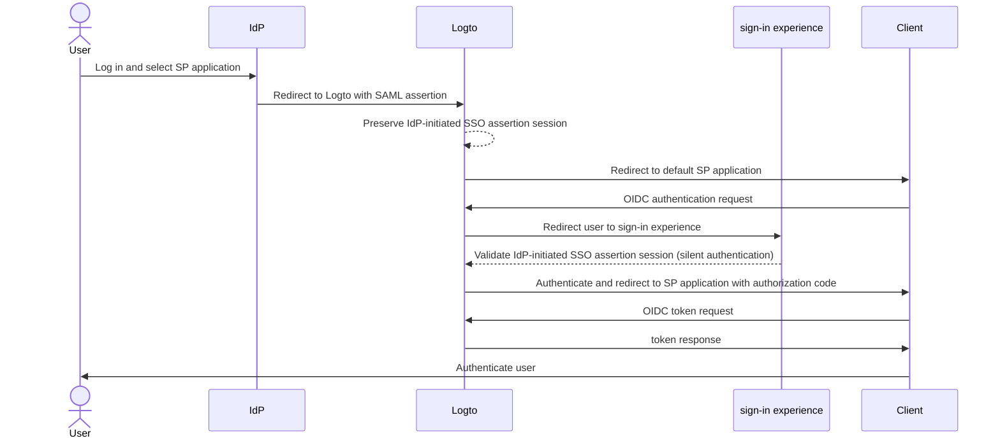
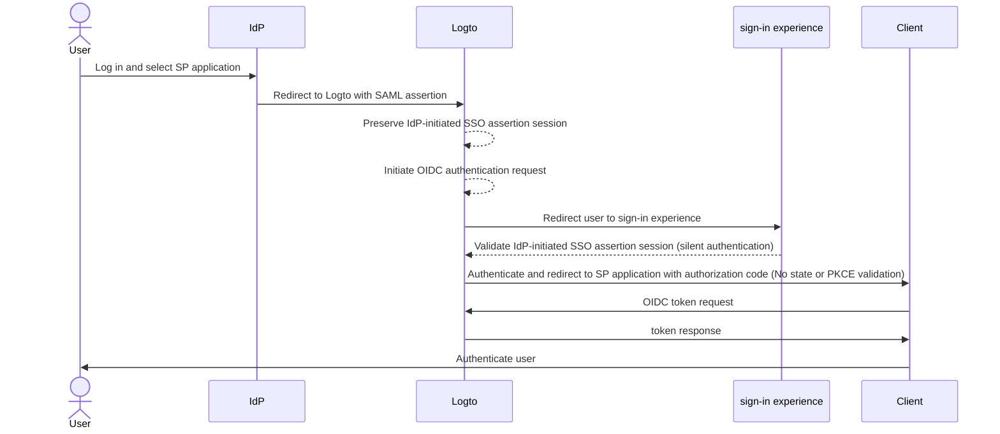

import Availability from '@components/Availability';
import idpInitiatedSsoPortalImage from '@site/docs/end-user-flows/enterprise-sso/assets/idp-initiated-sso-portal.png';
import idpInitiatedSsoRedirectImage from '@site/docs/end-user-flows/enterprise-sso/assets/idp-initiated-sso-redirect.png';
import idpInitiatedSsoSignInImage from '@site/docs/end-user-flows/enterprise-sso/assets/idp-initiated-sso-sign-in.png';

<Availability cloud="comingSoon" oss={false} />

# IdP-initiated SSO (SAML only)

IdP-initiated SSO is a single sign-on process where the Identity Provider (IdP) primarily controls the authentication flow. This process begins when a user logs into the IdP's platform, such as a company portal or a centralized identity dashboard. Once authenticated, the IdP generates an SAML assertion and directs the user to the Service Provider (SP) to access the application or service.


## Risks and considerations \{#risks-and-considerations}

IdP-initiated SSO can introduce several security vulnerabilities that organizations should be aware of. Since the authentication process is initiated by the IdP without a direct request from the user, it can be susceptible to various attacks, including [Cross-Site Request Forgery](https://blog.logto.io/csrf) (CSRF).

This lack of user-initiated authentication can lead to unauthorized access if proper safeguards are not in place. Additionally, the reliance on a single point of authentication increases the risk of a security breach, as compromising the IdP could expose all connected applications.

Therefore, it is highly recommended to use SP-initiated SSO, which provides a more secure and controlled authentication flow, ensuring that users explicitly request access to services.

## Connect IdP-initiated SSO with Logto OIDC applications \{#connect-idp-initiated-sso-with-logto-oidc-applications}

Logto as an OpenID Connect (OIDC) provider does not support IdP-initiated SSO. However, you can configure Logto as a SP to support IdP-initiated SSO with your enterprise IdP using SAML. This setup allows you to leverage Logto's authentication capabilities while maintaining the IdP's control over the authentication flow.

:::note
By default, this feature is not enabled in Logto. If you need IdP-initiated SSO enabled for your tenant, please contact our [support team](https://logto.io/contact?src=docs.sso).
:::

### Prerequisites \{#prerequisites}

Before configuring IdP-initiated SSO, you need to create a SAML connector first. Navigate to the <CloudLink to="/enterprise-sso">Console > Enterprise SSO</CloudLink> and follow the step-by-step guide to set up a [SAML](/integrations/saml-sso/) connector with your IdP.

Once the SAML connector is set up, you can enable the SSO sign-in method in the <CloudLink to="/sign-in-experience">Sign-in experience</CloudLink> section, and test the SP-initiated SSO flow to ensure that the configuration is correct. Make sure the SP-initiated SSO is working as expected before proceeding with IdP-initiated SSO.

### Enable IdP-initiated SSO \{#enable-idp-initiated-sso}

Once the IdP-initiated SSO feature is enabled for your tenant, you should see an extra tab in your SAML connector's settings page, called **IdP-initiated SSO**. Enable the **IdP-initiated SSO** toggle to activate the feature for the connector.

### Select the SP application \{#select-the-sp-application}

Unlike SP-initiated SSO, where the authentication flow starts from the SP, IdP-initiated SSO requires a client side SP application to redirect users after the authentication process. You can select the SP application from the list of registered applications in the **Default application** dropdown.

Only **Traditional Web App** and **Single Page App** applications are supported for IdP-initiated SSO. Make sure to select the appropriate application type based on your use case.

:::note
On you IdP's side, leave the `RelayState` parameter to **EMPTY** for the IdP-initiated SSO flow to work correctly. Logto will handle the redirection based on the default SP application selected.
:::

## Configure IdP-initiated authentication flow \{#configure-idp-initiated-authentication-flow}

In order to connect IdP-initiated SAML SSO with OIDC, Logto provides two configuration options to handle the authentication request.

### Option A: Redirect to the default SP application (Recommended) \{#option-a-redirect-to-the-default-sp-application-recommended}

When the IdP initiates the SSO flow, and sends the SAML assertion to Logto, an IdP-initiated SSO assertion session will be created. Logto will redirect the user to the default SP application to initiate a standard OIDC authentication request at the client side.



To setup this option, select the **Redirect to client for SP-initiated authentication** card in the **IdP-initiated SSO** tab of the SAML connector settings.


1. Provide a **Client redirect URL** to redirect the user to the default SP application after the IdP-initiated SSO flow. Logto will redirect the user to this URL with the `?ssoConnectorId={connectorId}` query parameter appended to the URL. The client application should handle the redirection and initiate the OIDC authentication request. (We recommend using a dedicated route or page in your client application to handle the IdP-initiated SSO authentication request.)

2. Handle the OIDC authentication request at the client side using the `ssoConnectorId` query parameter to identify the SAML connector that initiated the IdP-initiated SSO authentication flow.

3. Pass the [direct sign-in](/end-user-flows/authentication-parameters/direct-sign-in/) authentication parameter in the sign-in request to Logto to complete the SSO authentication flow.

```typescript
// React example
import { Prompt, useLogto } from '@logto/react';
import { useEffect } from 'react';
import { useNavigate, useSearchParams } from 'react-router-dom';

const SsoDirectSignIn = () => {
  const { signIn } = useLogto();
  const [searchParams] = useSearchParams();

  useEffect(() => {
    const ssoConnectorId = searchParams.get('ssoConnectorId');
    if (ssoConnectorId) {
      void signIn({
        redirectUri,
        prompt: Prompt.Login,
        directSignIn: {
          method: 'sso',
          target: ssoConnectorId,
        },
      });
    }
  }, [searchParams, signIn]);
};
```

- `redirectUri`: The `redirect_uri` to redirect the user after the OIDC authentication flow is completed.
- `prompt=login`: Forces the user to log in using the IdP-initiated SSO identity.
- `directSignIn=sso:{connectorId}`: Specifies the direct sign-in method as `sso` and the target SAML connector ID. This parameter will trigger the SSO authentication flow directly without showing the login page. User will be automatically authenticated using the preserved IdP-initiated SSO assertion session if the connector ID matches and the session is valid.

This method ensures that the authentication flow is secure and follows the standard OIDC protocol, while maintaining the IdP's control over the authentication process. Client app can take advantage of the IdP-initiated SSO assertion session to authenticate the user without additional login steps, while keeping the authentication flow secure and controlled. The client app can still validate the `state` and `PKCE` parameters to ensure the authentication request is secure.

:::note
This method is available for both **Traditional Web App** and **Single Page App** applications. And it is recommended for all the use cases.
:::

### Option B: Directly authenticate the user with IdP-initiated SSO \{#option-b-directly-authenticate-the-user-with-idp-initiated-sso}

For certain circumstances, SP may not be able to handle the IdP-initiated SSO callback and initiate the OIDC authentication request. In this case, Logto provides an alternative option to directly authenticate the user with the IdP-initiated SSO assertion session.

This option is considered less secure and not recommended. The authentication flow bypasses the standard OIDC protocol. As the authentication request is initiated by the IdP, the client app may not be able to validate the authentication request securely. E.g. the client app can not validate the `state` and `PKCE` parameters to ensure the authentication request is secure.

:::warning
This method is not available for **Single Page App** applications, as it requires the client app to handle the authentication request securely using the `PKCE` parameter. If you need to implement IdP-initiated SSO for a SPA application, please use the above option instead.
:::



To configure this option, select the **Directly sign-in using IdP-initiated SSO** option in the **IdP-initiated SSO** tab of the SAML connector settings.


1. Select the **Post sign-in redirect URI** to redirect the user back to the client application after successful authentication. This URL will be used as the `redirect_uri` in the OIDC authentication request. The URI must be one of the allowed redirect URIs registered in the client application.

   :::note
   It is highly recommended to use a dedicated **redirect URI** for IdP-initiated SSO. Given that the authentication request is unsolicited, the client application should manage the response independently, separate from the standard SP-initiated authentication flow.
   :::

2. Customize the authorization request parameters if needed using the **Additional authentication parameters** json editor (following the type `Map<string,string>`).

   E.g. By default Logto only requests the `openid` and `profile` scopes. You can add additional scopes or parameters to the authentication request.

   ```json
   {
     "scope": "email offline_access"
   }
   ```

   - add additional `email` scope to request the user's email address.
   - add `offline_access` scope to request the refresh token.

   We also recommend you to provide a custom `state` parameter to validate the authentication response securely.

   ```json
   {
     "state": "custom-state-value"
   }
   ```

   The client app should validate the `state` parameter in the authorization code response to ensure the authentication request is valid.
