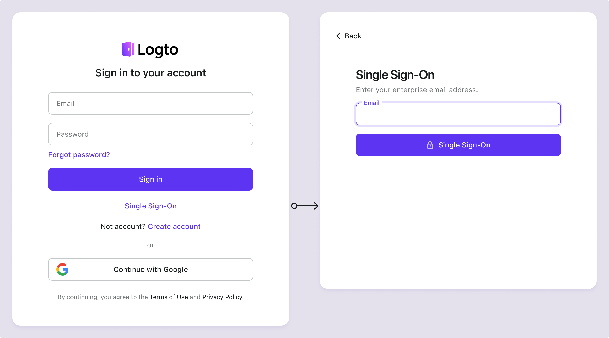
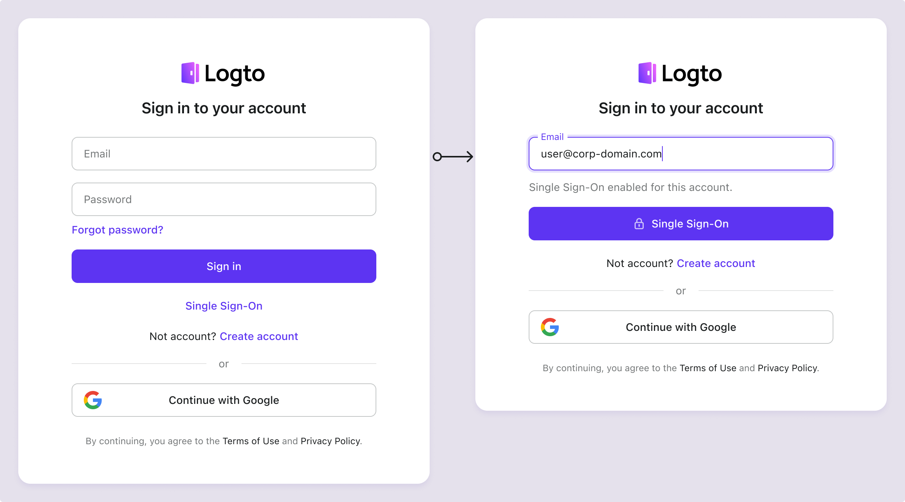

# SP-initiated SSO

SP-initiated SSO, the default and more secure method than [IdP-initiated SSO](/end-user-flows/enterprise-sso/idp-initiated-sso), allows enterprise users to initiate the SSO login process from Logto sign-in page. Logto supports both [email domain prompt SSO](#sp-initiated-sso-experience) and [direct sign-in parameter for SSO](/end-user-flows/authentication-parameters/direct-sign-in#enterprise-sso).

## Set up SP-initiated SSO

1. **Enable enterprise SSO** in your identity system

   To activate enterprise SSO, navigate to the <CloudLink to="/sign-in-experience/sign-up-and-sign-in">Console > Sign-in experience > Sign-up and sign-in</CloudLink> and toggle on the "Enable enterprise SSO" setting. Once enabled, a "Single Sign-On" button will appear on your sign-in page. Enterprise users with SSO-enabled email domains can access your services via their enterprise identity providers.

2. **Create enterprise connectors** for different clients

   Next, you need to integrate each enterprise identity provider for your clients. Similar to social sign-in, create a new enterprise connector in Logto and configure the required settings. Navigate to the <CloudLink to="/enterprise-sso">Console > Enterprise SSO</CloudLink>, click the "Add enterprise connector" button, and follow the instructions to set up the connector. Refer to the [enterprise SSO connector setup](/connectors/enterprise-connectors/).

3. **Set up email domains** for the enterprise connector

   Enterprise SSO identities are typically recognized by a company email domain. In the SSO Experience tab of each enterprise connector's details page, you can specify the associated email domains.

   Users with the specified email domains will be restricted to signing in exclusively through this enterprise SSO connector, while other sign-in methods—such as email verification codes, email-password authentication, or social login, will be disabled for these users. The SSO connector will be visible only to users with the specified email domains.

   :::note
   Public email domains (e.g., gmail.com, yahoo.com) cannot be linked to an Enterprise connector.
   :::

## SP-initiated SSO experience

SSO is activated when users attempt to sign in using an enterprise email domain configured for SSO. This process bypasses standard verification methods like passwords.

1. **Single sign-on button**:

   When the enterprise SSO sign-in method is enabled, a "Single Sign-On" button will appear as an alternative sign-in option on the sign-in page. By clicking this link, users are prompted to enter their enterprise email address to initiate the SSO process.

   - Single connector: If only one enterprise SSO connector is associated with the user's email domain, the user is redirected directly to the IdP login page.
   - Multiple connectors: If multiple enterprise SSO connectors are associated with the user's email domain, the user will first select the desired IdP from a list before being redirected to the IdP login page.

   

2. **Universal email sign-in**:

   In the universal identifier sign-in form (with email sign-in method enabled), enterprise SSO email domain detection is enabled by default. When users enter their email address, Logto automatically identifies if an enterprise SSO connector is associated with that domain. If a match is found, the default sign-in form updates: the "Sign in" button changes to a "Single Sign-On" button, restricting the user to signing in with the enterprise SSO connector(s).

   

## FAQs

  
Can I use Organization Name/Domain instead of Email Domain to redirect to the IdP?

Currently, Logto prebuilt sign-in experience supports only **email domain prompt SSO**, not **organization domain prompt SSO**.

You can create a custom routing page at your client side using the authentication parameters with `directSignIn:'sso:{connectorId}` . This page will redirect large enterprise clients to the appropriate IdP based on their organization domain. Learn more about the [direct sign-in parameter](/end-user-flows/authentication-parameters/direct-sign-in/).

  
Can I display a specific Enterprise Connector button on the sign-in page?

Different enterprise clients use different identity providers to manage their employee, and request different scopes (OIDC) or attribute (SAML). Therefore, it's not recommended to display an Enterprise connector button intended for a specific client on a generic sign-in page.

However, if you are developing a B2E product and want to show a button for a specific enterprise client, you can create a custom login page and use `directSignIn:sso` to route the button appropriately. Learn more about the [direct sign-in parameter](/end-user-flows/authentication-parameters/direct-sign-in/).

