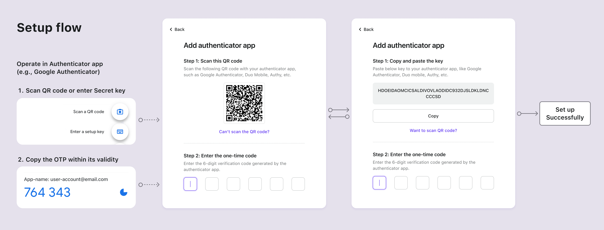
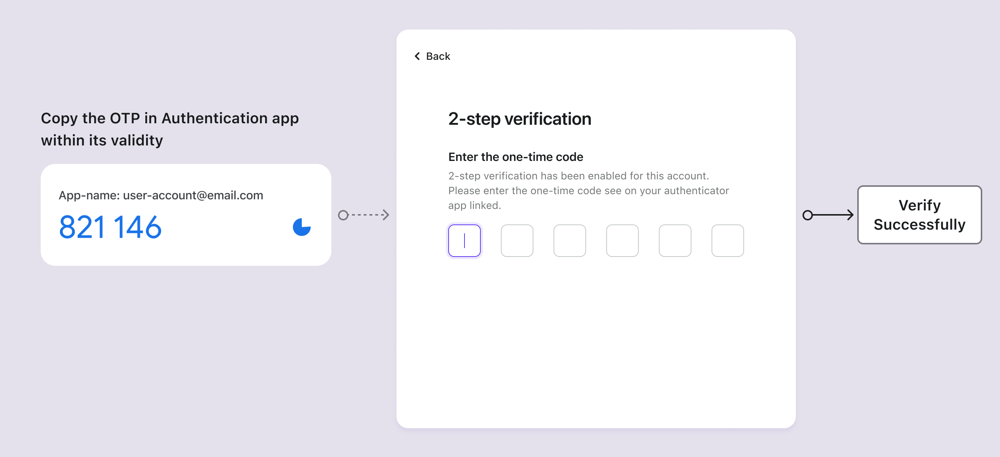

# Authenticator app OTP

## Concepts

The Authenticator app, also referred to as the Software Token, is one of the most widely adopted [MFA](https://auth.wiki/mfa) methods. It generates temporary, [one-time passwords (OTP)](https://auth.wiki/otp) to enhance the security of online service authentication. Unlike physical hardware tokens, software tokens are typically applications or plugins that users install on their devices, be it a smartphone or a computer browser. Software tokens can operate locally on a single device or synchronize across various devices, depending on the authenticator's capabilities and individual user settings.

Popular examples of software tokens include Google Authenticator, Microsoft Authenticator, Duo, 1Password, Authy, and more.

## Authentication flows

### Authentication app OTP setup flows

1. **QR Code or Secret Key**: Users receive a QR code or a secret key from your service.
2. **Add account**: Using their authenticator app, users scan the QR code or manually enter the secret key to add their account.
3. **Dynamic one-time password**: The authenticator app displays a six-digit code that refreshes every 1-2 minutes for the added account.
4. **Complete MFA setup**: Users enter this code within its validity into the MFA setup page, completing the setup of Authenticator App OTP for MFA.

### Authentication app OTP verification flows

1. **Login attempt**: During login, users are prompted for MFA.
2. **Retrieve OTP**: Open their authenticator app to retrieve the OTP for the respective account.
3. **Enter OTP**: Users enter the OTP displayed in the app within its validity into the 2-step verification page.
4. **Authentication**: The system verifies the OTP, granting access upon successful validation.

