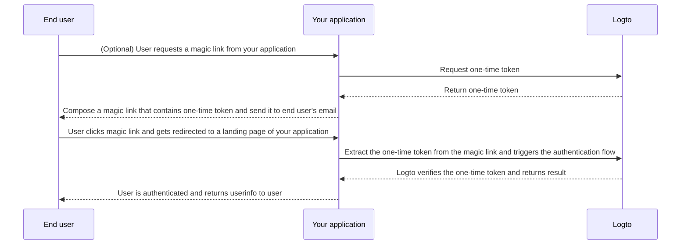

# Magic link (One-time token)

import Availability from '@components/Availability';

<Availability cloud oss="comingSoon" />

Similar to one-time password (OTP), a one-time token is another passwordless authentication method that can be used to verify a user's identity.
The token is valid for a limited period of time, and associated with an email address of the end user.

Sometimes you may want to invite new users to your application / organization without requiring them to create an account first.
Or you may forget your password and want to sign-in / reset your password by quickly verifying your identify via email.
In such cases, the application can send a "magic link" to your email. And you will be authenticated immediately when you click the link.

Application developers can use the one-time token to compose a magic link, and send it to the end user's email address.

## One-time token flow \{#one-time-token-flow}

Here is the sequence diagram of the authentication flow using one-time token:



## Implementation guide \{#implementation-guide}

Logto offers a set of both Management APIs and Experience APIs to ease the implementation of your magic link.

Before you start, make sure you have a Logto instance ready, and have established the Machine-to-Machine connection between your application server
and Logto endpoint (required for the Management APIs). Learn more about [Logto Management API](/integrate-logto/interact-with-management-api).

### Step 1: Request one-time token \{#step-1-request-one-time-token}

Use Logto Management API to create a one-time token.

```bash
POST /api/one-time-tokens
```

Sample request body payload:

```json
{
  "email": "user@example.com",
  // Optional. Defaults to 600 (10 mins).
  "expiresIn": 3600,
  // Optional. User will be provisioned to the specified organizations upon successful verification.
  "context": {
    "jitOrganizationIds": ["abcdefgh1234"]
  }
}
```

### Step 2: Compose your magic link \{#step-2-compose-your-magic-link}

After you get the one-time token, you can compose a magic link and send it to the end user's email address.
The magic link should at least contain the token and the user email as parameters, and should navigate to a landing page in your own application.
E.g. `https://yourapp.com/landing-page`.

Here's a simple example of what the magic link may look like:

```
https://yourapp.com/landing-page?token=YHwbXSXxQfL02IoxFqr1hGvkB13uTqcd&email=user@example.com
```

:::note

The parameter names in the magic link can be fully customized.
You may add additional information to the magic link based on your application's requirements,
as well as encoding all the URL parameters.

:::

### Step 3: Trigger the authentication flow via Logto SDK \{#step-3-trigger-the-authentication-flow-via-logto-sdk}

After the end user clicks the magic link and navigated to your application, you can extract the `token` and `email` parameters from the URL, and then call the `signIn()` function from Logto SDK to trigger the auth flow.

```typescript title="TokenLandingPage.tsx"
// React example
import { useLogto } from '@logto/react';
import { useEffect } from 'react';
import { useSearchParams } from 'react-router-dom';

const TokenLandingPage = () => {
  const { signIn } = useLogto();
  const [searchParams] = useSearchParams();

  useEffect(() => {
    // Extract the token and email from the magic link
    const oneTimeToken = searchParams.get('token');
    const email = searchParams.get('email');

    // Assuming this is your sign-in redirect URI
    const redirectUri = 'https://yourapp.com/callback';

    if (oneTimeToken && email) {
      signIn({
        redirectUri,
        clearTokens: false, // Optional. See warning message below
        extraParams: {
          'one_time_token': oneTimeToken,
          'login_hint': email,
        },
      });
    }
  }, [searchParams, signIn]);

  return <>Please wait...</>;
};
```

:::warning

If a user is already signed-in, calling the`signIn()` function from SDK will automatically clear all cached tokens (ID token, access token, and refresh token) from client storage,
which ends up losing the authentication status of the current user.

Therefore, you should specify an additional sign-in parameter `clearTokens: false` to avoid clearing the existing tokens.
If this is specified, you'll also need to manually clear the tokens in the sign-in callback page.

Ignore this if your magic links are not designed for authenticated users.

:::

### Step 4: (Optional) Clear cached tokens in sign-in callback page \{#step-4-clear-cached-tokens-in-sign-in-callback-page}

If you specify `clearTokens: false` in the sign-in function, you need to manually clear the tokens in the sign-in callback page.

```typescript title="Callback.tsx"
// React example
import { useHandleSignInCallback, useLogto } from '@logto/react';
import { useEffect } from 'react';

const Callback = () => {
  const { clearAllTokens } = useLogto();

  useEffect(() => {
    void clearAllTokens();
  }, [clearAllTokens]);

  useHandleSignInCallback(() => {
    // Navigate to your home page
  });

  return <>Please wait...</>;
};
```

## FAQs \{#faqs}

<details>

<summary>

### Can I use the magic link to invite new users to my organizations?

</summary>

Yes, you can use the magic link to invite new users to your application, as well as organizations.
If you want to invite new users to your organization, simply specify the `jitOrganizationIds` in the request body.

The user will automatically join the organizations upon successful verification, and default organization roles will be assigned.
Check out the "Just-in-time provisioning" section in your organization details page, and configure the default roles for your organizations.

</details>

<details>

<summary>

### Does the one-time token expire?

</summary>

Yes, the one-time token will expire after the specified `expiresIn` time (in seconds). The default expiration time is 10 minutes.

</details>

<details>

<summary>

### If I disable user registration in "Sign-in Experience", can I still use magic link to invite users?

</summary>

Yes, you can still use magic link to invite users even if you disable user registration in "Sign-in Experience".

</details>

<details>

<summary>

### What will happen if a user already signed in, and then click another magic link?

</summary>

There are a number of possible scenarios:

1. The user is already signed in, and then clicks a magic link that associates with the current user account. In this case, Logto will still verify the one-time token, and provision the user to specified organizations if needed.
2. The user is already signed in, and then clicks a magic link that associates with a different account. In this case, Logto will prompt the user to continue as the new account, or go back to the application with the current account.
   1. If the user chooses to continue as the new account, Logto will switch to the new account after the token verification is successful.
   2. If the user chooses to stick to the current account, Logto will not verify the token and return to the application with the current account.
3. If your sign-in prompt is set to "login" or contains "login", Logto will automatically sign-in the account associated with the one-time token without prompting switch.

</details>
