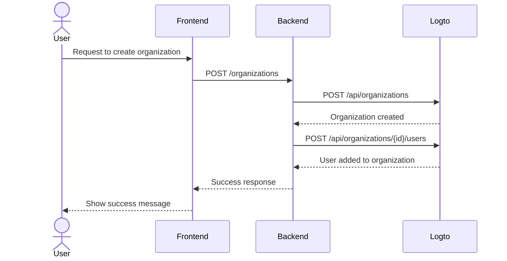

import GearIcon from '@site/src/assets/gear.svg';
import OrganizationIcon from '@site/src/assets/organization.svg';

# Organization experience

The [organization](/organizations) experience is the set of UIs and flows your business customers and their employees use—especially in [multi-tenant applications](https://auth.wiki/multi-tenancy). This guide shows how to integrate it into your app using the Logto Management API.

This section helps you design the **organization experience** for your end users—for example:

1. Admins can create their own organizations.
2. Admins can manage organization members.
3. Admins can invite members to join their organizations.
4. and more.

  

## Understand the authentication flow

To integrate with the Logto Management API, first understand the basic authentication flow. It has two key requirements:

### Protect your backend API

- Frontend calls to your backend API require authentication.
- Protect API endpoints by validating the user's Logto access token.
- Ensure only authenticated users can access your services.

### Access the Logto Management API

- Your backend service securely calls the Logto Management API.
- Follow the [Interact with Management API](/integrate-logto/interact-with-management-api) guide for setup.
- Use machine-to-machine authentication to obtain access credentials.

The next few chapters explain how to set up the Logto Management API and walk through common use cases for building your organization experience.

## Organization experience features \{#features-for-organization-experience}

<DocCardList
  items={[
    {
      type: 'link',
      label: 'Create organization',
      href: '/end-user-flows/organization-experience/create-organization',
      description:
        'Use Logto Management API to let end-users create organizations on the product by themselves.',
      customProps: {
        icon: <OrganizationIcon />,
      },
    },
    {
      type: 'link',
      label: 'Invite members to organization',
      href: '/end-user-flows/organization-experience/invite-organization-members',
      description:
        'Use Logto Management API to let organization admins invite members to their organizations.',
      customProps: {
        icon: <OrganizationIcon />,
      },
    },
    {
      type: 'link',
      label: 'Organization management',
      href: '/end-user-flows/organization-experience/organization-management',
      description:
        'Use Logto Management API to let organization admins manage their members inside the organization.',
      customProps: {
        icon: <GearIcon />,
      },
    },
  ]}
/>

For a detailed explanation of organization definitions, member concepts, and organization templates, see [Understand how organizations work](/organizations/understand-how-organizations-work).

## Related resources \{#related-resources}

<Url href="https://blog.logto.io/build-multi-tenant-saas-application">
  Build a multi-tenant SaaS application: A complete guide from design to implementation
</Url>
