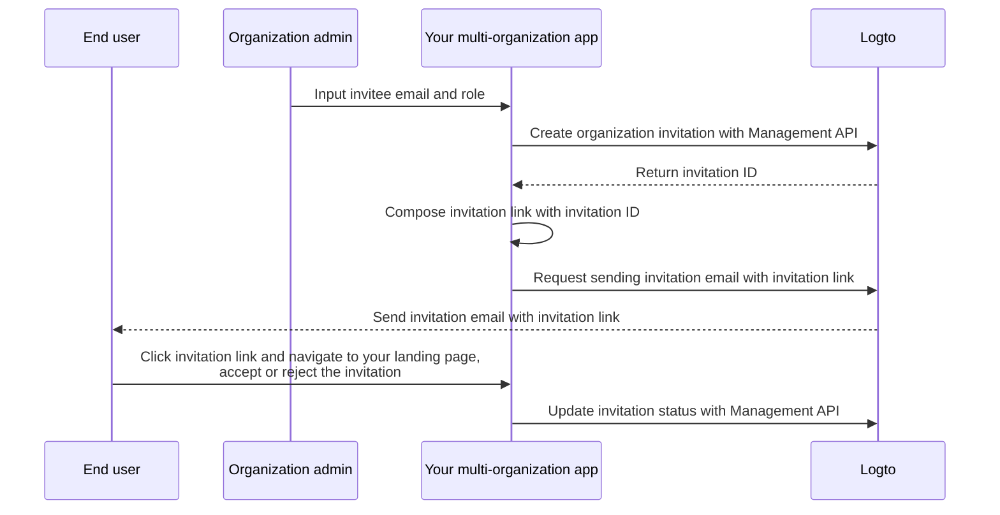

# Invite organization members

In multi‑organization applications, a common requirement is inviting members to an organization. This guide walks through the steps and technical details to implement this feature.

## Flow overview \{#flow-overview}

The overall process is illustrated in the diagram below:



## Create organization roles \{#create-organization-roles}

Before inviting members, create organization roles. See the [organization template](/authorization/organization-template) to learn more about roles and permissions.

In this guide, let's still create two typical organization roles: `admin` and `member`.

The `admin` role has full access to all resources in the organization, while the `member` role has limited access. For example:

- `admin` role:
  - `read:data` - Read access to all organization data resources.
  - `write:data` - Write access to all organization data resources.
  - `delete:data` - Delete access to all organization data resources.
  - `invite:member` - Invite members to the organization.
  - `manage:member` - Manage members in the organization.
  - `delete:member` - Remove members from the organization.
- `member` role:
  - `read:data` - Read access to all organization data resources.
  - `write:data` - Write access to all organization data resources.
  - `invite:member` - Invite members to the organization.

This can be done easily in the [Logto Console](https://cloud.logto.io/). You can also use the [Logto Management API](https://openapi.logto.io/operation/operation-createorganizationrole) to create organization roles programmatically.

## Configure your email connector \{#configure-your-email-connector}

Since invitations are sent via email, ensure your [email connector](/connectors/email-connectors) is properly configured. To send invitations, configure an [email template](/connectors/email-connectors/email-templates#email-template-types) with usage type `OrganizationInvitation`. You can include organization (e.g., name, logo) and inviter (e.g., email, name) [variables](/connectors/email-connectors/email-templates#email-template-variables) in the content, and customize [localized templates](/connectors/email-connectors/email-templates#email-template-localization) as needed.

A sample email template for the `OrganizationInvitation` usage type is shown below:

```json
{
  "subject": "Welcome to my organization",
  "content": "<p>Join {{organization.name}} by this <a href=\"{{link}}\" target=\"_blank\">link</a>.</p>",
  "usageType": "OrganizationInvitation",
  "type": "text/html"
}
```

The `{{link}}` placeholder in the email content will be replaced with the actual invitation link when the email is sent.

:::note

Logto Cloud’s built‑in “Logto email service” doesn’t currently support the `OrganizationInvitation` usage type. Configure your own email connector (e.g., SendGrid) and set up the `OrganizationInvitation` template instead.

:::

## Handle invitations with Logto Management API \{#handle-invitations-with-logto-management-api}

:::note

If you haven’t set up the Logto Management API yet, see [Interact with Management API](/integrate-logto/interact-with-management-api) for details.

:::

### Create an organization invitation with Logto Management API

There’s a set of invitation‑related Management APIs in the organizations feature. With these APIs, you can:

- `POST /api/organization-invitations`: Create an organization invitation with an assigned organization role.
- `POST /api/one-time-tokens`: Create a one‑time token for the invitee to authenticate when they accept the invitation. [Learn more](/end-user-flows/one-time-token)
- `POST /api/organization-invitations/{id}/message`: Send the organization invitation to the invitee via email.
  Note: The payload supports a `link` property so you can compose your own invitation link based on the invitation ID. For example:

  ```json
  {
    "link": "https://your-app.com/invitation/join?id=your-invitation-id&token=your-one-time-token&email=invitee-email"
  }
  ```
