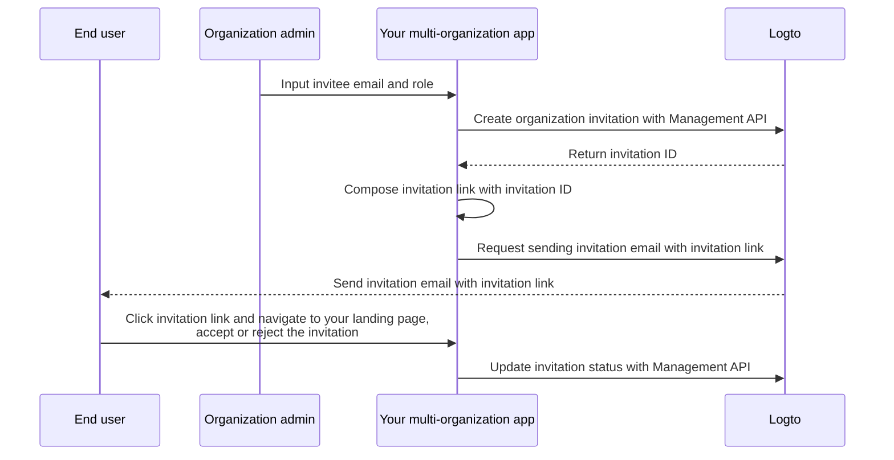

# Invite organization members

As a multi-organization application, one common requirement is to invite members to your organization. In this guide, we will walk you through the steps and technical details to implement this feature in your application.

## Flow overview

The overall process is illustrated in the diagram below:



## Create organization roles

Before inviting members to your organization, you need to create organization roles. Check out the [Configure organization template](/authorization/organization-template/configure-organization-template) guide for detailed instructions.

In this guide, let's create two typical organization roles: `admin` and `member`.

The `admin` role has full access to all resources in the organization, while the `member` role has limited access. For example, each role can have a set of permissions as follows:

- `admin` role:
  - `read:data` - Read access to all organization data resources.
  - `write:data` - Write access to all organization data resources.
  - `delete:data` - Delete access to all organization data resources.
  - `invite:member` - Invite members to the organization.
  - `manage:member` - Manage members in the organization.
  - `delete:member` - Remove members from the organization.
- `member` role:
  - `read:data` - Read access to all organization data resources.
  - `write:data` - Write access to all organization data resources.
  - `invite:member` - Invite members to the organization.

This can be done easily in the [Logto Console](https://cloud.logto.io/). You can also use the [Logto Management API](https://openapi.logto.io/operation/operation-createorganizationrole) to create organization roles programmatically.

## Configure your email connector

Since invitations are sent via email, ensure your [email connector](/connectors/email-connectors) is properly configured. To send invitations, you need to configure a newly introduced [email template](/connectors/email-connectors/email-templates#email-template-types) usage type - `OrganizationInvitation`.

A sample email template for the `OrganizationInvitation` usage type is shown below:

```json
{
  "subject": "Welcome to my organization",
  "content": "<p>Join my organization by this <a href=\"{{link}}\" target=\"_blank\">link</a>.</p>",
  "usageType": "OrganizationInvitation",
  "type": "text/html"
}
```

The `{{link}}` placeholder in the email content will be replaced with the actual invitation link when sending the email. In this guide, let's say it would be `https://your-app.com/invitation/accept/{your-invitation-id}`.

:::note

Logto Cloud's built-in "Logto email service" does not support the `OrganizationInvitation` usage type at the moment. Instead, you need to configure your email connector (e.g. Sendgrid) and set up the `OrganizationInvitation` template.

:::

## Handle invitations with Logto Management API

:::note

If you haven't set up the Logto Management API yet, check out [Interact with Management API](/integrate-logto/interact-with-management-api) for details.

:::

We've provided a set of invitation-related Management APIs in the organizations feature. With these APIs, you can:

- `POST /api/organization-invitations` create an organization invitation with an assigned organization role.
- `POST /api/organization-invitations/{id}/message` send the organization invitation to invitee via email.
  Note: This API payload supports a `link` property, you can compose your invitation link based on the invitation ID. For example:
  ```json
  {
    "link": "https://your-app.com/invitation/accept/{your-invitation-id}"
  }
  ```
  Accordingly, you need to implement a landing page when your invitee navigates through the invitation link to your application.
- `GET /api/organization-invitations` & `GET /api/organization-invitations/{id}` get all your invitations or a specific one by ID.
  On your landing page, use these APIs to list all invitations or details of an invitation that a user has received.
- `PUT /api/organization-invitations/{id}/status` accept or reject the invitation by updating the invitation status.
  Use this API to handle the user's response to the invitation.

Please be noted that all the APIs listed above requires a valid "organization token". [Check this guide](/authorization/organization-template/protect-organization-resources#step-2-fetch-the-organization-token) to learn how to obtain the organization token.

## Use organization role-based access control (RBAC) to manage user permissions

With the above setups, you can now send invitations via email, and invitees can join the organization with the assigned role.

Users with different organization roles will have different scopes (permissions) in their organization tokens. Thus, both your client app and backend services should check these scopes to determine visible features and permitted actions.

## Handle scope updates in organization tokens

:::note

Make sure you have integrated organization with your app. Check out the [integration guide](/authorization/organization-template/protect-organization-resources) for more details.

:::

Managing scope updates in organization tokens involves:

### Revoking existing scopes

For instance, demoting an admin to a non-admin member should remove scopes from the user. In such case, you can simply clear the cached organization token and fetch a new one with refresh token. The shrunk scopes will be reflected immediately in the newly issued organization token.

### Granting new scopes

This can be further divided into two scenarios:

#### Grant new scopes that already defined in your auth system

Similar to revoking scopes, if the newly granted scope is already registered with the auth server, you can simply issue a new organization token, and the new scopes will be reflected immediately.

#### Grant new scopes that are newly introduced your auth system

In this case, you need to trigger a re-login or re-consent process to update the user's organization token. E.g., calling the `signIn` method in Logto SDK.

Learn more about [issuing an organization token](/authorization/organization-template/protect-organization-resources/#fetch-the-organization-token).

### Implement real-time permission check and update organization token

Logto provides Management API to fetch real-time user permissions in the organization.

- `GET /api/organizations/{id}/users/{userId}/scopes` ([API references](https://openapi.logto.io/operation/operation-listorganizationuserscopes))

You can then compare the scopes in the user's organization token with the real-time permissions to determine if the user has been promoted or demoted.

- If demoted, you can simply clear the cached organization token and the SDK will automatically issue a new one with the updated scopes.

  ```ts
  const { clearAccessToken } = useLogto();

  ...
  // If fetched real-time scopes have fewer scopes than the organization token scopes
  await clearAccessToken();
  ```

  This does not require a re-login or re-consent process. New organization tokens will be issued automatically by the Logto SDK.

- If new scope is introduced into your auth system, trigger a re-login or re-consent process to update the user's organization token. Let's take the React SDK for example:

  ```ts
  const { clearAllTokens, signIn } = useLogto();

  ...
  // If fetched real-time scopes have newly assigned scopes than the organization token scopes
  await clearAllTokens();
  signIn({
    redirectUri: '<your-sign-in-redirect-uri>',
    prompt: 'consent',
  });
  ```

  The above code will trigger a page navigation to the consent screen and auto-redirect back to your app, with updated scopes in the user's organization token.
