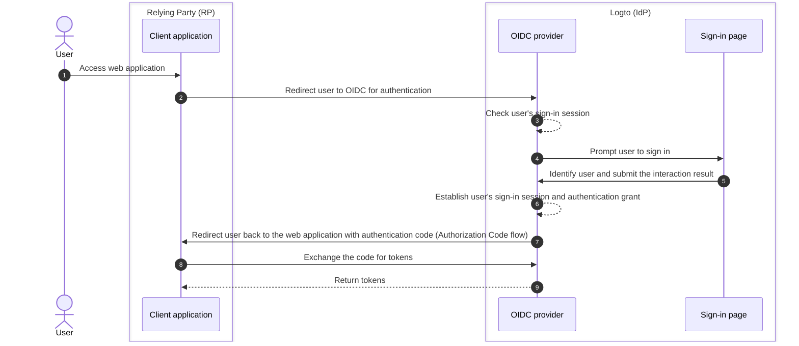

# Sign-out

The sign-out process in Logto (as an OIDC-based identity provider) is a multi-faced concept due to the involvement of both centralized sign-in session managed by Logto and the distributed authentication status managed by the client applications.

## Sign-in session

To better understand the sign-out process, it's important to first understand how user sign-in sessions and their authentication status are managed in Logto.



1. The user accesses the web application (RP).
2. The client application redirects the user to Logto (IdP) for [authentication](https://auth.wiki/authentication).
3. The OIDC provider checks the user's sign-in session status. If no session exists or the session has expired, the user is prompted to sign in.
4. The user interacts with the sign-in page to get authenticated.
5. After successful sign-in, Logto creates a new session for the user and redirects back to the client application with an authorization code.
6. The OIDC provider creates a new sign-in session and authentication grant for the user.
7. The OIDC provider redirects the user back to the client with an authentication code ([Authorization Code flow](https://auth.wiki/authorization-code-flow)).
8. The client receives the authentication code and exchanges it for tokens to access user information.
9. Grant tokens to the client application.

## Components

### Centralized sign-in session managed by Logto

In the above flow, the centralized sign-in session is managed by Logto. The session is created when the user successfully signs in and is destroyed when the user signs out. The session is also destroyed when the user's session expires.

Logto sign-in session is managed using session cookies. The session cookie is set when the user signs in. All the authentication requests are validated against the session cookie. If the session cookie is present and valid the user with be automatically authenticated and directly redirected to the client application with the authorization code. Otherwise, the user will be prompted to sign in.

1. Shared Logto session cookie
   For a user who signs in to multiple client applications from the same user agent (e.g., browser), the user will have a shared session cookie under the Logto domain. This means that the user only needs to sign in once and get automatically authenticated for other client applications.

   ```mermaid
    flowchart TD
    subgraph User [User agent A]
      U[User]

      subgraph Layer1 [Client domain A]
        A[Client Application A]
      end

      subgraph Layer1 [Client domain B]
        B[Client Application B]
      end

      subgraph Layer2 [Logto domain]
          C{{Logto sign-in session?}}
          D[sign-in page]
      end
    end

    U --> |Sign-in| A
    A --> |Redirect to Logto| C
    U --> |Sign-in| B
    B --> |Redirect to Logto| C
    C --> |No| D
    D --> |Create session| C
   ```

2. Isolated Logto session cookie
   For a user who signs in to different client applications from different devices or browsers, the user will have isolated session cookies under the Logto domain. This means that the user needs to sign in for each client application separately.

   ```mermaid
    flowchart TD
    U[User]

    subgraph DeviceA [User agent A]
      subgraph Layer1 [Client domain A]
        A[Client Application A]
      end

      subgraph Layer2 [Logto domain]
          C{{Logto sign-in session?}}
          D[sign-in page]
      end
    end

    subgraph DeviceB [User agent B]
      subgraph Layer3 [Client domain B]
        B[Client Application B]
      end

      subgraph Layer4 [Logto domain]
          E{{Logto sign-in session?}}
          F[sign-in page]
      end
    end

    U --> |Sign-in| A
    A --> |Redirect to Logto| C
    U --> |Sign-in| B
    B --> |Redirect to Logto| E
    C --> |No| D
    E --> |No| F
    D --> |Create session| C
    F --> |Create session| E
   ```

## Distributed authentication status managed by the client applications

Each client application maintains its own authentication status. Whether a Native, SPA, or Web application, all have their own way of managing the user's authentication status.

Upon successful sign-in, the client application may receive an [ID token](https://auth.wiki/id-token) and [access token](https://auth.wiki/access-token). The client application can use the ID token to determine the user's identity and the access token to access the user's resources. The user's authentication status is represented by the access token's expiration time.

- Native and SPA applications:
  Client application need to securely store and manage these tokens in order to maintain the user's authentication status. E.g., store the tokens in local storage or session storage, and clear the tokens when the user signs out.
- Web applications:
  Web apps like those built with frameworks like Next.js often manage their own session for logged-in users alongside the tokens issued by Logto. Once the user signs in, and the web app receives the tokens from Logto, it can store the tokens at the client-side just like SPA applications, or it can store the tokens at the server-side and manage the session using cookies or other mechanisms.

## Sign-out mechanisms

### Clear tokens and local session at the client side

On the client side, a simple sign-out involves clearing the local session and removing tokens (ID token, access token, refresh token) from local storage or session storage. This results in a client-side-only sign-out where the centralized session remains intact. Users sign out in this manner may still be able to access other applications under the same authorization server session until the centralized session expires or is actively destroyed.

### Clear sign-in session at Logto

To explicitly sign out the user and clear the session at Logto, the client application need to redirect the user to the Logto's **end session endpoint**.

E.g. `https://{your-logto-domain}/oidc/session/end`

The **end session endpoint** is a standard OIDC endpoint that allows the client application to notify the authorization server that the user has signed out. The endpoint will clear the centralized sign-in session at Logto.

Once the session is cleared, any subsequent authorization requests will require the user to sign in again.

If a **post-logout redirect URI** is provided, the user will be redirected to the specified URI after the session is cleared. Otherwise, the user will be redirected to the default post-logout page hosted by Logto.

## Federated sign-out: Back-channel logout

For more consistent sign-out management, Logto supports [back-channel logout](https://openid.net/specs/openid-connect-backchannel-1_0-final.html). Back-channel logout is a mechanism that allows Logto to notify all the client applications under the same sign-in session when the user signs out.

This is particularly useful in scenarios where the user signs out from one client application and expects to be signed out from all other client applications under the same Logto sign-in session.

To enable back-channel logout for your client applications, go to the application details page in the Logto dashboard, and register a back-channel logout URI. Logto will send a logout token to all the registered URI when the user initiates a sign-out request from any client application.

If your client application requires the sign-in session to be included in the logout token, turn on the `Is session required` settings in the back-channel logout configuration. A `sid` claim will be included in the logout token to identify the user's sign-in session at Logto.

1. User initiates a sign-out request from one client application.
2. Logto receives the end session request, generates a logout token, and sends the logout token to all registered back-channel logout URIs.
3. Each client application receives the logout token and perform sign-out actions.

Sign-out actions for each client application when receiving the logout token:

- Validate the logout token.
- Clear the local session and remove tokens from local storage or session storage.

## Sign-out methods in Logto SDKs

If you are integrating Logto with your client application using Logto's SDKs:

- For SPA and web applications, the `client.signOut()` method will clear the local token storage and redirect the user to the Logto's end session endpoint. You may specify a **post-logout redirect URI** to redirect the user after the session is cleared.
- For native applications (including hybrid apps like **React Native** and **Flutter**), only the local token storage is cleared. This is because in native application, we use the sessionless webview to handle the sign-in process. No session cookies are stored in the native browser, so there is no need to clear the sign-in session at Logto. Each authentication request is a standalone request that does not carry any session cookies.

:::note
For native applications that does not support sessionless webview or does not recognize the `emphasized` settings(Android app using **React Native** or **Flutter** SDK), you may force the user prompt to sign in again by passing the `prompt=login` parameter in the authorization request.
:::

## FAQs

<details>
  <summary> I'm not receiving the back-channel logout notifications.</summary>

- Ensure that the back-channel logout URI is correctly registered in the Logto dashboard.
- Ensure that your client application has an valid active sign-in session and is the same session as the one that initiated the sign-out request.

</details>

## Related resources

<Url href="https://blog.logto.io/oidc-back-channel-logout/">
  Understanding OIDC back-channel logout.
</Url>
