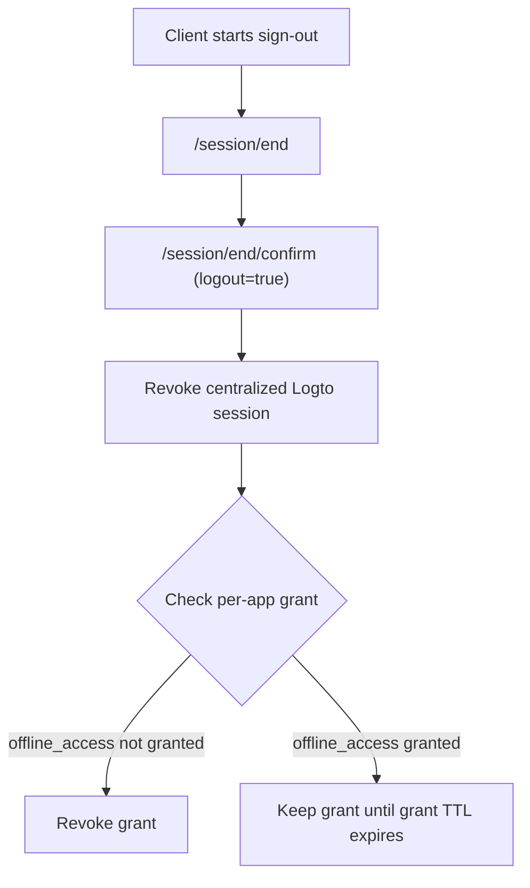

# Sign-out

Sign-out in Logto involves two layers:

- **Logto session sign-out**: Ends the centralized sign-in session under the Logto domain.
- **App sign-out**: Clears local session state and tokens in your client application.

To better understand how sessions work in Logto, see [Sessions](/sessions).

## Sign-out mechanisms \{#sign-out-mechanisms}

### 1) Client-side-only sign-out \{#1-client-side-only-sign-out}

Client app clears its own local session and tokens (ID/access/refresh tokens). This signs user out from that app's local state only.

- Logto session may still be active.
- Other apps under same Logto session may still SSO.

### 2) End-session at Logto (global sign-out in current Logto implementation) \{#2-end-session-at-logto-global-sign-out-in-current-logto-implementation}

To clear centralized Logto session, app redirects user to the end session endpoint, for example:

`https://{your-logto-domain}/oidc/session/end`

In current Logto SDK behavior:

1. `signOut()` redirects to `/session/end`.
2. Then it goes to `/session/end/confirm`.
3. Default confirm form auto-posts `logout=true`.

As a result, current SDK sign-out is treated as **global sign-out**.

:::note

- **Global sign-out**: Revoke the centralized Logto session.

:::

### What happens during global sign-out \{#what-happens-during-global-sign-out}


```mermaid
flowchart TD
  A["Client starts sign-out"] --> B["/session/end"]
  B --> C["/session/end/confirm (logout=true)"]
  C --> D["Revoke centralized Logto session"]
  D --> E{"Check per-app grant"}
  E -->|"offline_access not granted"| F["Revoke grant"]
  E -->|"offline_access granted"| G["Keep grant until grant TTL expires"]
```

During global sign-out:

- The centralized Logto session is revoked.
- Related app grants are handled per app authorization state:
  - If `offline_access` is **not** granted, related grants are revoked.
  - If `offline_access` **is** granted, grants are not revoked by end-session.
- For `offline_access` cases, refresh tokens and grants remain valid until grant expiration.

## Grant lifetime and `offline_access` impact \{#grant-lifetime-and-offline-access-impact}

- Default Logto grant TTL is **180 days**.
- If `offline_access` is granted, end-session does not revoke that app grant by default.
- Refresh token chain associated with that grant can continue until the grant expires (or is explicitly revoked).

## Federated sign-out: back-channel logout \{#federated-sign-out-back-channel-logout}

For cross-app consistency, Logto supports [back-channel logout](https://openid.net/specs/openid-connect-backchannel-1_0-final.html).

When a user signs out from one app, Logto can notify all apps participating in the same session by sending a logout token to each app's registered back-channel logout URI.

If `Is session required` is enabled in app back-channel settings, the logout token includes `sid` to identify the Logto session.

Typical flow:

1. User initiates sign-out from one app.
2. Logto processes end-session and sends logout token(s) to registered back-channel logout URI(s).
3. Each app validates logout token and clears its own local session/tokens.

## Sign-out methods in Logto SDKs \{#sign-out-methods-in-logto-sdks}

- **SPA and web**: `client.signOut()` clears local token storage and redirects to Logto end-session endpoint. You may provide a post-logout redirect URI.
- **Native (including React Native / Flutter)**: usually clears local token storage only. Sessionless webview means no persistent Logto browser cookie to clear.

:::note
For native applications that does not support sessionless webview or does not recognize the `emphasized` settings(Android app using **React Native** or **Flutter** SDK), you may force the user prompt to sign in again by passing the `prompt=login` parameter in the authorization request.
:::

## Enforce re-authentication on every access \{#enforce-re-authentication-on-every-access}

For high-security actions, include `prompt=login` in auth requests to bypass SSO and force credential entry each time.

If requesting `offline_access` (to receive refresh tokens), also include `consent`, `prompt=login consent`.

Typical combined setting:

```txt
prompt=login consent
```

## FAQs \{#faqs}

<details>
  <summary>

### I'm not receiving the back-channel logout notifications. \{#im-not-receiving-the-back-channel-logout-notifications}

</summary>

- Ensure back-channel logout URI is correctly registered in Logto dashboard.
- Ensure your app has an active sign-in state for the same user/session context.

</details>

## Related resources \{#related-resources}

<Url href="https://blog.logto.io/oidc-back-channel-logout/">
  Understanding OIDC back-channel logout.
</Url>
