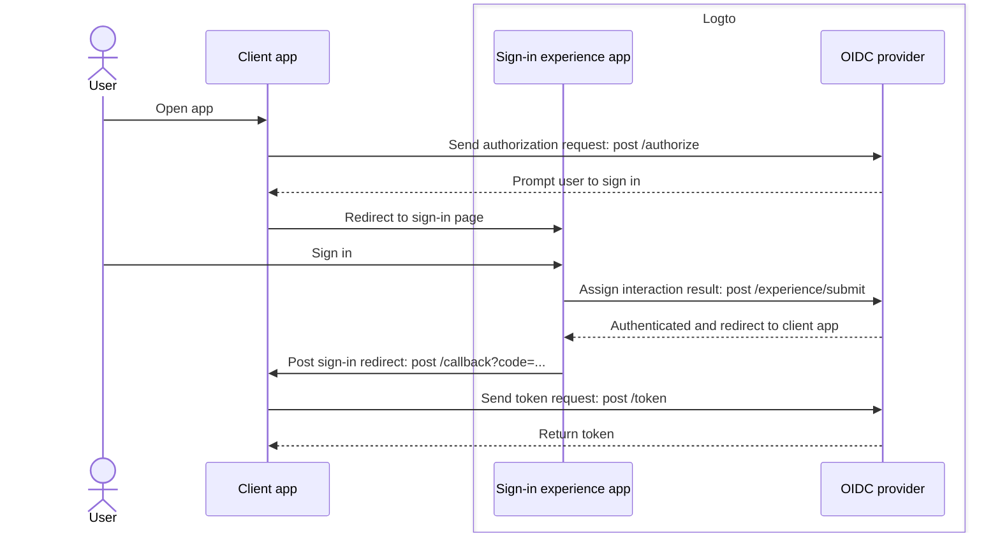
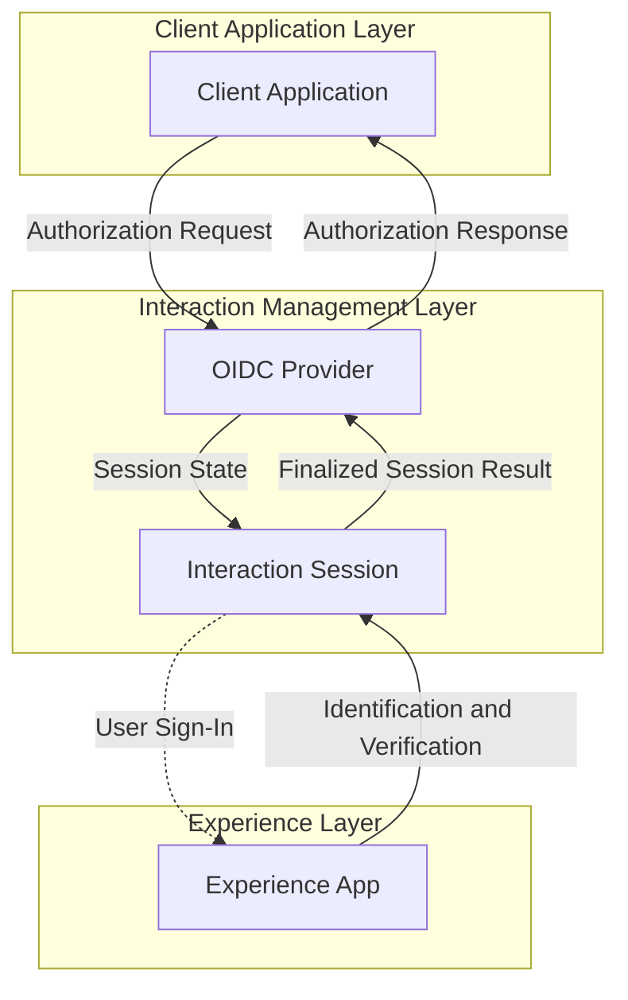

# Sign-up and sign-in

Sign-up and sign-in is the core interaction process for end-users to authenticate and authorize access to client applications. As a centralized OIDC-based [CIAM](https://auth.wiki/iam) platform, Logto provides a universal sign-in experience for users across multiple client applications and platforms.

## User flow

In a typical [OIDC](https://auth.wiki/openid-connect) authentication flow, the user starts by opening the client app. The client app sends out an [authorization request](https://auth.wiki/authorization-request) to Logto OIDC provider. If the user does not have an active session, Logto will prompt the user to the Logto-hosted sign-in experience page. The user interacts with the Logto experience page and gets authenticated by providing the necessary credentials. Once the user is successfully authenticated, Logto will redirect the user back to the client app with the [authorization code](https://auth.wiki/authorization-code-flow#how-does-authorization-code-flow-work). The client app then sends a [token request](https://auth.wiki/token-request) to Logto OIDC provider with the authorization code to get the tokens.

## User interaction

An **interaction session** is created for each user interaction when a client app initiates an authorization request. This session centralizes the user interaction status across multiple client applications, allowing Logto to provide a cohesive sign-in experience. As users switch between client apps, the interaction session remains consistent, maintaining the user's authentication status and reducing the need for repeated sign-ins across platforms. Once the **interaction session** is established, the user is prompted to sign in to Logto.

The **experience app** in Logto is a dedicated, hosted application that facilitates the sign-in experience. When users need to authenticate, they are directed to the **experience app**, where they complete their sign-in and interact with Logto. The **experience app** utilizes the active interaction session to track and support the user's interaction progress.

To support and control this user journey, Logto presents a set of session-based **Experience APIs**. These APIs enable the **experience app** to handle a wide range of user identification and verification methods by updating and accessing the interaction session status in real-time.

Once the user meets all validation and verification requirements, the interaction session concludes with a result submission to the OIDC provider, where the user is fully authenticated and has provided consent, finalizing the secure sign-in process.

## Sign-in experience customization

Logto provides a flexible and customizable user experience for various business requirements. Including custom branding, user interface, and user interaction flows. The **experience app** can be tailored to meet the client application's branding and security requirements.

Continue to learn more about the sign-in experience [setup](/end-user-flows/sign-up-and-sign-in/sign-up) and [customization](/customization) in Logto.

## FAQs

  
Per app sign-in experience method or branding

For applications that require different sign-in experiences or branding, Logto also supports
per-app customization. Check out the [application settings](/customization/match-your-brand/#app-specific-branding) for more details.

  
Limit Email domain / IP address / Region

For attribute-based access control, for example, limiting sign-in based on email domain, IP
address, or region, you can use the [Custom token claims](/developers/custom-token-claims/) feature in Logto to
reject or allow authorization requests based on the user's attributes.

  
Headless API for sign-in and sign-up

Currently, Logto does not provide a headless API for sign-in and sign-up. However, you can bring
your own sign-in UI using the [Bring your own UI](/customization/bring-your-ui/) to customize the sign-in and
sign-up experience.

