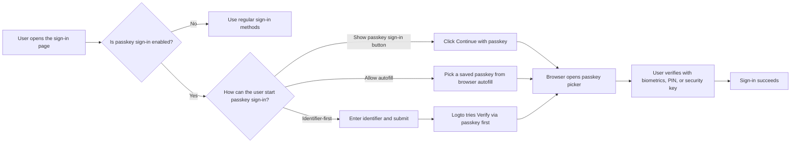
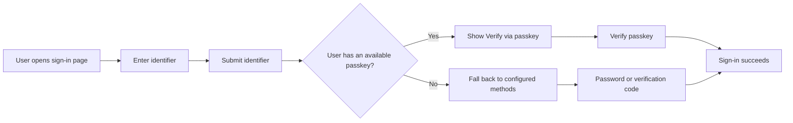
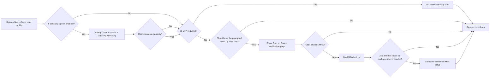

# Passkey sign-in

Passkey sign-in lets users authenticate with a WebAuthn credential directly during sign-in, without entering a password or verification code first. In Logto, the credential used for passkey sign-in is the same WebAuthn credential model used by MFA, so the sign-in and MFA experiences are closely connected.

This document explains how passkey sign-in works in Logto's built-in sign-in experience, what the different entry paths look like for end users, and how it interacts with MFA.

## How passkey sign-in works \{#how-passkey-sign-in-works}

To use passkey sign-in, you first need to enable it in the <CloudLink to="/sign-in-experience/sign-up-and-sign-in">sign-in experience</CloudLink> configuration. After it is enabled, Logto can offer passkey sign-in in up to three ways on the sign-in page:

- A dedicated `Continue with passkey` button on the first sign-in screen.
- An identifier-first flow that tries `Verify via passkey` after the user enters their email, phone number, or username.
- Browser autofill on the identifier input, so the browser can suggest available passkeys directly from the current device.

At a high level, the experience looks like this:

## Three passkey sign-in paths \{#three-passkey-sign-in-paths}

### 1. Show "Continue with passkey" button enabled \{#1-show-continue-with-passkey-button-enabled}

When `Show "Continue with passkey" button` option is enabled, the sign-in page shows a `Continue with passkey` button at the bottom of the first screen.

The user flow is:

1. Open the sign-in page.
2. Click `Continue with passkey`.
3. Select a passkey from the browser or operating system prompt.
4. Complete biometric, PIN, or hardware-key verification.
5. Sign in successfully.

This is the most direct path. It is best for users who already know they have a saved passkey and want a one-step login experience.

### 2. Show "Continue with passkey" button disabled \{#2-show-continue-with-passkey-button-disabled}

When `Show "Continue with passkey" button` option is disabled, Logto switches to an identifier-first experience on the first screen. The page only asks for the user's identifier first.

After the user submits the identifier:

1. Logto checks whether passkey sign-in is enabled and whether the identified user has a usable passkey.
2. If a passkey is available, Logto starts the "Verify via passkey" flow first.
3. The user can complete passkey verification and sign in immediately.
4. If no passkey is available, or the user prefers a different method, Logto falls back to other configured verification methods.

The available fallback methods depend on the current tenant's sign-in experience configuration. For example, the user may switch to password, email verification code, or phone verification code, depending on which factors are enabled for that identifier.

### 3. Allow prompting and autofill \{#3-allow-prompting-and-autofill}

When `Allow prompting and autofill` option is enabled, compatible browsers can show the pre-saved passkeys directly from the identifier input field.

The user flow is:

1. Focus the identifier input on the sign-in page.
2. The browser suggests saved passkeys for the current origin.
3. The user selects a passkey from the autofill list.
4. The browser asks the user to verify with biometrics, PIN, or a hardware key.
5. Sign-in succeeds.

This flow is especially useful on devices where passkeys are already synced by the platform, because users can sign in without manually moving to a second page or tapping a dedicated passkey button.

## Sign-up and passkey binding flow \{#sign-up-and-passkey-binding-flow}

Passkey sign-in is not only a sign-in entry point. It also affects what happens after registration, because the same WebAuthn credential can later be reused for both sign-in and MFA.

After the user completes the regular sign-up steps, Logto can prompt the user to create a passkey. That prompt is optional for end users, but once they create the passkey, the next step depends on the tenant's MFA policy and the user's own MFA status.

The main logic is:

## Relationship between passkey sign-in and MFA \{#relationship-between-passkey-sign-in-and-mfa}

### Passkey sign-in automatically skips MFA verification \{#passkey-sign-in-automatically-skips-mfa-verification}

A passkey used for passkey sign-in is backed by a WebAuthn credential, and that credential is also treated as a WebAuthn MFA factor. Because of that, passkey sign-in and WebAuthn MFA are effectively equivalent from the credential perspective.

That leads to two important behaviors:

- If the user signs in with a passkey, Logto skips the separate MFA verification step.
- If the user had already linked WebAuthn as an MFA factor before passkey sign-in was enabled, that existing credential can be reused as the user's passkey sign-in credential. The user does not need to bind it again.

In other words, a successful passkey sign-in already satisfies the WebAuthn-based identity verification that would otherwise be required during MFA.

### Binding a passkey does not automatically force MFA for user-controlled tenants \{#binding-a-passkey-does-not-automatically-force-mfa-for-user-controlled-tenants}

For users in tenants where MFA is not mandatory, binding a passkey during sign-up or account setup does not automatically turn on MFA for the account.

Instead, after the passkey is created, Logto shows a confirmation page titled "Turn on 2-step verification".

On that page, the user can:

- Click the "Enable 2-step verification" button to explicitly turn on MFA and continue to the next binding steps.
- Skip the prompt and finish the current flow without enabling MFA.

If the user chooses to enable MFA, Logto then continues with the normal MFA setup flow and may ask the user to bind additional factors, depending on the tenant's MFA configuration. For example, if other MFA factors are enabled for the tenant, Logto can continue with binding another factor or backup codes.

### What happens when passkey sign-in is disabled later \{#what-happens-when-passkey-sign-in-is-disabled-later}

If passkey sign-in is turned off later, the previously bound passkey is still a WebAuthn credential. That means it can continue to work as an MFA factor as long as WebAuthn MFA remains available for the tenant.

Disabling passkey sign-in removes the passkey as a direct sign-in entry point, but it does not invalidate the underlying WebAuthn MFA credential.

## Limitations and compatibility \{#limitations-and-compatibility}

- Passkey sign-in is not available for Enterprise SSO users.
- Passkey sign-in depends on browser and platform WebAuthn support.
- "Allow prompting and autofill" only works in browsers and environments that support passkey autofill / conditional UI.
- Passkeys are origin-bound. A passkey registered for one domain cannot be used on another domain.

## Q&A \{#q-a}

  

### Does passkey sign-in still require MFA verification? \{#does-passkey-sign-in-still-require-mfa-verification}

  

No. A successful passkey sign-in already satisfies the WebAuthn-based verification requirement, so Logto skips the separate MFA verification step.

  

### Can a passkey bound for passkey sign-in still be used as an MFA factor after passkey sign-in is disabled? \{#can-a-passkey-bound-for-passkey-sign-in-still-be-used-as-an-mfa-factor-after-passkey-sign-in-is-disabled}

  

Yes. Passkey sign-in and WebAuthn MFA are backed by the same underlying credential model. If passkey sign-in is disabled later, the bound passkey can still be used as a WebAuthn MFA factor.

  

### Can Enterprise SSO users use passkey sign-in? \{#can-enterprise-sso-users-use-passkey-sign-in}

  

No. Enterprise SSO users are not eligible for passkey sign-in.

  

### Does passkey sign-in still require CAPTCHA? \{#does-passkey-sign-in-still-require-captcha}

  

No. Passkey sign-in itself does not require an extra CAPTCHA step. CAPTCHA can still apply to other sign-in actions on the page, such as password or verification-code based submission, but not to the passkey verification flow itself.

