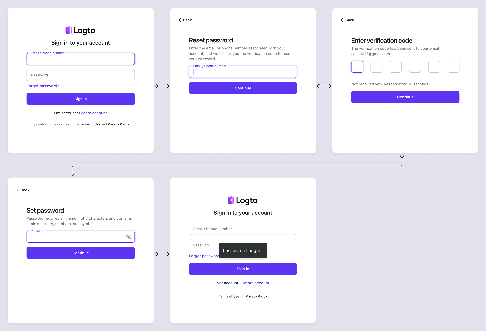

# Reset password

The password recovery feature will be automatically enabled to you when you have a valid [Email connector](/connectors/email-connectors) or [SMS connector](/connectors/sms-connectors) configured. User can reset their password by providing their registered email address or phone number.

## Password reset flow

Once the reset password feature is enabled, a "Forgot password" link button will be displayed under the sign-in form. Users can click the "Forgot password" link to initiate a password reset process.

:::note
Not seeing the "Forgot password" link? Make sure you have a valid **Email** or **SMS** connector configured.
:::

1. **Visit sign-in page**: User visits the sign-in page.
2. **Click on Forgot password link**: User clicks on the "Forgot password" link.
3. **Enter email/phone**: After clicking on the "Forgot password" link, user will be redirected to a new page where they can enter their registered email address or phone number.
4. **Send verification code**: Logto will send a verification code to the user provided email address or phone number and redirect to the code verification page.
5. **Enter verification code**: User enters the verification code received in their email or phone. Logto will verify the code and identity of the user associated with the email address or phone number.
6. **Enter new password**: User will be prompted to enter a new password once the verification code is successfully verified
7. **Successful password reset:** If the provided password meets the password policy requirements, the password will be updated successfully.
8. **Redirect to sign-in page**: User will be redirected to the sign-in page to sign in with the new password

## Update password for authenticate users

For authenticated users, they can update their password by visiting the account settings page. Check the [account settings](/end-user-flows/account-settings/) to learn more about implementing a user account settings page.

## Set up password policy

For new users or users who are updating their password, you can set a password policy to enforce password strength requirements. Visit the <CloudLink to="/sign-in-experience/password-policy"> Console > Sign-in experience > Password policy</CloudLink> to configure the password policy settings.

1. **Minimum password length**: Set the minimum number of characters required for the password. (NIST suggests using at least 8 [characters](https://pages.nist.gov/800-63-3/sp800-63b.html#sec5))
2. **Minimum required character types**: Set the minimum number of character types required for the password. The available character types are:
   1. Uppercase letters: `(A-Z)`
   2. Lowercase letters: `(a-z)`
   3. Numbers: `(0-9)`
   4. Special characters: ``(!"#$%&'()\*+,-./:;<>=?@[]^\_`|{}~ )``
3. **Breach history check**: Enable this setting to reject passwords that have been previously exposed in data breaches. (Powered by [Have I Been Pwned](https://haveibeenpwned.com/Passwords))
4. **Repetition check**: Enable this setting to reject passwords that contain repetitive characters. (e.g., "11111111" or "password123")
5. **User information check**: Enable this setting to reject passwords that contain user information such as username, email address, or phone number.
6. **Custom words**: Provide a list of custom words (case-insensitive) that you want to reject in the password.

## FAQs

  
 How to sign-out a user after a successful password reset?

Subscribe to the `PostResetPassword` [webhook event](/developers/webhooks/webhooks-events#user-interaction-hook-events) to receive a notification when a user successfully resets their password. You can then trigger a [sign-out](/end-user-flows/sign-out) action to invalidate the user's current session and redirect them to the sign-in page.

  
 How to implement the password reset flow on my custom UI?

You can implement your own password reset flow by using the Logto's **Management API** and **Account API**. Checkout [account settings](/end-user-flows/account-settings/) for more details.

  
 How can I send a password reset link to the user's email?

You can create a self-hosted password reset endpoint and utilize the Logto SDK to initiate a sign-in request with [`first_screen`](/end-user-flows/authentication-parameters/first-screen) set to `reset-password`. This will seamlessly redirect the user to the password reset page.

