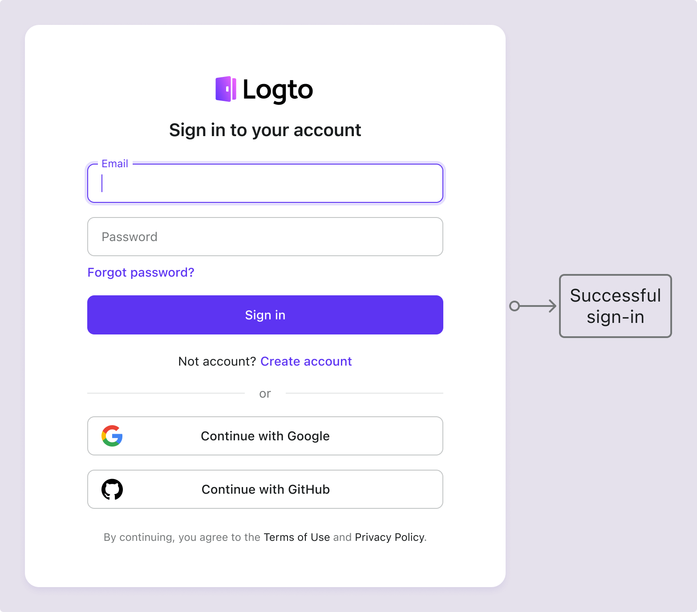
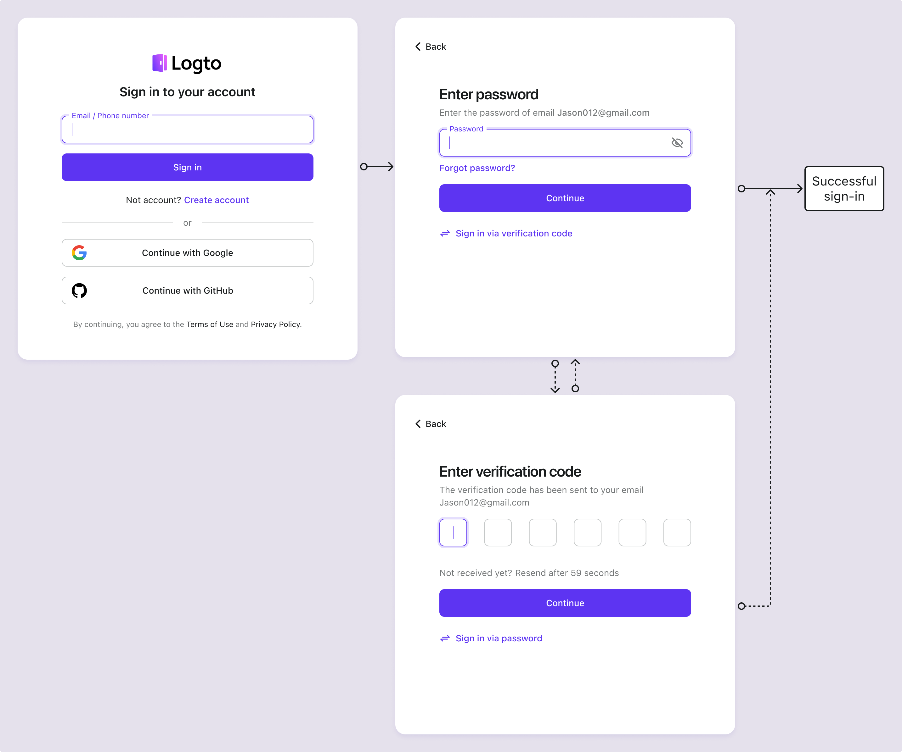
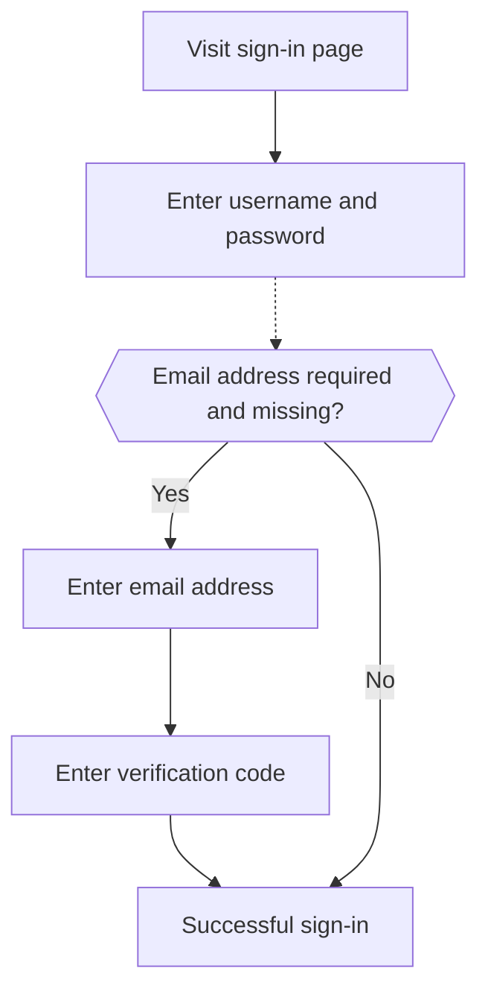

# Email / phone / username sign-in

## Configure the identifier sign-in flow

As previously stated, various identifier types may be collected from users throughout the [sign-up flow](/end-user-flows/sign-up-and-sign-in/sign-up) or [direct account creation in Logto](/user-management/manage-users#add-users). In addition, users may enter and complete additional information as they explore and utilize the product. Those identifiers can be used to uniquely identify users in Logto's system and allow them to be authenticated and sign in to the applications that are integrated with Logto.

Whether you choose to use the pre-build sign-in page hosted by Logto or planing [build your own custom sign-in UI](/customization#custom-ui), you will need to configure the available sign-in methods and verification settings for your end-users.

## Set up the identifier and authentication settings

### 1. Set the supported sign-in identifiers

You can add multiple supported identifiers from the drop-down list as enabled sign-in methods for end users. The available options are:

- **Username**
- **Email address**
- **Phone number**

Reordering the identifiers will change the order in which they are displayed on the sign-in page. The first identifier will be the primary sign-in method for users.

### 2. Set the authentication settings

For each sign-in identifier, you will need to configure at least one effective verification factor to verify the user's identity. There are two factors you can choose from:

- **Password**: Available for all types of sign-in identifiers. Once enabled, users must provide a password to complete the sign-in process.
- **Verification code**: Available for **Email address** and **Phone number** identifiers only. Once enabled, users must enter a verification code sent to their email or phone number to complete the sign-in process.

If both factors are enabled, users can choose either method to complete the sign-in process. You can also reorder the factors to change the order in which they are displayed on the sign-in page. The first factor will be used as the primary verification method for users and the second one will be displayed as an alternative link.

## Identifier sign-in flow user experience

The sign-in experience adapts based on the chosen identifier and available authentication factors.

- **Smart input for multiple identifiers:**
  If more than one identifier sign-in method is enabled, Logto build-in sign-in page will automatically detect the type of identifier entered by the user and display the corresponding verification options. For example, if both **Email address** and **Phone number** are enabled, the sign-in page will automatically detect the type of identifier entered by the user and display the corresponding verification options. It switches to a phone number format with region code if numbers are entered consecutively or an email format when a “@” symbol is used.
- **Enabled verification factors:**
  - **Password only:** Both identifier and password fields will be displayed on the first screen.
  - **Verification code only:** The identifier field appears on the first screen, followed by the verification code field on the second screen.
  - **Password and verification code:** The identifier field is entered initially on the first screen, followed by steps to enter the password or verification code on the second screen based on the verification order. A switch link is provided to allow users to switch between the two verification methods.

### Examples

  
Example 1: Email address with password verification

Add the **Email address** as the sign-in identifier and enable the **Password** factor for verification.

  
Example 2: Email/Phone with password(primary) and verification code (alternative) verification enabled

Add both **Email address** and **Phone number** as the sign-in identifiers.
Enable the **Password** and **Verification code** factors for both identifiers.

## Collect additional user profile on sign-in

In Logto’s sign-in flow, a profile fulfillment process may be triggered if the sign-up identifier settings are updated. This ensures that all users, including existing ones, provide any newly required identifiers.

When a developer adds a new identifier (such as an email address), it becomes mandatory for all users. If a returning user signs in with an existing identifier (like a username), they will be prompted to supply and verify the new identifier if it is missing from their profile. Only after completing this step can they access the application, ensuring a smooth and consistent transition to the updated requirements.

Breaking down the process:

1. **Username** was previously set as the sign-up identifier with **Create your password** setting auto-enabled.
2. **Email address** is later set as the sign-up identifier. The **Email address** identifier is automatically added as an enabled sign-in option.
3. A returning user signs in with their username and password.
4. The user is prompted to provide and verify an email address after their initial sign-in step.

The same process applies to the **Create your password** sign-up settings as well. If the **Create your password** settings in newly enabled in the sign-up flow, the **Password** factor will be automatically enabled for all the sign-in identifiers you choose. All the returning users without a password will be prompted to create one during the sign-in process.

:::note
Note: For a custom sign-in flows, refer to the feature of [Bring your UI](/customization/bring-your-ui/).
:::

## FAQs

  
Self-hosted sign-in experience (embedded sign-in)

Logto does not currently support headless API for sign-in and sign-up. However, you can use our [Bring your UI](/customization/bring-your-ui/) feature to upload your custom sign-in form to Logto. We also support multiple sign-in parameters you can use to pre-fill the sign-in form with user identifier collected from your application or directly sign-in with a third-party social or enterprise SSO provider. Learn more at [Authentication parameters](/end-user-flows/authentication-parameters/).

## Related resources

<Url href="https://www.youtube.com/watch?v=64rBXpWbScc">Email sign-up and sign-in experience</Url>

<Url href="https://www.youtube.com/watch?v=chQxCJX6e6w">
  Username sign-up and sign-in experience
</Url>
