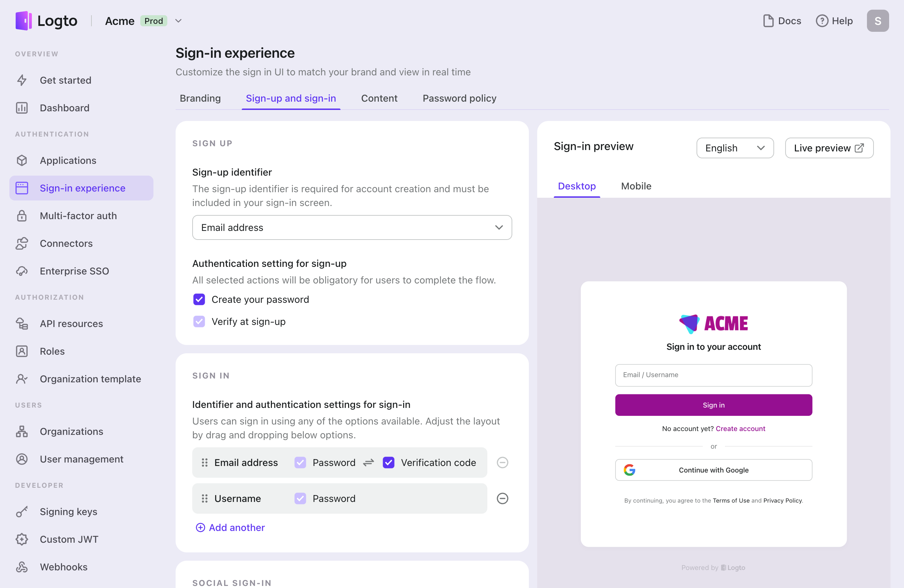
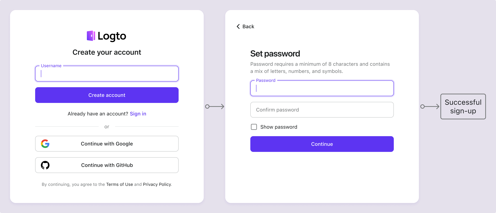
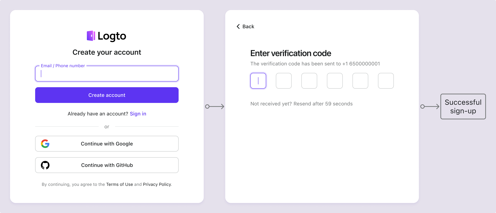
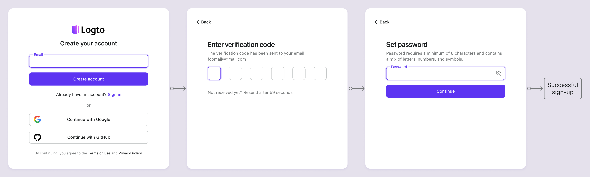

# Email / phone / username sign-up

User registration is the first step for users to engage with your application. Logto supports a variety of sign-up methods, including username password, email or phone number verification, [social sign-up](/end-user-flows/sign-up-and-sign-in/social-sign-in), and [enterprise SSO](/end-user-flows/enterprise-sso). You can set up the sign-up methods that best fit your application's requirements.

Visit <CloudLink to="/sign-in-experience/sign-up-and-sign-in">Console > Sign-in experience > Sign-up and sign-in</CloudLink> to start configuring the identifier sign-up flow.

## Set up the sign-up identifier

To successfully create a new user account in Logto, users must provide an **identifier** that uniquely identifies them within Logto's system. As the first step, set the **identifier** you need to collect from users during the sign-up process. The available options are:

- **Username**: A unique [username](/user-management/user-data#username) the user can use to sign in to the application.
- **Email address**: A valid [email address](/user-management/user-data#primary_email) the user can use to sign in to the application.
- **Phone number**: A valid [phone number](/user-management/user-data#primary_phone) the user can use to sign in to the application.
- **Email address or phone number**: Allow users to sign up with either a valid email address or phone number.
- **Not applicable**: No sign-up identifier is enabled. This applies to the [social](/end-user-flows/sign-up-and-sign-in/social-sign-in)-only or [enterprise SSO](/end-user-flows/enterprise-sso)-only sign-up methods.

All the identifiers collected during the sign-up process must be unique across users under the same tenant. They will be stored in the [user's profile](/user-management/user-data#user-profile) and can be used to sign in to the applications that are integrated with Logto.

## Set up the sign-up verification settings

To ensure the security of the user sign-up and future sign-in process, you also need to configure the verification settings for the identifiers that you collect during the sign-up process. The available settings are:

- **Create your password:** Require users to create a password during sign-up that complies with the password policy configured in your sign-in experience settings. This password, along with the user’s identifier, serves as their credential for signing in to the application. If you set **Username** as the sign-up identifier, this requirement is automatically enabled, as the **Username** can only be used with a password to effectively verify the user's identity. [Password policy](/end-user-flows/sign-up-and-sign-in/reset-password#set-up-password-policy) can be customized to meet your security requirements.
- **Verify at sign-up**: Require users to verify their email address or phone number during sign-up. Currently, Logto only accepts verified emails and phone numbers as identifiers. This setting is automatically enabled when an **Email address** or **Phone number** is used as the sign-up identifier. Users must confirm ownership by entering a verification code sent to their email or phone number during the sign-up process.

| Identifier            | Create user password | Verify at sign-up |
| --------------------- | -------------------- | ----------------- |
| Username              | Required             | N/A               |
| Email address         | Optional             | Required          |
| Phone number          | Optional             | Required          |
| Email or phone number | Optional             | Required          |
| Not applicable        | N/A                  | N/A               |

## Sign-up flow examples

  
Type 1: Username with password creation

Select the **Username** as the sign-up identifier. Create your password is forced to be enabled.

  
Type 2: Email address or phone number with verification flow

Select the **Email address or phone number** as the sign-up identifier. **Verify at sign-up** is forced to be enabled.

  
Type 3: Email address with verification and password creation

Select the **Email address** as the sign-up identifier. **Verify at sign-up** is forced to be enabled. Enable **Create your password** to require users to create a password during sign-up. (Same applies to the phone number sign-up flow)

## Sign up with social or enterprise SSO

In addition to these traditional identifier sign-up methods, Logto also supports passwordless sign-up with social and enterprise SSO identity providers, making the onboarding process more seamless and user-friendly.

Once a [social connector](/connectors/social-connectors) or [enterprise SSO connector](/connectors/enterprise-connectors) is configured and enabled in Logto, users can easily sign up using their existing social or enterprise identity provided by the connector. Social and enterprise SSO sign-up methods allow users to bypass extra steps like creating a password or verifying their email address or phone number. Logto will automatically sync the user's information through their verified social or enterprise identity and store it in the user's profile.

Check the [social sign-in](/end-user-flows/sign-up-and-sign-in/social-sign-in/) and [enterprise SSO](/end-user-flows/enterprise-sso/) sections to learn more about the sign-up flow with social and enterprise SSO connectors.

:::note
Note: For a custom sign-up flows, refer to the feature of [Bring your UI](/customization/bring-your-ui/).
:::

## FAQs

  
Collect additional user information on sign-up

  
To collect additional user profile information (e.g., Full name, Birthday, Company name) during sign-up, you have two options:

- **Self-hosted onboarding flows**: Redirect users to your own onboarding flow after successful sign-up for customizable data collection.
- **Bring your own UI**: Customize your own sign-up flow using our bring your own ui feature with user profile settings API (coming soon).

  
 Admin-created users / Invited users

Learn how to implement the [invite only sign-up flow.](/end-user-flows/sign-up-and-sign-in/disable-user-registration/#implement-an-invitation-only-sign-up-flow)

  
 Embedded sign-up forms on your website

  
Logto dose not currently support headless API for sign-in and sign-up. You can use the [Bring your UI](/customization/bring-your-ui/) feature to upload your own sign-up form to Logto or use the sign-in parameters to populate user information to Logto from your website. Learn more about the user identifier population at [Authentication parameters](/end-user-flows/authentication-parameters/).

  
Sending welcome emails to new users

Subscribe to the `User.Created` webhook event to trigger a welcome email to new users. Learn more about [webhook events](/developers/webhooks/webhooks-events/#data-mutation-hook-events).

  
 Skip email verification on sign-up

Currently, Logto only supports verified emails and phone numbers as identifiers. The verification process is required to ensure the security and ownership of the user's identifier.
Support for unverified emails or phone numbers is on our [roadmap](https://logto.productlane.com/roadmap). Stay tuned for updates!

## Related resources

<Url href="https://www.youtube.com/watch?v=64rBXpWbScc">Email sign-up and sign-in experience</Url>

<Url href="https://www.youtube.com/watch?v=chQxCJX6e6w">
  Username sign-up and sign-in experience
</Url>
