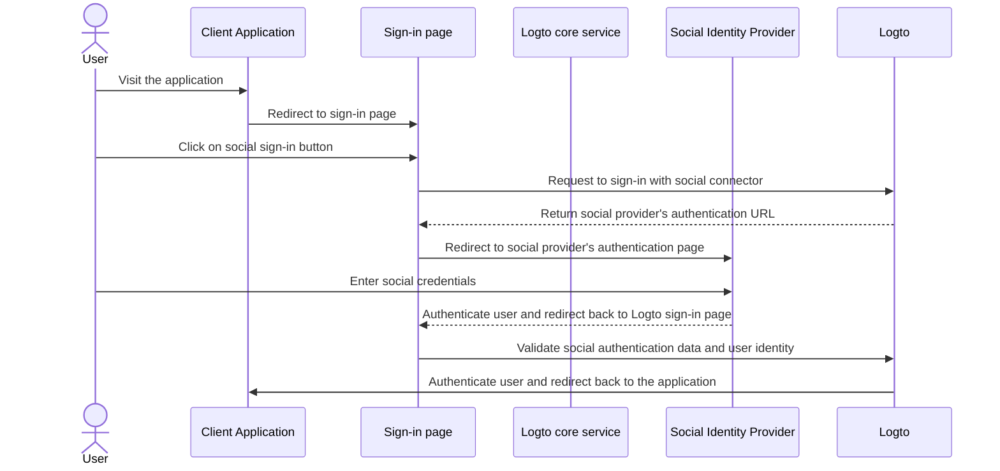
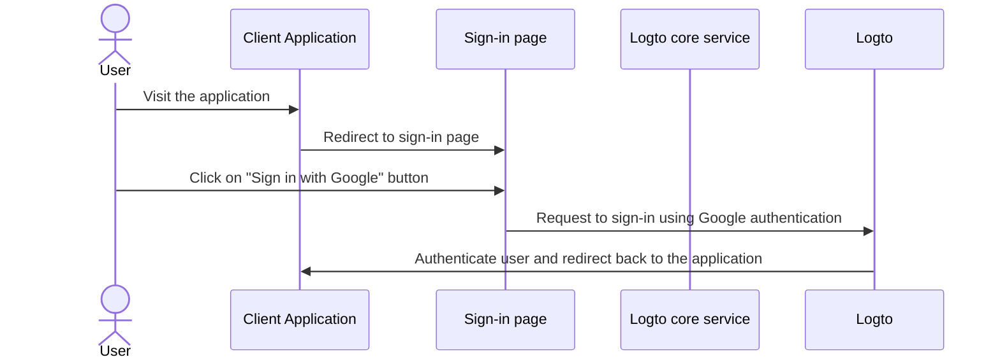
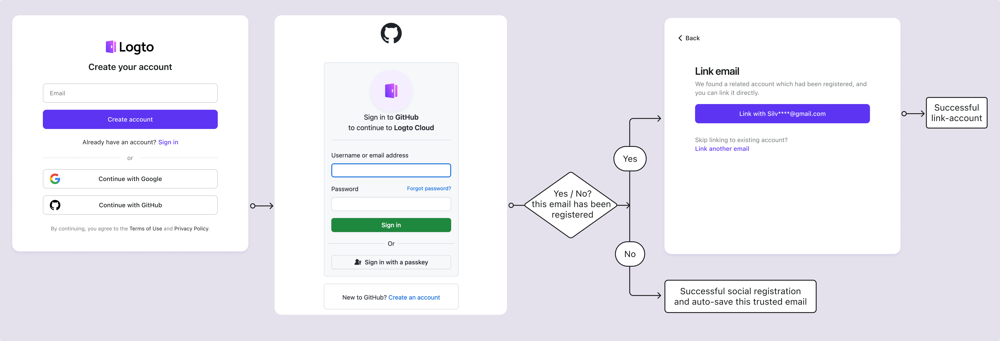

# Social sign-in

Social sign-in is a widely used authentication method that allows users to sign in and sign up using their existing social media accounts, such as Google, Facebook, Twitter, and LinkedIn.

Benefits of social sign-in:

- **Simplified onboarding process**: Social sign-in allows users to sign up or sign in with a single click, without needing to create a new account or remember another password. This reduces friction and boosts user engagement.
- **Increased trust and security**: By leveraging established, trusted platforms like Google or Facebook, users feel more confident in your application.
- **User data enrichment**: Social sign-in enables you to gather additional profile information from the social platform, such as name, email address, profile picture, and more.

## Implement social sign-in

1. **Configure your social connectors**:<br/>
   Navigate to <CloudLink to="/connectors/social">Console > Connectors > Social connectors</CloudLink>. Click on the “Add Social Connector” button and locate the social connector you want to add (e.g. Google, or Github). Refer to our documentation for detailed instructions on adding a [social connector](/connectors/social-connectors/).
2. **Add social login buttons**:<br/>
   By default, your newly added social connector won't be visible on the end-user sign-in page. To add social sign-in buttons to the sign-in page, you need to enable the social connector in the sign-in experience settings.

   Navigate to <CloudLink to="/sign-in-experience/sign-up-and-sign-in">Console > Sign-in experience > Sign-up and sign-in</CloudLink>. Click the “Add social connector” button to integrate social login buttons on your signup and login pages. Use drag and drop to arrange their order on the UI.

3. **Set account linking options**:<br/>
   For new users signing up with [social identities](/user-management/user-data#social-identities), Logto enables linking their social account to an existing email or phone number account within the Logto system. By default, a related [account linking](#account-linking) page is shown to users during social sign-up, allowing them to link their social account to an existing account or create a new one.

   To streamline this process, you can enable the **Automatic account linking** option in the sign-in experience settings. This will automatically link the social account to an existing account if the email or phone number matches.

4. **Save changes**: <br/>
   Review your changes carefully and save them to apply the configuration.

## User experience of social sign-in

With social sign-in, sign-up and sign-in processes in Logto are streamlined for users.



1. **Sign-in with social**: User clicks on the social sign-in button displayed on the sign-in page.
2. **Redirection**: The user is redirected to the social identity provider's authentication page.
3. **Social authentication**: The user enters their social credentials and authenticates with the social provider. If the user is already logged in to the social provider, they may be automatically authenticated. If multiple sign-in sessions are detected, the user may be prompt to choose the correct account (e.g. multiple google account).
   :::note
   Google “prompt” parameters can be set in the Google connector, allowing you to customize the user experience of selecting account and consent screen for Google login.
   :::
4. **Return to Logto**: After successful authentication, the social provider redirects the user back to the Logto sign-in page with the authentication data.
5. **Social identity validation**: Logto validates the social authentication data and user identity. If no user account associated with the social identity exists, a new account will be created.
6. **User authentication**: Logto authenticates the user and redirects them back to the client application to complete the authentication process.

### Google One-tap

Logto also supports the [Google One-tap](https://developers.google.com/identity/gsi/web/guides/features) sign-in method for the Google connector, allowing users to sign in with a single click. This feature further simplifies the sign-in process by removing the need for users to be redirected to the Google authentication page.

To enable Google One-tap sign-in, follow the instructions in the [Google connector](/integrations/google) settings. Once enabled, users will see a "Sign in with Google" popup when user lands on the sign-in page. When they click it, they will be automatically authenticated with their Google account and redirected back to the application.




## Account linking

As mentioned above, Logto allows users to link their social accounts to existing email or phone number accounts within the Logto system. This process is essential for maintaining a unified user account across different authentication methods and identity providers.

- **New account creation**:
  When a user signs in with a [social identity](/user-management/user-data#social-identities) that does not exist in the Logto system, and the email or phone number provided does not match any existing user account, a new account will be created in Logto directly.
- **Existing account linking**:
  If the email or phone number provided by the social identity is already associated with an existing account in Logto, we offer a flexible account linking process.

  - **Automatic account linking:** If the “Automatic account linking” option is enabled in your <CloudLink to="/sign-in-experience/sign-up-and-sign-in">Sign-in experience</CloudLink> settings, Logto will automatically link the social account to the existing account based on a matching email or phone number. Users will not be prompted to link the accounts and will be instantly signed in to their existing account. The social account will be linked, allowing the user to sign in using either method in the future.
  - **Manual account linking**: If the “Automatic account linking“ option is disabled, users will be prompted to link their social account to the existing account during the sign-in process. They can choose to link the accounts or create a new one.

    

    ```mermaid
    flowchart TD
    A[Authenticate with social identity] --> B{{Social identity exists in Logto?}}
    B -- Yes --> C[Signed in with existing account]
    B -- No --> D{{Email/phone match any existing account?}}
    D -- Yes --> E{{Automatic account linking enabled?}}
    E -- Yes --> G[Link social identity to existing account]
    G --> C
    D -- No --> H[Create new account and sign in]
    E -- No --> I{{Link social account?}}
    I -- Yes --> G
    I -- No --> H
    ```

:::note
If a related account is located during the social sign-up process with an email or phone number that matches an existing account, and the user chooses not to link the accounts, the email or phone number will not be synced to the new account in Logto. This ensures that the email and phone number remain unique across all user accounts.

If the email or phone number is a required sign-up identifier, the user will be prompted to provide another email or phone number during the sign-up process. See [Collect additional user profile](#collect-additional-user-profile-data) for more details.
:::

## Collect additional user profile data

During the social sign-up process, depending on the mandatory sign-up identifier (**email address**, **phone number** and **username**) settings you have configured, users may be prompted to provided additional verified information to complete the sign-up or sign-up process after getting authenticated with the social provider.

For example, **Email address** has been set as the sign-up identifier:

1. **Sign-up with social identity which provides a verified email address**

   If a verified email address is provided by the social identity, the user will be automatically signed up with the social identity and the email address will be synced to the user profile

2. **Sign-up with social identity which does not provide a verified email address**

   If the social identity does not provide a verified email address, the user will be prompted to provide an email address during the sign-up process. The user must verify the email address by entering a verification code sent to the provided email address.

   ```mermaid
   flowchart TD
      A[Authenticate with social identity] --> B{{Email address required and missing?}}
      B -- Yes --> C[Enter email address]
      C --> D[Enter verification code]
      D --> E[Successful sign-up]
      B -- No --> E
   ```

3. **Sign-up with social identity which provides a registered email address**

   If the social identity provides an email address that is already registered in the Logto system, the user will be prompted to link the social account to the existing account or create a new account. If the user selects to create a new account, they will be prompted to provide a new email address and verify it.

   ```mermaid
      flowchart TD
       A[Authenticate with social identity] --> B{{Email address match any existing account?}}
       B -- Yes --> C{{Link social account?}}
       C -- Yes --> D[Link social identity to existing account]
       D --> E[Successful sign-in]
       C -- No --> F[Enter new email address]
       F --> G[Enter verification code]
       G --> E
       B -- No --> E
   ```

## FAQs

<details>
  <summary> How to add social login buttons and directly sign in with social on my website?</summary>

Logto allows you to add social login buttons to your website and initiate the social sign-in process directly without showing the default sign-in form. Check out our [Direct sign-in](/end-user-flows/authentication-parameters/direct-sign-in/) guide for detailed instructions.

</details>

<details>
  <summary> Why my emails or phone numbers are not populated after signing up with social?</summary>

In Logto, the email address and phone number can be used as the sign-in identifier to uniquely identify users. Only verified email addresses and phone numbers are accepted as identifiers. If the social identity does not provide the `email_verified` or `phone_number_verified` claim, the email address or phone number will not be synced to the user profile. You can still find them under the social identities data in the user profile.

Support of unverified email or phone number as a user profile will be available soon.

</details>

## Related resources

<Url href="https://www.youtube.com/watch?v=sv60N9eW8Ew">Social sign-in experience</Url>
