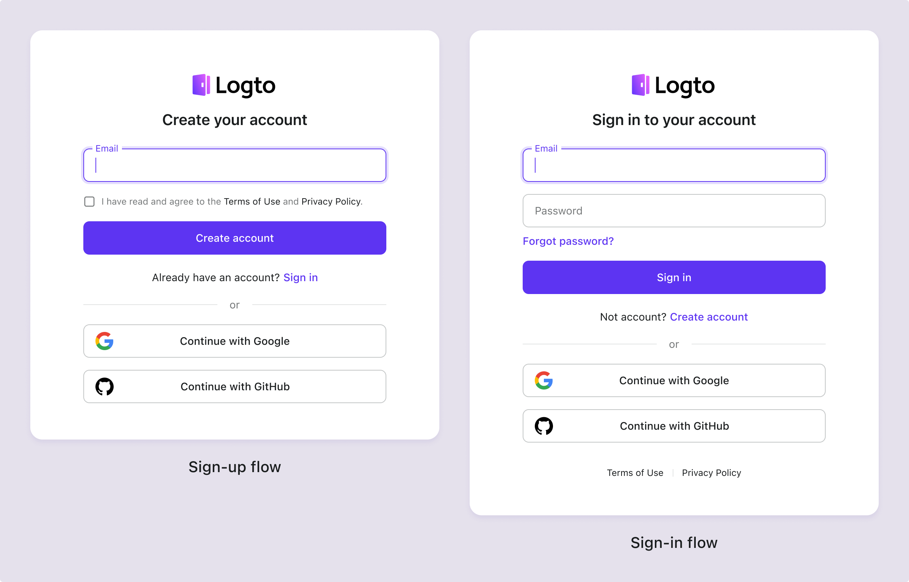

# Terms and privacy

To ensure your product remains open and transparent, add links to your Terms of Use and Privacy Policy on the sign-in and sign-up pages. This allows you to meet compliance requirements specific to your industry.

## Configure terms & privacy

1. Navigate to <CloudLink to="/sign-in-experience/content">Console > Sign-in experience > Content</CloudLink>.
2. Add the external links for your “Terms of use” and “Privacy policy”.
3. Set the policy for “Agree to terms” based on your compliance needs for specific regions or industries.

:::note
If the value is empty, you do not need to manage terms and privacy agreements within Logto's sign-in flows. You can address these after the user has signed into your application.
:::

## User experience for agreeing to terms

Logto provides multiple pre-build flows to handle the user experience for agreeing to terms based on your different compliance requirements:

### Option 1: Agree to terms automatically on continue sign-in/sign-up

This policy provides the smoothest user experience by automatically agreeing to the terms when the user continues with the sign-in or sign-up process.
User will not be prompted to agree to the terms explicitly.

### Opetion 2: Agree to terms on sign-up only

This policy requires new users to manually agree to the **Terms and Privacy Policies**. Under the EU’s [GDPR](https://gdpr-info.eu/art-4-gdpr/) and California’s [CCPA](https://oag.ca.gov/privacy/ccpa), businesses must obtain informed consent from users before collecting personal information.

When users first use social registration (e.g., Google or GitHub), a pop-up will prompt them to consent to the **Terms and Privacy Policies** after being redirected to Logto. This consent is not required for subsequent social logins.

### Option 3: Agree to terms on sign-in and sign-up

This policy requires users to agree to the **Terms and Privacy Policies** whenever they sign in or sign up. This policy is suitable for applications that require users to agree to the terms every time they sign in. Users must check the box to agree to the terms before proceeding. This approach is in compliance with the Chinese PIPL and Brazil's LGPD.

