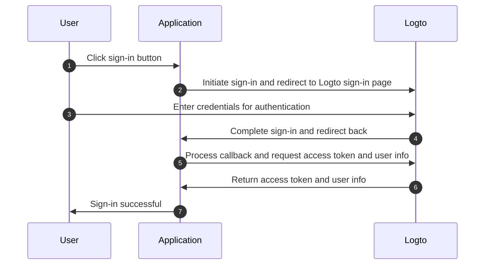
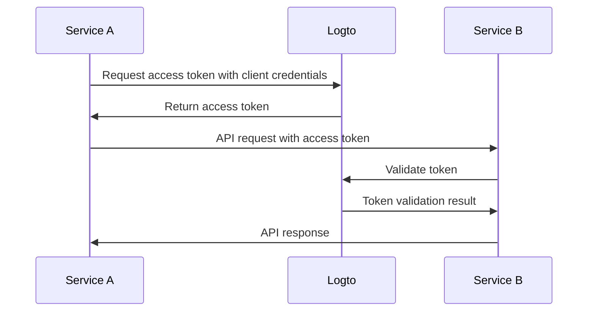

# Understand authentication flow

Logto is built on [OAuth 2.0](https://auth.wiki/oauth-2.0) and [OpenID Connect (OIDC)](https://auth.wiki/openid-connect) standards. Understanding these authentication standards will make the integration process smoother and more straightforward.

### User authentication flow

Here's what happens when a user signs in with Logto:

In this flow, several key concepts are essential for the integration process:

- `Application`: This represents your app in Logto. You'll create an application configuration in the Logto Console to establish a connection between your actual application and Logto services. Learn more about [Application](/integrate-logto/application-data-structure/#introduction).
- `Redirect URI`: After users complete authentication on the Logto sign-in page, Logto redirects them back to your application through this URI. You'll need to configure the Redirect URI in your Application settings. For more details, see [Redirect URIs](/integrate-logto/application-data-structure/#redirect-uris).
- `Handle sign-in callback`: When Logto redirects users back to your application, your app needs to process the authentication data and request access tokens and user information. Don't worry - the Logto SDK handles this automatically.

This overview covers the essentials for quick integration. For a deeper understanding, check out our [Sign-in experience explained](/concepts/sign-in-experience/) guide.

### Machine-to-machine authentication flow

Logto provides [machine-to-machine (M2M) application](/quick-starts/m2m) type to enable direct authentication between services, based on [OAuth 2.0 Client Credentials flow](https://auth.wiki/client-credentials-flow):

This machine-to-machine (M2M) authentication flow is designed for applications that need to directly communicate with resources without user interaction (thus no UI), such as an API service updating user data in Logto or a statistics service pulling daily orders.

In this flow, services authenticate using client credentials - a combination of [Application ID](/integrate-logto/application-data-structure/#application-id) and [Application Secret](/integrate-logto/application-data-structure/#application-secret) that uniquely identifies and authenticates the service. These credentials serve as the service's identity when requesting [access tokens](https://auth.wiki/access-token) from Logto.
