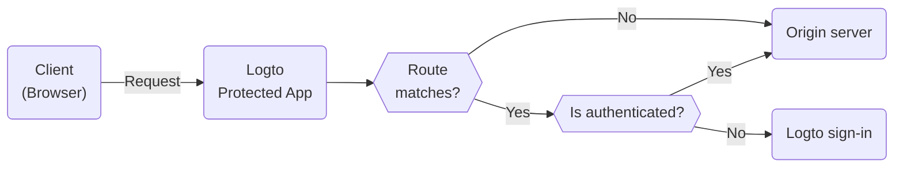

# Protected App

The Protected App is designed to eliminate the complexity of [SDK integrations](/quick-starts) by separating the [authentication](https://auth.wiki/authentication) layer from your application. We handle the authentication, allowing you to focus on your core functionality. Once a user is authenticated, the Protected App serves the content from your server.

## How Protected App works

The Protected App, powered by Cloudflare, operates globally on edge networks, ensuring low latency and high availability for your application.

The Protected App maintains session state and user information. If a user is not authenticated, the Protected App redirects them to the sign-in page. Once authenticated, the Protected App wraps the user's request with authentication and user information, then forwards it to the origin server.

This process is visualized in the following flowchart:



## Protect your origin server

The origin server, which could be either a physical or virtual device not owned by Logto's Protected App, is where your application content resides. Similar to a Content Delivery Network (CDN) server, the Protected App manages authentication processes and retrieves content from your origin server. Therefore, if users gain direct access to your origin server, they can bypass the authentication and your application is no longer protected.

So it is important to secure origin connections, it prevents attackers from discovering and access your origin server without authentication. There are several ways to do this:

1. HTTP Header Validation
2. JSON Web Tokens (JWT) Validation

### HTTP Header Validation

Securing your origin server can be achieved using [HTTP Basic Authentication](https://developer.mozilla.org/en-US/docs/Web/HTTP/Authentication#basic_authentication_scheme) to secure your origin server.

Each request from the Protected App includes the following header:

```
Authorization: Basic base64(appId:appSecret)
```

By validating this header, you can confirm the request comes from the Protected App and deny any requests that do not include this header.

If you're using Nginx or Apache, you can refer to the following guides to implement HTTP Basic Authentication on your origin server:

1. Nginx: [Configuring HTTP Basic Authentication](https://docs.nginx.com/nginx/admin-guide/security-controls/configuring-http-basic-authentication/)
2. Apache: [Authentication and Authorization](https://httpd.apache.org/docs/2.4/howto/auth.html)

To check the headers within your application, refer to the [HTTP Basic Authentication example](https://developers.cloudflare.com/workers/examples/basic-auth/) provided by Cloudflare to learn how to restrict access using the HTTP Basic schema.

### JSON Web Tokens (JWT) Validation

Another way to secure your origin server is by using JSON Web Tokens (JWT).

Each authed request from the Protected App includes the following header:

```
Logto-ID-Token: <JWT>
```

The JWT is called [ID Token](https://auth.wiki/id-token) which is signed by Logto and contains user information. By validating this JWT, you can confirm the request comes from the Protected App and deny any requests that do not include this header.

The token is encrypted and signed as a [JWS](https://auth.wiki/jws) token.

The validation steps:

1. [Validating a JWT](https://datatracker.ietf.org/doc/html/rfc7519#section-7.2)
2. [Validating the JWS signature](https://datatracker.ietf.org/doc/html/rfc7515#section-5.2)
3. The token's issuer is `https://<your-logto-domain>/oidc` (issued by your Logto auth server)

```js
const express = require('express');
const jwksClient = require('jwks-rsa');
const jwt = require('jsonwebtoken');

const ISSUER = 'https://<your-logto-domain>/oidc';
const CERTS_URL = 'https://<your-logto-domain>/oidc/jwks';

const client = jwksClient({
  jwksUri: CERTS_URL,
});

const getKey = (header, callback) => {
  client.getSigningKey(header.kid, function (err, key) {
    callback(err, key?.getPublicKey());
  });
};

const verifyToken = (req, res, next) => {
  const token = req.headers['Logto-ID-Token'];

  // Make sure that the incoming request has our token header
  if (!token) {
    return res
      .status(403)
      .send({ status: false, message: 'missing required Logto-ID-Token header' });
  }

  jwt.verify(token, getKey, { issuer: ISSUER }, (err, decoded) => {
    if (err) {
      return res.status(403).send({ status: false, message: 'invalid id token' });
    }

    req.user = decoded;
    next();
  });
};

const app = express();

app.use(verifyToken);

app.get('/', (req, res) => {
  res.send('Hello World!');
});

app.listen(3000);
```

## Get authentication state and user information

If you need to get authentication and user information for your application, you can also use the `Logto-ID-Token` header.

If you only want to decode the token, you can use the following code:

```js
const express = require('express');

const decodeIdToken = (req, res, next) => {
  const token = req.headers['Logto-ID-Token'];

  if (!token) {
    return res.status(403).send({
      status: false,
      message: 'missing required Logto-ID-Token header',
    });
  }

  const parts = token.split('.');
  if (parts.length !== 3) {
    throw new Error('Invalid ID token');
  }

  const payload = parts[1];
  const decodedPayload = atob(payload.replace(/-/g, '+').replace(/_/g, '/'));
  const claims = JSON.parse(decodedPayload);

  req.user = claims;
  next();
};

const app = express();

app.use(decodeIdToken);

app.get('/', (req, res) => {
  res.json(req.user);
});

app.listen(3000);
```

## Get the original host

If you need to get the original host requested by the client, you can use the `Logto-Host` or `x-forwarded-host` header.

## Customize authentication rules

By default, the Protected App will protect all routes. If you need to customize the authentication rules, you can set the "Custom authentication rules" field in Console.

It supports regular expressions, here are two case scenarios:

1. To only protect routes `/admin` and `/privacy` with authentication: `^/(admin|privacy)/.*`
2. To exclude JPG images from authentication: `^(?!.*\.jpg$).*$`

## Local development

The Protected App is designed to work with your origin server. However, if your origin server is not publicly accessible, you can use a tool like [ngrok](https://ngrok.com/) or [Cloudflare Tunnels](https://developers.cloudflare.com/pages/how-to/preview-with-cloudflare-tunnel/) to expose your local server to the internet.

## Transition to SDK integration

The Protected App is designed to simplify the authentication process. However, if you decide to transition to SDK integration for better control and customization, you can [create a new application](/integrate-logto/integrate-logto-into-your-application) in Logto and configure the [SDK integration](/quick-starts). And for a smooth transition, you can reuse the application configs from the Protected App. The Protected App is actually a "Traditional Web App" in Logto, you can find the "[AppId](/integrate-logto/application-data-structure#application-id)" and "[AppSecret](/integrate-logto/application-data-structure#application-secret)" in the application settings. After the transition is complete, you can remove the Protected App from your application.
