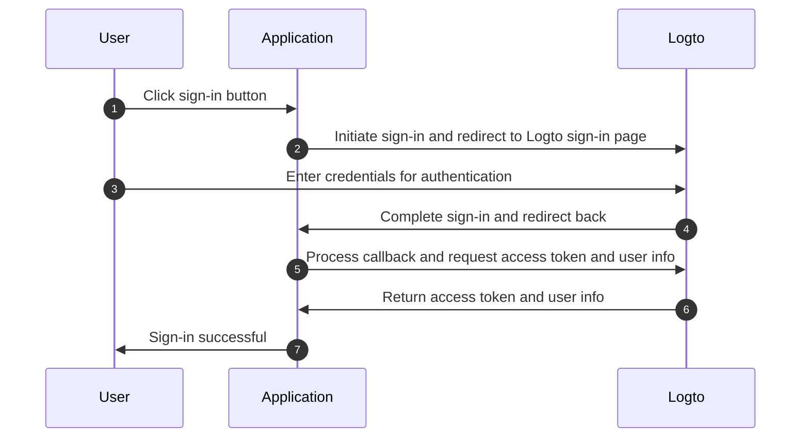
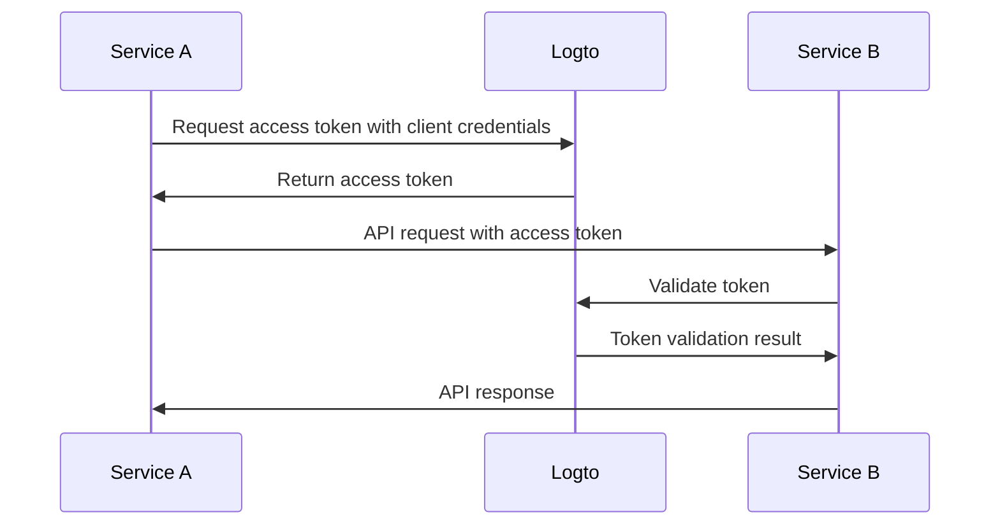

# Quick start

## Understanding Logto authentication flow

Logto is built on OAuth 2.0 and OpenID Connect (OIDC) standards. Understanding these authentication standards will make the integration process smoother and more straightforward.

If you're already familiar with OAuth 2.0 and OIDC standards, feel free to skip this section.

### User authentication flow

Here's what happens when a user signs in with Logto:

In this flow, several key concepts are essential for the integration process:

- `Application`: This represents your app in Logto. You'll create an application configuration in the Logto Console to establish a connection between your actual application and Logto services. Learn more about [Application](/concepts/application-data-structure/#introduction).
- `Redirect URI`: After users complete authentication on the Logto sign-in page, Logto redirects them back to your application through this URI. You'll need to configure the Redirect URI in your Application settings. For more details, see [Redirect URIs](/concepts/application-data-structure/#redirect-uris).
- `Handle sign-in callback`: When Logto redirects users back to your application, your app needs to process the authentication data and request access tokens and user information. Don't worry - the Logto SDK handles this automatically.

This overview covers the essentials for quick integration. For a deeper understanding, check out our [Sign-in experience explained](/concepts/sign-in-experience/) guide.

### Machine-to-machine authentication flow

Logto provides machine-to-machine (M2M) application type to enable direct authentication between services, based on OAuth 2.0 Client Credentials flow:

This machine-to-machine (M2M) authentication flow is designed for applications that need to directly communicate with resources without user interaction (thus no UI), such as an API service updating user data in Logto or a statistics service pulling daily orders.

In this flow, services authenticate using client credentials - a combination of [Application ID](/concepts/application-data-structure/#application-id) and [Application Secret](/concepts/application-data-structure/#application-secret) that uniquely identifies and authenticates the service. These credentials serve as the service's identity when requesting access tokens from Logto.

## Integrate Logto into your application

1. Navigate to <CloudLink to="/applications">Console > Applications</CloudLink>

2. Click "Create application" to add a new application

3. Choose your application framework to begin

:::note
If you can't find your framework, click the "Create app without framework" button in the bottom right of the application creation page to create an app by selecting an [Application type](/concepts/application-data-structure/#application-types).

You can also file a feature request or contribute a SDK by following our [SDK conventions](/developer/sdk-conventions).
:::

4. After selecting your framework, you'll see a quick start guide for the framework's SDK. Follow the steps to configure and integrate your application

:::note
The guide in the console is only for quick start with Logto using our SDK. For complete integration guides, including advanced SDK usage, check out [Quick starts](/quick-starts) section.
:::

5. Once completed, you'll access the details page for additional configuration options

### Integrate with Protected APP (Logto Cloud only)

For Logto Cloud users, you can try out our [Protected APP](/integrate-logto/protected-app), which requires no code integration.

Protected APP simplifies integration by separating the authentication layer from your application - we handle all authentication flows, letting you focus on core feature development.

Once users are authenticated, Protected APP fetches and displays content directly from your server.
