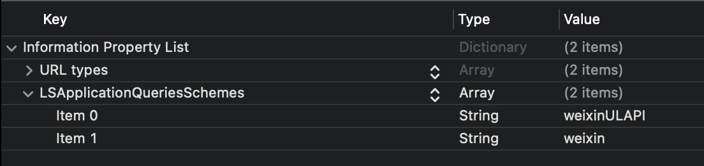

import GuideTip from '../../fragments/_guide-tip.mdx';

<GuideTip />

# WeChat native connector

The official Logto connector for WeChat social sign-in in native apps (iOS and Android).

## Get started

If you don't know the concept of the connector or don't know how to add this connector to your Sign-in experience, please see [Logto tutorial](/connectors/social-connectors).

In native apps, you cannot use the web as a sign-in method of WeChat: navigation to the WeChat app is required, and it also requires using their SDK.

We know it sounds scary, but don't worry. We'll handle it easily in this tutorial.

## Create a mobile app in the WeChat Open Platform

> 💡 **Tip**
>
> You can skip some sections if you have already finished.

### Create an account

Open https://open.weixin.qq.com/, click the "Sign Up" button in the upper-right corner, then finish the sign-up process.

### Create a mobile app

Sign in with the account you just created. In the "Mobile Application" (移动应用) tab, click the big green button "Create a mobile app" (创建移动应用).


Let's fill out the required info in the application form.


#### Basic info

Most of them are pretty straightforward, and we have several tips here:

- If you just want to test WeChat sign-in and the app is not on the App Store, in the "App is available" section, choose "No" to skip the "App download link".
- The "App operation flow chart" looks tricky. From our experience, you need to prepare a simple flowchart and several app screenshots to improve the possibility of passing the review.

Click "Next step" to move on.

#### Platform info

You can configure one or both iOS and Android platforms to integrate Logto with WeChat native sign-in.

**iOS app**

Check "iOS app" (iOS 应用), then check the target device type of your app accordingly.


If you chose "No" for the App Store availability, you cloud skip filling out the "AppStore download address" here.

Fill out _Bundle ID_, _Test version Bundle ID_, and _Universal Links_ (actually, only one link is needed 😂).

> ℹ️ **Note**
>
> _Bundle ID_ and _Test version Bundle ID_ can be the same value.

> 💡 **Tip**
>
> WeChat requires universal link for native sign-in. If you haven't set up or don't know it, please refer to the [Apple official doc](https://developer.apple.com/ios/universal-links/).

**Android app**

Check "Android app" (Android 应用).


Fill out _Application Signing Signature_ (应用签名) and _Application Package Name_ (应用包名).

> ℹ️ **Note**
>
> You need to sign your app to get a signature. Refer to the [Sign your app](https://developer.android.com/studio/publish/app-signing) for more info.

After finish signing, you can execute the `signingReport` task to get the signing signature.

```bash
./gradlew your-android-project:signingReport
```

The `MD5` value of the corresponding build variant's report will be the _Application Signing Signature_ (应用签名), but remember to remove all semicolons from the value and lowercase it.

E.g. `1A:2B:3C:4D` -> `1a2b3c4d`.

#### Waiting for the review result

After completing the platform info, click "Submit Review" to continue. Usually, the review goes fast, which will end within 1-2 days.

We suspect the reviewer is allocated randomly on each submission since the standard is floating. You may get rejected the first time, but don't give up! State your status quo and ask the reviewer how to modify it.

## Enable WeChat native sign-in in your app

### iOS

We assume you have integrated [Logto iOS SDK](/quick-starts/swift) in your app. In this case, things are pretty simple, and you don't even need to read the WeChat SDK doc:

**1. Configure universal link and URL scheme in your Xcode project**

In the Xcode project -> Signing & Capabilities tab, add the "Associated Domains" capability and the universal link you configured before.


Then goes to the "Info" tab, add a [custom URL scheme](https://developer.apple.com/documentation/xcode/defining-a-custom-url-scheme-for-your-app) with the WeChat App ID.


Finally open your `Info.plist`, add `weixinULAPI` and `weixin` under `LSApplicationQueriesSchemes`.



> 🤦 **Note**
>
> We know these actions are not very reasonable, but this is the minimum workable solution we found. See the [magical official guide](https://developers.weixin.qq.com/doc/oplatform/en/Mobile_App/Access_Guide/iOS.html) for more info.

**2. Add `LogtoSocialPluginWechat` to your Xcode project**

Add the framework:


And add `-ObjC` to your Build Settings > Linking > Other Linker Flags:


> ℹ️ **Note**
>
> The plugin includes WeChat Open SDK 1.9.2. You can directly use `import WechatOpenSDK` once imported the plugin.

**3. Add the plugin to your `LogtoClient` init options**

```swift
let logtoClient = LogtoClient(
  useConfig: config,
  socialPlugins: [LogtoSocialPluginWechat()]
)
```

**4. Handle `onOpenURL` properly**

> ℹ️ **Note**
>
> The function `LogtoClient.handle(url:)` will handle all the native connectors you enabled. You only need to call it once.

```swift
// SwiftUI
YourRootView()
  .onOpenURL { url in
      LogtoClient.handle(url: url)
  }

// or AppDelegate
func application(_ app: UIApplication, open url: URL, options: /*...*/) -> Bool {
  LogtoClient.handle(url: url)
}
```

### Android

We assume you have integrated [Logto Android SDK](/quick-starts/android) in your app. In this case, things are pretty simple, and you don't even need to read the WeChat SDK doc:

**1. Add `Wechat Open SDK` to your project**

Ensure the `mavenCentral()` repository is in your Gradle project repositories:

```kotlin
repositories {
  // ...
  mavenCentral()
}
```

Add the Wechat Open SDK to your dependencies:

```kotlin
dependencies {
  // ...
  api("com.tencent.mm.opensdk:wechat-sdk-android:6.8.0")  // kotlin-script
  // or
  api 'com.tencent.mm.opensdk:wechat-sdk-android:6.8.0'   // groovy-script
}
```

**2. Introduce `WXEntryActivity` to your project**

Create a `wxapi` package under your package root and add the `WXEntryActivity` in the `wxapi` package (Take `com.sample.app` as an example):

```kotlin
// WXEntryActivity.kt
package com.sample.app.wxapi

import io.logto.sdk.android.auth.social.wechat.WechatSocialResultActivity

class WXEntryActivity: WechatSocialResultActivity()
```

```java
// WXEntryActivity.java
package com.sample.app.wxapi

import io.logto.sdk.android.auth.social.wechat.WechatSocialResultActivity

public class WXEntryActivity extends WechatSocialResultActivity {}
```

The final position of the `WXEntryActivity` under the project should look like this (Take Kotlin as an example):

```bash
src/main/kotlin/com/sample/app/wxapi/WXEntryActivity.kt
```

**3. Modify the `AndroidManifest.xml`**

Add the following line to your `AndroidManifest.xml`:

```xml
\<?xml version="1.0" encoding="utf-8"?>
\<manifest xmlns:android="http://schemas.android.com/apk/res/android"
  package="com.sample.app">

  \<application>
    \<!-- line to be added -->
    \<activity android:name=".wxapi.WXEntryActivity" android:exported="true"/>
  \</application>

\</manifest>
```

## Test WeChat native connector

That's it. Don't forget to [Enable social connector in sign-in experience](/connectors/social-connectors/#enable-social-sign-in).

Once WeChat native connector is enabled, you can build and run your app to see if it works.

> ⚠️ **Caution**
>
> WeChat doesn't have a plan for those devices without the WeChat app installed. Logto will hide this connector during sign-in if so (which is the recommended way from the [official development guide](https://developers.weixin.qq.com/doc/oplatform/en/Mobile_App/WeChat_Login/Development_Guide.html)).
