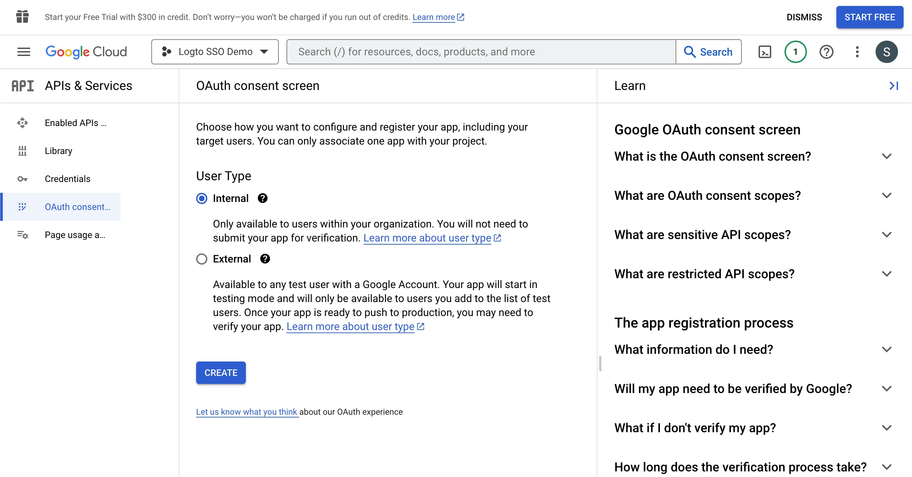

import GuideTip from '../../fragments/_sso_guide_tip.mdx';

# Set up Single Sign-On with Google Workspace

With minimal configuration efforts, this connector allows integration with Microsoft Entra ID for enterprise SSO.

<GuideTip />

## Step 1: Create a new project on Google Cloud Platform \{#step-1-create-a-new-project-on-google-cloud-platform}

Before you can use Google Workspace as an authentication provider, you must set up a project in the [Google API Console](https://console.developers.google.com/) to obtain OAuth 2.0 credentials, If you already have a project, you can skip this step. Otherwise, create a new project under your Google organization.

## Step 2: Config the consent screen for your application \{#step-2-config-the-consent-screen-for-your-application}

In order to create a new OIDC credential, you need to configure the consent screen for your application.

1. Navigate to the [OAuth consent screen](https://console.cloud.google.com/apis/credentials/consent) page and select the `Internal` user type. This will make the OAuth application only available to users within your organization.

2. Fill in the `Consent Screen` settings following the instructions on the page. You need to provide the following minimum information:

- **Application name**: The name of your application. It will be displayed on the consent screen.
- **Support email**: The support email of your application. It will be displayed on the consent screen.

3. Set the `Scopes` for your application. In order to retrieve the user's identity information and email address properly from the IdP, Logto SSO connectors need to grant the following scopes from the IdP:

- **openid**: This scope is required for OIDC authentication. It is used to retrieve the ID token and get access to the userInfo endpoint of the IdP.
- **profile**: This scope is required for accessing the user's basic profile information.
- **email**: This scope is required for accessing the user's email address.

Click the `Save` button to save the consent screen settings.

## Step 3: Create a new OAuth credential \{#step-3-create-a-new-oauth-credential}

Navigate to the [Credentials](https://console.cloud.google.com/apis/credentials) page and click the `Create Credentials` button. Select the `OAuth client ID` option from the dropdown menu to create a new OAuth credential for your application.

Continue setting up the OAuth credential by filling up the following information:

1. Select the `Web application` as the application type.
2. Fill in the `Name` of your client application, `Logto SSO Connector` for example. This will help you to identify the credentials in the future.
3. Fill in the `Authorized redirect URIs` with the Logto callback URI. This is the URI that Google will redirect the user's browser after successful authentication. After a user successfully authenticates with the IdP, the IdP redirects the user's browser back to this designated URI along with an authorization code. Logto will complete the authentication process based on the authorization code received from this URI.
4. Fill in the `Authorized JavaScript origins` with the Logto callback URI's origin. This ensures only your Logto application can send requests to the Google OAuth server.
5. Click the `Create` button to create the OAuth credential.

## Step 4: Set up Logto connector with the client credentials \{#step-4-set-up-logto-connector-with-the-client-credentials}

After successfully creating the OAuth credential, you will receive a prompt modal with the client ID and client secret.

Copy the `Client ID` and `Client secret` and fill in the corresponding fields on Logto’s SSO connector `Connection` tab.

Now you have successfully configured a Google Workspace SSO connector on Logto.

## Step 5: Additional Scopes (Optional) \{#step-5-additional-scopes-optional}

Use the `Scope` field to add additional scopes to your OAuth request. This will allow you to request more information from the Google OAuth server. Please refer to the [Google OAuth Scopes](https://developers.google.com/identity/protocols/oauth2/scopes) documentation for more information.

Regardless of the custom scope settings, Logto will always send the `openid`, `profile`, and `email` scopes to the IdP. This is to ensure that Logto can retrieve the user's identity information and email address properly.

## Step 6: Set email domains and enable the SSO connector \{#step-6-set-email-domains-and-enable-the-sso-connector}

Provide the `email domains` of your organization on Logto’s connector `SSO experience` tab. This will enable the SSO connector as an authentication method for those users.

Users with email addresses in the specified domains will be redirected to use your SSO connector as their only authentication method.

For more information about the Google Workspace SSO connector, please check [Google OpenID Connector](https://developers.google.com/identity/openid-connect/openid-connect).
