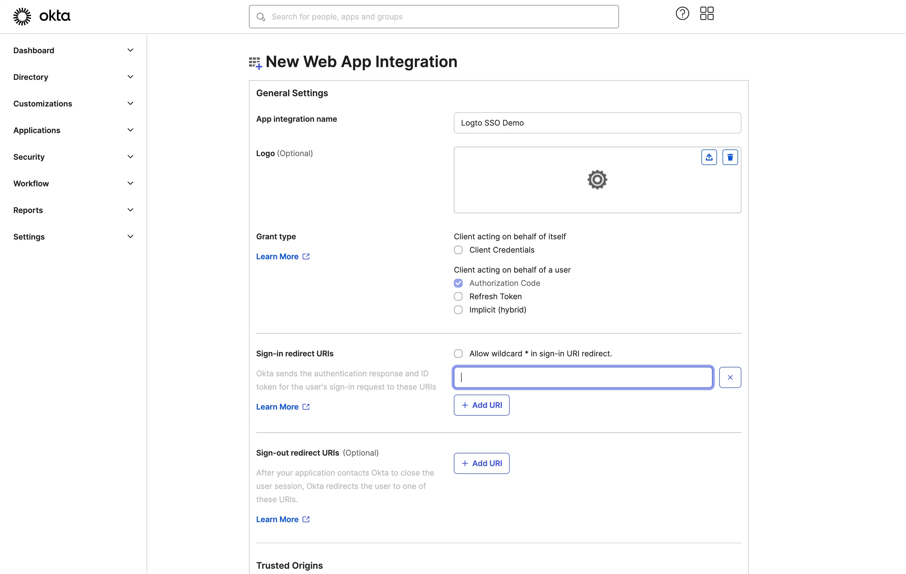

import GuideTip from '../../fragments/_sso_guide_tip.mdx';

# Set up Single Sign-On with Okta

With minimal configuration efforts, this connector allows integration with Okta for enterprise SSO.

<GuideTip />

## Step 1: Create an OIDC application on Okta admin portal \{#step-1-create-an-oidc-application-on-okta-admin-portal}

- Visit the Okta admin portal and sign in as an administrator.
- Navigate to the `Applications`/`Applications` page using the side menu.
- Click the `Create App Integration` button to create a new OIDC application.
- Select the `OIDC - OpenID Connect` option as the `Sign-in method`.
- Select the `Web Application` option as the `Application type`.

Click the `Next` button to continue.

## Step 2: Configure the application settings \{#step-2-configure-the-application-settings}

1. Provide an `App integration name`. It will be used as the identifier of your OIDC application.
2. Add a new `Sign-in redirect URIs` using the Logto SSO connector's callback URL.

This is the URI that the Okta will redirect the user's browser after successful authentication. After a user successfully authenticates with the IdP, the IdP redirects the user's browser back to this designated URI along with an authorization code. Logto will complete the authentication process based on the authorization code received from this URI.

3. Assign users to the application.

Based on the `Assignments` settings, you can choose to assign the application to all users or specific users/groups.

Click the `Save` button to save the application settings.

## Step 3: Set up Logto connector with the client credentials \{#step-3-set-up-logto-connector-with-the-client-credentials}

After successfully creating the OIDC application, you will be redirected to the application details page.

Copy the `client ID` and `client secret` and fill in the corresponding fields on the Logto SSO connector `Connection` tab.

Use your Okta domain as the `issuer`. Example: `https://dev-12345678.okta.com`. Once you have filled in all the fields, click the `Save` button to save the connector settings.

If the `issuer` link you provided is valid, you will see a parsed full list of Okta IdP configurations shown below the `issuer` field.

## Step 4: Additional Scopes (Optional) \{#step-4-additional-scopes-optional}

Use the `Scope` field to add additional scopes to your OAuth request. This will allow you to request more information from the Okta OAuth server. Please refer to the [Okta documentation](https://developer.okta.com/docs/reference/api/oidc/#scopes) for more details about the available scopes.

Regardless of the custom scope settings, Logto will always send the `openid`, `profile`, and `email` scopes to the IdP. This is to ensure that Logto can retrieve the user's identity information and email address properly.

## Step 5: Set email domains and enable the SSO connector \{#step-5-set-email-domains-and-enable-the-sso-connector}

Provide the `email domains` of your organization on Logto’s connector `SSO experience` tab. This will enable the SSO connector as an authentication method for those users.

Users with email addresses in the specified domains will be redirected to use your SSO connector as their only authentication method.

For more details about creating OIDC integration with Okta, please check [Create OIDC App Integrations](https://help.okta.com/oie/en-us/content/topics/apps/apps_app_integration_wizard_oidc.htm).
