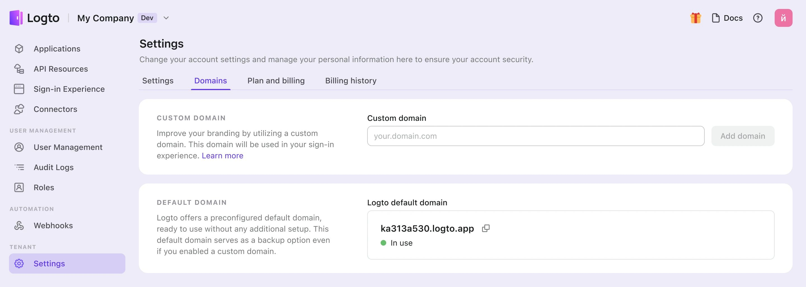
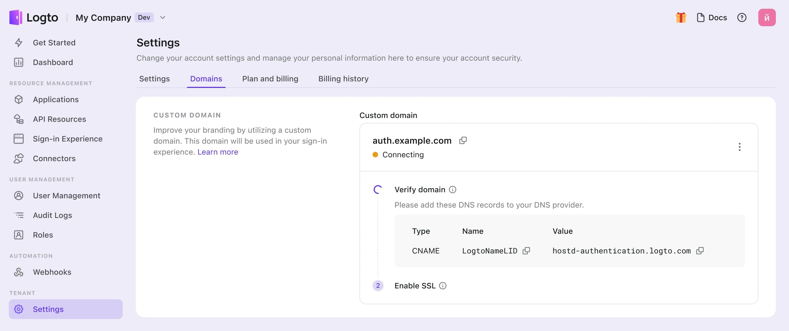

# Custom domain

Your Logto tenant comes with a default free domain `{{tenant-id}}.app.logto`. However, you can elevate your user experience and brand recognition by using a custom domain, like `auth.example.com`.

Your custom domain is used for several functions:

- [Sign-in and registration page](/end-user-flows/sign-up-and-sign-in) URLs
- [Passkey](/end-user-flows/mfa/webauthn) linking URLs (Changing the domain after users have linked Passkeys may block their authentication).
- Callback URIs for [social connectors](/connectors/social-connectors) or [enterprise SSO connectors](/connectors/enterprise-connectors).
- [SDK endpoint](/integrate-logto/application-data-structure#openid-provider-configuration-endpoint) for integrating Logto with your application.

:::note
Changing the domain after publishing your service may cause troubles because your application code and integrations might still reference the old domain. To ensure a smooth transition, **set up your custom domain at the beginning** during a Production tenant creation.
:::

## Configure custom domain in Console

To add a new custom domain in the Logto Console, follow these steps:

1. Navigate to <CloudLink to="/tenant-settings/domains">Console > Settings > Domains</CloudLink>.
2. In "Custom Domain" section, enter your domain name and click "add domain".

   

3. Copy the CNAME value in the table, and go to your domain's DNS provider to add record.

   

4. Wait for the verification and SSL process.
   1. We will auto-verify your records every 10 seconds until the custom domain is added. Just ensure that the entered domain name or DNS Records are accurate.
   2. Verification typically takes a few minutes but can take up to 24 hours, depending on the DNS provider. Feel free to navigate away during the process.

## Troubleshooting

<details>
<summary>SSL certificate issues</summary>

If you encounter SSL certificate issues when setting up your custom domain, it may be related to CAA records in your DNS configuration. CAA records specify which Certificate Authorities (CAs) are authorized to issue certificates for your domain.

To troubleshoot and resolve SSL certificate issues related to CAA records, refer to [Cloudflare's documentation](https://developers.cloudflare.com/ssl/edge-certificates/caa-records/) on CAA Records.

</details>

<details>
<summary>"The hostname is associated with a held zone" Error</summary>

If you encounter the error message "The hostname is associated with a held zone, please contact the owner to have the hold removed" when adding a custom domain, it means that the domain is already in Cloudflare zone, and it is set to "Zone Hold" status. See this [Cloudflare documentation](https://developers.cloudflare.com/fundamentals/setup/account/account-security/zone-holds/) for more information.

To resolve this issue, you'll need to release the zone hold. Follow the above link for instructions on how to release the zone hold in Cloudflare.

</details>

## Use custom domain

Once you've configured your settings, both your custom domain name and the default Logto domain name will be available for your tenant. However, certain configurations are required to activate your custom domain name.

:::note
In this article, we assume that your custom domain is `auth.example.com`.


:::

### Updating the SDK endpoint for applications

Alter your initialization code for the Logto SDK by modifying the domain name of the endpoint.

```typescript
const client = new LogtoClient({
  ...,// other options
  endpoint: 'https://auth.example.com',
});
```

### Modifying auth endpoints for other applications

If you have applications that aren't using the Logto SDK, it's necessary to update their auth endpoints.

You can locate the auth endpoints at the well-known URL:

```
https://auth.example.com/oidc/.well-known/openid-configuration
```

### Updating the social connector's callback URI

The social connector's callback URI will be updated automatically if your users are using the custom domain. You need to go to the social provider's developer console to update the callback URI.

When your users are using the custom domain, the social connector's callback URI will be using the new domain. Therefore, you need to navigate to the social provider's developer console to manually update the callback URI.
