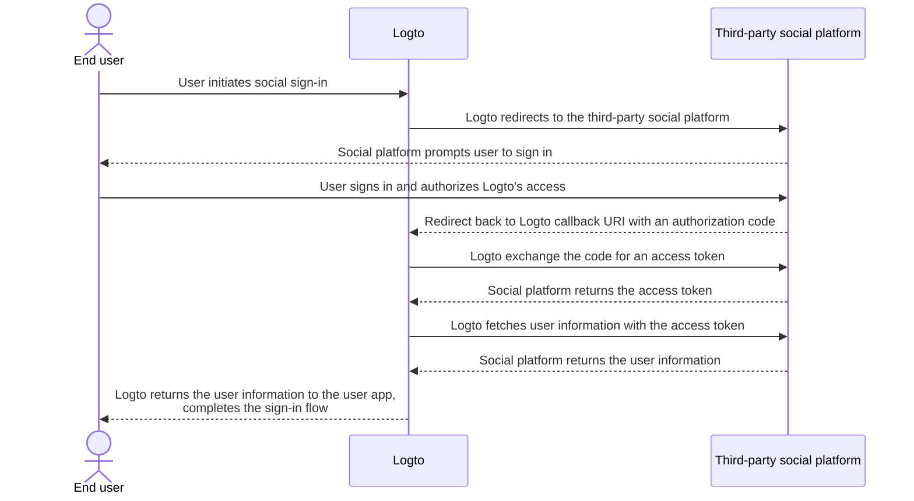

# Implement connectors

After looking at the connector's file structure, let's discuss the implementation and main idea of developing a connector.

We will go through a straightforward example for social and passwordless connectors so that you can build your connector with almost the same idea.

In this part, we are not diving deep into details of specific parameters (such as `config`) since it is not the point of this guide. Developers who implement new connectors should read documents provided by third-party service vendors, and those documents should elaborate on parameters' in details.

## Build a social connector \{#build-a-social-connector}

Let's take GitHub connector as an example.

Most social connectors' authorization flow obeys [OAuth Authorization Code Flow](https://openid.net/specs/openid-connect-basic-1_0.html).

:::note
Majority of the _social connectors_, obtaining a user profile with end-users' authentication follows a two-step scheme (assume that all steps succeeds):

1. Start an authentication request and obtain user's authentication.
2. Fetch `accessToken` by using a connector vendor granted `authCode`.
3. Request for a publicly accessible user profile using `accessToken`.

:::



In order to accomplish the flow, we need to have following three methods:

### getAuthorizationUri \{#getauthorizationuri}

`getAuthorizationUri` generates a redirect URL that can direct end-users to the page need users' authentication.

The interface is defined as `GetAuthorizationUri` in [`@logto/connector-kit`](https://github.com/logto-io/logto/blob/master/packages/toolkit/connector-kit/src/types/social.ts).

You are allowed to store sign-in-related essential information using `setSession` (the second input parameter of `GetAuthorizationUri`) for the sake of `getUserInfo` method.

Listed parameters are required:

- `authorizationEndpoint` can be found in GitHub OAuth doc site, which is the page where end-user should go for authentication
- `config`, which includes `clientId` and `clientSecret` in GitHub scenario
- `state`, a random string to proof CSRF
- `redirectUri` of landing page after end-user's successful authentication

```typescript
const getAuthorizationUri = async ({ state, redirectUri }) => {
  const queryParameters = new URLSearchParams({
    client_id: config.clientId, // `config` contains your GitHub application credential
    redirect_uri: redirectUri,
    state,
  });

  return `${authorizationEndpoint}?${queryParameters.toString()}`;
};
```

### getAccessToken \{#getaccesstoken}

`getAccessToken` gets access token with authorization code issued after end-users successful authentication.

Besides `config` we mentioned in previous `getAuthorizationUri` method, we also want to get:

- authorization `code` from parameters brought to redirect landing page
- `accessTokenEndpoint`, which is the endpoint to get access token with authorization code

```typescript
const getAccessToken = async (config: GithubConfig, code: string) => {
  const { clientId: client_id, clientSecret: client_secret } = config;

  const httpResponse = await got.post({
    url: accessTokenEndpoint,
    json: {
      client_id,
      client_secret,
      code,
    },
    timeout: defaultTimeout,
  });

  const result = accessTokenResponseGuard.safeParse(qs.parse(httpResponse.body));

  if (!result.success) {
    throw new ConnectorError(ConnectorErrorCodes.InvalidResponse, result.error);
  }

  const { access_token: accessToken } = result.data;

  assert(accessToken, new ConnectorError(ConnectorErrorCodes.SocialAuthCodeInvalid));

  return { accessToken };
};
```

### getUserInfo \{#getuserinfo}

`getUserInfo` fetches user information with access token got in previous step.

The interface is defined as `GetUserInfo` in [`@logto/connector-kit`](https://github.com/logto-io/logto/blob/master/packages/toolkit/connector-kit/src/types/social.ts).

For sign-in purposes, you can retrieve necessary information using the `getSession` function.

`userInfoEndpoint` is the endpoint which is used to get user information.

You may check official documents to find specific user information that can be accessed at user info endpoint and corresponding scope.

`id` assigned by the connector's identity provider (in this case, GitHub) is required; other information is optional. If you can get `email` or `phone` from the user profile, MAKE SURE that they are "verified". You also need to align the returning keys with the fields name in [Logto user profile](/user-management/user-data/#basic-data).

```typescript
const getUserInfo = async (
  data: { code: string; config: GithubConfig },
  getSession: GetSession,
  { set: SetStorageValue, get: GetStorageValue }
) => {
  const { code, config } = data;
  const { accessToken } = await getAccessToken(config, code);

  try {
    const httpResponse = await got.get(userInfoEndpoint, {
      headers: {
        authorization: `token ${accessToken}`,
      },
      timeout: defaultTimeout,
    });

    const result = userInfoResponseGuard.safeParse(parseJson(httpResponse.body));

    if (!result.success) {
      throw new ConnectorError(ConnectorErrorCodes.InvalidResponse, result.error);
    }

    const { id, avatar_url: avatar, email, name } = result.data;

    return {
      id: String(id),
      avatar: conditional(avatar),
      email: conditional(email),
      name: conditional(name),
    };
  } catch (error: unknown) {
    if (error instanceof HTTPError) {
      const { statusCode, body: rawBody } = error.response;

      if (statusCode === 401) {
        throw new ConnectorError(ConnectorErrorCodes.SocialAccessTokenInvalid);
      }

      throw new ConnectorError(ConnectorErrorCodes.General, JSON.stringify(rawBody));
    }

    throw error;
  }
};
```

You can find complete implementation [here](https://github.com/logto-io/connectors/blob/master/packages/connector-github/src/index.ts).

For more details on configurable parameters, see GitHub connector README or GitHub official documents.

:::note
The example we've been discussing is based on the OAuth protocol's Authorization Code grant type, which is used in Logto's GitHub connector. However, it's worth highlighting that another grant type, the Implicit grant type, can also be used to retrieve a user's profile, and in fact, provides an access_token directly in the authentication response. Despite this convenience, the Authorization Code grant type is generally recommended over the Implicit type due to its stronger security.

You can also build a connector based on OIDC or some other open protocols, it depends on your use case as well as the compatibility of the social vendor you want to connect to.
:::

## Build a passwordless connector \{#build-a-passwordless-connector}

Let's go through the implementation of Aliyun direct mail connector to get the process of building a passwordless connector.

Passwordless connectors are used to send a random code to end-users' email or phone. As a result, a `sendMessage` method is required.

### sendMessage \{#sendmessage}

In order to send message, we need `config` and `endpoint` to be correctly set up.

- `endpoint` is the endpoint your API calls connect to
- `config` contains `templates` (contents templates for sending passcode in different user flows), `clientId` and `clientSecret` (to access to API requests)

```typescript
const sendMessage = async (data, inputConfig) => {
  const { to, type, payload } = data;
  const config = inputConfig ?? (await getConfig(defaultMetadata.id));
  validateConfig<AliyunDmConfig>(config, aliyunDmConfigGuard);
  const { accessKeyId, accessKeySecret, accountName, fromAlias, templates } = config;
  const template = templates.find((template) => template.usageType === type);

  assert(
    template,
    new ConnectorError(
      ConnectorErrorCodes.TemplateNotFound,
      `Cannot find template for type: ${type}`
    )
  );

  const parameters = {
    AccessKeyId: accessKeyId,
    AccountName: accountName,
    ReplyToAddress: 'false',
    AddressType: '1',
    ToAddress: to,
    FromAlias: fromAlias,
    Subject: template.subject,
    HtmlBody:
      typeof payload.code === 'string'
        ? template.content.replace(/{{code}}/g, payload.code)
        : template.content,
  };

  try {
    const httpResponse = await request(
      endpoint,
      { Action: 'SingleSendMail', ...staticConfigs, ...parameters },
      accessKeySecret
    );

    const result = sendEmailResponseGuard.safeParse(parseJson(httpResponse.body));

    if (!result.success) {
      throw new ConnectorError(ConnectorErrorCodes.InvalidResponse, result.error);
    }

    return result.data;
  } catch (error: unknown) {
    if (error instanceof HTTPError) {
      const {
        response: { body: rawBody },
      } = error;

      assert(typeof rawBody === 'string', new ConnectorError(ConnectorErrorCodes.InvalidResponse));

      errorHandler(rawBody);
    }

    throw error;
  }
};

const request = async (
  url: string,
  parameters: PublicParameters & Record<string, string>,
  accessKeySecret: string
) => {
  const finalParameters: Record<string, string> = {
    ...parameters,
    SignatureNonce: String(Math.random()),
    Timestamp: new Date().toISOString(),
  };
  const signature = getSignature(finalParameters, accessKeySecret, 'POST');

  const payload = new URLSearchParams();

  for (const [key, value] of Object.entries(finalParameters)) {
    payload.append(key, value);
  }
  payload.append('Signature', signature);

  return got.post({
    url,
    headers: {
      'Content-Type': 'application/x-www-form-urlencoded',
    },
    form: payload,
  });
};
```

You can find complete implementation [here](https://github.com/logto-io/connectors/blob/master/packages/connector-aliyun-dm/src/index.ts).

For more details on configurable parameters, see Aliyun direct mail connector README or Aliyun direct mail official documents.

## What's more? \{#whats-more}

To see connector methods' definition and build a picture of connector interface design, see [`@logto/connector-kit`](https://github.com/logto-io/logto/tree/master/packages/toolkit/connector-kit). You can also find _ConnectorMetadata_ reference at "[Connectors - ConnectorMetadata](/connectors/connector-data-structure/#connectors-local-storage-connectormetadata)" and "[Connector file structure](/logto-oss/develop-your-connector/connector-file-structure/)" can help you figure out how to organize your implementation.

- A connector's config [_Zod_](https://github.com/colinhacks/zod) schema is obligatory for all connectors. This is quite important since we do type check before saving `config` to DB and calling APIs which requires `config` information.
- All _SMS connectors_ and _email connectors_ require a `sendMessage` method to call service providers message sending APIs using configs from the database. Developers can also reuse this method to send a testing message with unsaved config while setting connectors up in Admin Console.
- Authorization URL generator `getAuthorizationUri` and user profile retriever `getUserInfo` are required for all _social connectors_ (`getAccessToken` is regarded as an optional step in `getUserInfo`).
- All connectors' methods work through API calls, as a result, connector developers need to check documents and handle possible unsuccessful API call responses.

## Install your own connectors \{#install-your-own-connectors}

We assume that you have already finished building your own connector. Go through following steps to manually install it:

1. Copy the connector folder you implemented to directory `/packages/connectors` of [`logto-io/logto`](https://github.com/logto-io/logto).
2. Install connector repository's dependencies by typing `pnpm pnpm:devPreinstall && pnpm i` at root path of logto folder.
3. Build connector with `pnpm connectors build`.
4. Link local connectors using `pnpm cli connector link`.
5. Restart Logto instance with `pnpm dev` at root directory of `logto-io/logto`, and you can find connectors successfully installed.

You can now test and try out your connector to see whether it works as expected.

If you want to add connectors that have already been published to NPM or Logto official connectors, you may check out [Using Logto CLI - Manage connectors](/logto-oss/using-cli/manage-connectors/#add-connectors).
