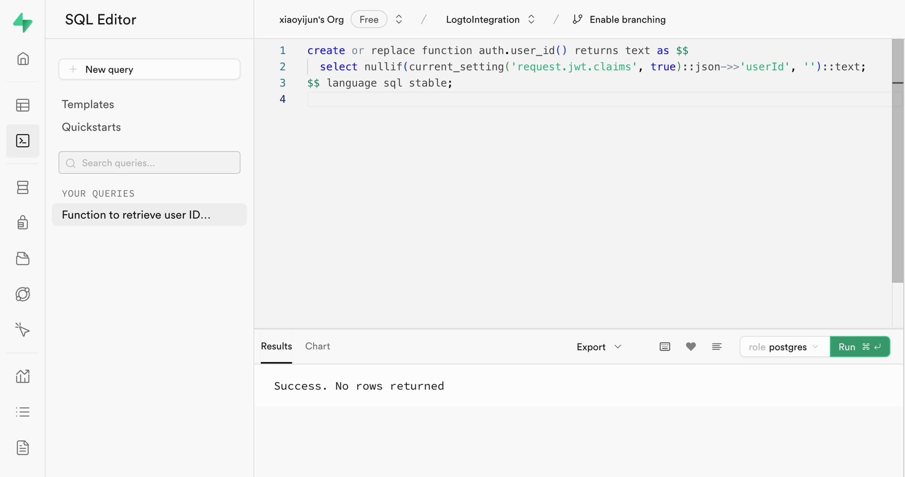
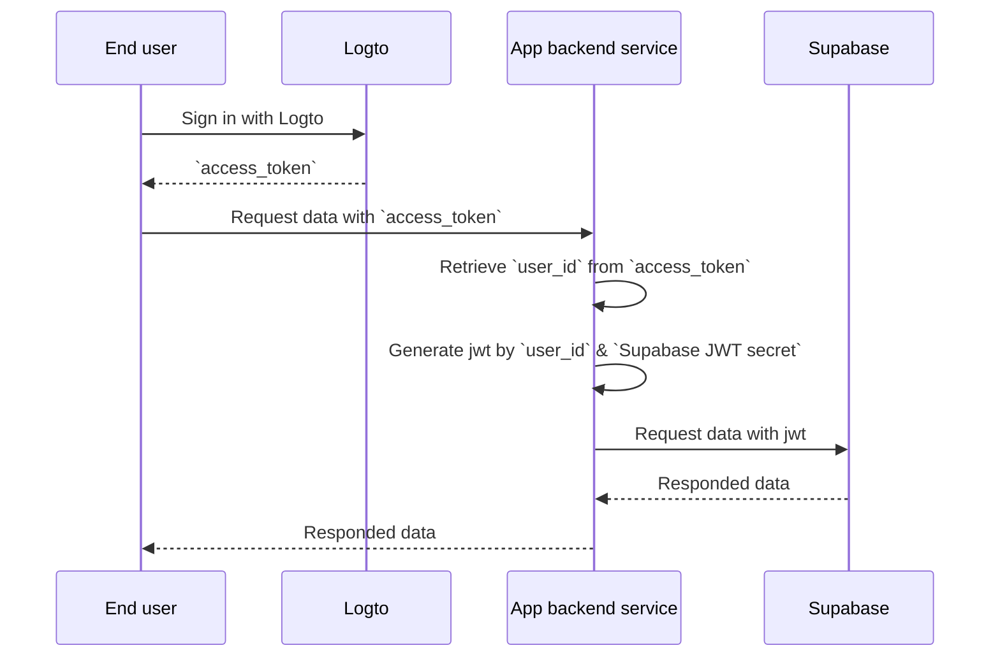

# Add authentication to your Supabase application

## Supabase basics \{#supabase-basics}

Supabase utilizes [Postgres's Row-Level Security](https://www.postgresql.org/docs/current/ddl-rowsecurity.html) to control data access permissions. In simple terms, by creating Row Level Security policies for tables in the database, we can restrict and manage who can read, write, and update data in a table.

Let's assume you have a table named "posts" in your database, with the following content:


The `user_id` field in the table represents the user to whom each post data belongs. You can restrict each user to only access their own post data based on the `user_id` field.

However, before this can be implemented, Supabase needs to be able to identify the current user accessing the database.

### Add user data to the Supabase requests \{#add-user-data-to-the-supabase-requests}

Thanks to Supabase's support for JWT, when our application interacts with Supabase, we can generate a JWT containing user data using the JWT secret provided by Supabase. We then use this JWT as the Authentication header when making requests. Upon receiving the request, Supabase automatically verifies the validity of the JWT and allows access to the data contained within it throughout subsequent processes.

Firstly, we can obtain the JWT secret provided by Supabase from the “Project Settings” in the Supabase dashboard:


Then, when we use the Supabase SDK to make requests to Supabase, we utilize this secret to generate our JWT and attach it as the Authentication header to the request. (Please note that this process occurs within your application's backend service, and the JWT secret should never be exposed to third parties).

```jsx
import { createClient } from '@supabase/supabase-js';
import { sign } from 'jsonwebtoken';

/
 * Note:
 * You can find the SUPABASE_URL, SUPABASE_ANON_KEY in the same place where you find the JWT Secret.
 */
const SUPABASE_URL = process.env.SUPABASE_URL;
const SUPABASE_ANON_KEY = process.env.SUPABASE_ANON_KEY;

const SUPABASE_JWT_SECRET = process.env.SUPABASE_JWT_SECRET;

export const getSupabaseClient = (userId) => {
  const jwtPayload = {
    userId,
  };

  const jwt = sign(jwtPayload, SUPABASE_JWT_SECRET, {
    expiresIn: '1h', // Just for demonstration
  });

  const client = createClient(SUPABASE_URL, SUPABASE_ANON_KEY, {
    global: {
      headers: {
        Authorization: `Bearer ${jwt}`,
      },
    },
  });

  return client;
};
```

Next, navigate to the SQL Editor in the Supabase dashboard and create a function to retrieve the userId carried in the request:



The code used in the image is as follows:

```sql
create or replace function auth.user_id() returns text as $$
  select nullif(current_setting('request.jwt.claims', true)::json->>'userId', '')::text;
$$ language sql stable;
```

As the code shows, in Supabase, you can retrieve the payload of the JWT we generate by calling `request.jwt.claims`. The `userId` field inside the payload is the value we have set.

With this function, Supabase can determine the user who is currently accessing the database.

### Create Row-Level Security policy \{#create-row-level-security-policy}

Next, we can create a Row-Level Security policy to restrict each user to only access their own post data based on the `user_id` field in the posts table.

1. Navigate to the Table Editor page in the Supabase dashboard and select the posts table.
2. Click on "Add RLS Policy" at the top of the table.
3. In the prompted window, click "Create policy".
4. Input a Policy Name and choose the SELECT Policy command.
5. In the `using` block of the code below, enter:

```sql
auth.user_id() = user_id
```


By leveraging such policies, data access control within Supabase is achieved.

In real-world applications, you would create various policies to restrict user actions such as data insertion and modification. However, this is beyond the scope of this article. For more information on Row-Level Security (RLS), please refer to [Secure your data using Postgres Row Level Security](https://supabase.com/docs/guides/database/postgres/row-level-security).

### Basic integration process with Logto \{#basic-integration-process-with-logto}

As mentioned earlier, because Supabase utilizes RLS for its access control, the key to integrating with Logto (or any other authentication service) lies in obtaining the user id of the authorized user and sending it to Supabase. The entire process is illustrated in the diagram below:



Next, we will explain how to integrate Logto with Supabase based on this process diagram.

## Logto integration \{#logto-integration}

Logto offers integration guides for various frameworks and programming languages.

Generally, apps built with these frameworks and languages fall into categories such as Native apps, SPA (single-page apps), traditional web apps, and M2M (machine-to-machine) apps. You can visit the [Logto quick starts](/quick-starts) page to integrate Logto into your application based on the tech stack you are using. Afterward, follow the instructions below to integrate Logto into your project based on the type of your application.

### Native app or SPA \{#native-app-or-spa}

Both native apps and SPAs run on your device, and the credentials (access token) obtained after login are stored locally on your device.

Therefore, when integrating your app with Supabase, you need to interact with Supabase through your backend service because you cannot expose sensitive information (like Supabase JWT secret) on each user's device.

Let's assume you're building your SPA using React and Express. You've successfully integrated Logto into your application by following the [Logto React SDK Guide](/quick-starts/react) (you can refer to the code in our [react sample](https://github.com/logto-io/js/tree/master/packages/react-sample)). Additionally, you've added Logto access token validation to your backend server according to the [Protect your API on Node (Express)](/authorization/api-resources/node-express) documentation.

Next, you'll use the access token obtained from Logto to request user data from your backend server:

```jsx
import { useLogto } from '@logto/react';
import { useState, useEffect } from 'react';
import PostList from './PostList';

const endpoint = '<https://www.mysite.com/api/posts>';
const resource = '<https://www.mysite.com/api>';

function PostPage() {
  const { isAuthenticated, getAccessToken } = useLogto();
  const [posts, setPosts] = useState();

  useEffect(() => {
    const fetchPosts = async () => {
      const response = await fetch(endpoint, {
        headers: {
          Authorization: `Bearer ${await getAccessToken(resource)}`,
        },
      });
      setPosts(response.json());
    };

    if (isAuthenticated) {
      void fetchPosts();
    }
  }, [isAuthenticated, getAccessToken]);

  return <PostList posts={posts} />;
}

export default PostPage;
```

In your backend server, you've already extracted the logged-in user's id from the access token using middleware:

```jsx
// auth-middleware.ts
import { createRemoteJWKSet, jwtVerify } from 'jose';

//...

export const verifyAuthFromRequest = async (ctx, next) => {
  // Extract the token
  const token = extractBearerTokenFromHeaders(ctx.request.headers);

  const { payload } = await jwtVerify(
    token, // The raw Bearer Token extracted from the request header
    createRemoteJWKSet(new URL('https://<your-logto-domain>/oidc/jwks')), // generate a jwks using jwks_uri inquired from Logto server
    {
      // expected issuer of the token, should be issued by the Logto server
      issuer: 'https://<your-logto-domain>/oidc',
      // expected audience token, should be the resource indicator of the current API
      audience: '<your request listener resource indicator>',
    }
  );

  // if you are using RBAC
  assert(payload.scope.includes('some_scope'));

  // custom payload logic
  ctx.auth = {
    userId: payload.sub,
  };

  return next();
};
```

Now, you can use the `getSupabaseClient` described above to attach the `userId` to the JWT used in subsequent requests to Supabase. Alternatively, you can create a middleware to create a Supabase client for requests that need to interact with Supabase:

```jsx
export const withSupabaseClient = async (ctx, next) => {
  ctx.supabase = getSupabaseClient(ctx.auth.userId);

  return next();
};
```

In the subsequent processing flow, you can directly call `ctx.supabase` to interact with Supabase:

```jsx
const fetchPosts = async (ctx) => {
	cosnt { data } = await ctx.supabase.from('posts').select('*');

	return data;
}
```

In this code, Supabase will return only the post data belonging to the current user based on the previously set policies.

### Traditional web app \{#traditional-web-app}

The main difference between a traditional web app and a Native app or SPA is that a traditional web app renders and updates pages solely on the web server. Therefore, user credentials are managed directly by the web server, while in Native apps and SPAs, they reside on the user's device.

When integrating Logto with a traditional web app in Supabase, you can directly retrieve the logged-in user's id from the backend.

Taking a Next.js project as an example, after you integrate Logto with your project following the [Next.js SDK Guide](/quick-starts/next-app-router), you can use the Logto SDK to retrieve user information and construct the corresponding JWT for interacting with Supabase.

```jsx
import { getLogtoContext } from '@logto/next-server-actions';
import { logtoConfig } from '@/logto';
import { getSupabaseClient } from '@/utils';
import PostList from './PostList';

export default async function PostPage() {
  const { cliams } = await getLogtoContext(logtoConfig);

  // `sub` value in `cliams` is user id.
  const supabase = getSupabaseClient(cliams.sub);

  const { data: posts } = await supabase.from('posts').select('*');

  return <PostList posts={posts} />;
}
```

### Machine-to-machine app \{#machine-to-machine-app}

Machine-to-machine (M2M) is often used when your app needs to communicate directly with resource servers, such as a static service that pulls daily posts, etc.

You can use the [Machine-to-machine: Auth with Logto](/quick-starts/m2m) guide for machine-to-machine app authentication. The integration between Supabase and Machine-to-machine apps is similar to that of Native apps and SPAs (as described in the "[Native app or SPA](#native-app-or-spa)" section). It involves obtaining an access token from Logto and then validating it through a protected backend API.

However, it's important to note that Native apps and SPAs are typically designed for end-users, so the user id obtained represents the user itself. However, the access token for machine-to-machine apps represents the application itself, and the `sub` field in the access token payload is the client id of the M2M app, not a specific user. Therefore, during development, it's crucial to distinguish which data is intended for M2M apps.

Further more, if you want a specific M2M app to access Supabase on behalf of the entire service to bypass RLS restrictions, you can use Supabase's `service_role` secret to create a Supabase client. It’s useful when you want to make some administrative or automated tasks that require access to all data without being restricted by the Row-Level Security policies set up for individual users.

The `service_role` secret can be found on the same page as the JWT secret:


When creating a Supabase client, use the `service_role` secret, then this client can access all data in the database:

```jsx
import { createClient } from '@supabase/supabase-js';

// ...
const SUPABASE_SERVICE_ROLE_SCRET = process.env.SUPABASE_SERVICE_ROLE_SCRET;

const client = createClient(SUPABASE_URL, SUPABASE_SERVICE_ROLE_SCRET, {
  // ...options
});
```
