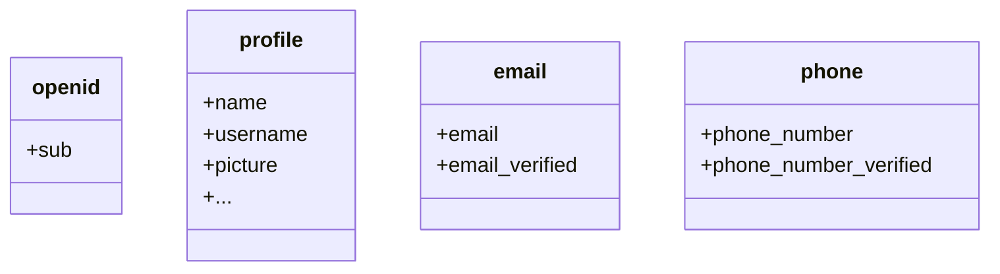

By default, limited claims are returned. If you need more information, you can request additional scopes to access more claims.

:::info
A "claim" is an assertion made about a subject; a "scope" is a group of claims. In the current case, a claim is a piece of information about the user.
:::

Here's a non-normative example the scope - claim relationship:

:::tip
The "sub" claim means "subject", which is the unique identifier of the user (i.e. user ID).
:::

Logto SDK will always request three scopes: `openid`, `profile`, and `offline_access`.
