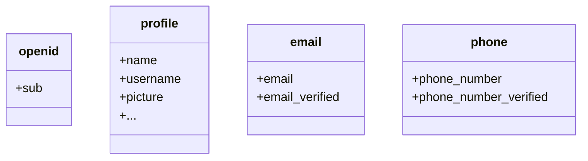

import GetUserInfoApis from '../../fragments/_get-user-info-apis.mdx';

import ScopesAndClaims from './scopes-and-claims/_scopes-and-claims.mdx';

You may find some user information are missing in the returned object from `useLogtoUser()`. This is because OAuth 2.0 and OpenID Connect (OIDC) are designed to follow the principle of least privilege (PoLP), and Logto is built on top of these standards.

### Request additional claims

By default, limited claims are returned. If you need more information, you can request additional scopes to access more claims.

:::info
A "claim" is an assertion made about a subject; a "scope" is a group of claims. In the current case, a claim is a piece of information about the user.
:::

Here's a non-normative example the scope - claim relationship:



:::tip
The "sub" claim means "subject", which is the unique identifier of the user (i.e. user ID).
:::

To request additional scopes, you can configure the `logto` module options:

```ts title="nuxt.config.ts"
import { UserScope } from '@logto/nuxt';

export default defineNuxtConfig({
  logto: {
    scopes: [UserScope.Email, UserScope.Phone], // Add more scopes if needed
    // ...other configs
  },
});
```

Then you can access the additional claims in the `user` object:

```html title="index.vue"
<template>
  <div v-if="user">
    <p>Name: {{ user.name }}</p>
    <p>Email: {{ user.email }}</p>
    <p>Phone: {{ user.phone }}</p>
  </div>
</template>
```

### Claims that need network requests

To prevent bloating the user object, some claims require network requests to fetch. For example, the `custom_data` claim is not included in the user object even if it's requested in the scopes. To access these claims, you can configure the `fetchUserInfo` option:

```ts title="nuxt.config.ts"
export default defineNuxtConfig({
  logto: {
    scopes: [UserScope.CustomData],
    fetchUserInfo: true,
  },
  // ...other configurations
});
```

By setting `fetchUserInfo` to `true`, the SDK will fetch the user information by requesting to the [userinfo endpoint](https://openid.net/specs/openid-connect-core-1_0.html#UserInfo) after the user is signed in, and `user.custom_data` will be available once the request is completed.

To learn more about the available scopes and claims, see the [Scopes and claims](#scopes-and-claims) section.

### Fetch user information manually

To access all methods provided by the Logto client, you can use the `useLogtoClient()` composable:

```ts title="index.vue"
const client = useLogtoClient();
```

:::warning
Logto client is only available in the server-side. The composable will return `undefined` in the client-side.
:::

<GetUserInfoApis
  getIdTokenClaimsApi="client.getIdTokenClaims()"
  fetchUserInfoApi="client.fetchUserInfo()"
/>

For example, to manually fetch user information:

```ts title="index.vue"
import { useLogtoClient, useState, callOnce } from '#imports';

const client = useLogtoClient();
const userInfo = useState(null);

// Call once to prevent running from client-side
await callOnce(async () => {
  if (!client) {
    throw new Error('Logto client is not available');
  }

  if (!(await client.isAuthenticated())) {
    return;
  }

  try {
    userInfo.value = await client.fetchUserInfo();
  } catch (error) {
    console.error('Failed to get user information:', error);
  }
});
```

### Scopes and claims

<ScopesAndClaims />
