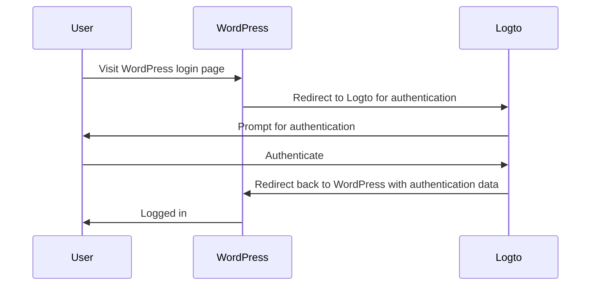
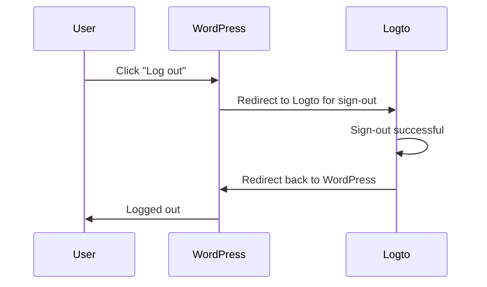

import TabItem from '@theme/TabItem';
import Tabs from '@theme/Tabs';

import FurtherReadings from '../../fragments/_further-readings.md';

# Add authentication to your WordPress website with Logto plugin

This tutorial will show you how to integrate Logto into your [Wordpress](https://wordpress.org) website with our official WordPress plugin.

## Prerequisites \{#prerequisites}

- A [Logto Cloud](https://cloud.logto.io) account or a [self-hosted Logto](/introduction/set-up-logto-oss).
- A Logto traditional application created.
- A WordPress project: follow the official [Wordpress installation guide](https://wordpress.org/support/article/how-to-install-wordpress/) to set up your Wordpress website before proceeding.

## Integration \{#integration}.

### Install the plugin \{#install-the-plugin}

<Tabs>

<TabItem value="admin-panel" label="From WordPress admin panel">

1. Go to **Plugins** > **Add New**.
2. Search for "Logto".
3. Click **Install Now**.
4. Click **Activate**.

</TabItem>

<TabItem value="upload" label="From upload">

1. Download the Logto WordPress plugin from one of the following links:
   - [Latest release](https://github.com/logto-io/wordpress/releases)
   - [WordPress plugin directory](https://wordpress.org/plugins) and search for "Logto".
2. Download the plugin ZIP file.
3. Go to **Plugins** > **Add New** in your WordPress admin panel.
4. Click **Upload Plugin**.
5. Select the downloaded ZIP file and click **Install Now**.
6. Click **Activate**.

</TabItem>

</Tabs>

### Configure the plugin \{#configure-the-plugin}

Now you should be able to see the Logto menu in your WordPress admin panel sidebar. Click **Logto** > **Settings** to configure the plugin.

:::note
You should have a **traditional web** application created in Logto Console before configuring the plugin. If you haven't created one, please refer to [Integrate Logto into your application](/integrate-logto/integrate-logto-into-your-application) for more information.
:::

The minimum configuration to get started for the plugin is:

- Logto endpoint: The endpoint of your Logto tenant.
- App ID: The app ID of your Logto application.
- App secret: One of the valid app secrets of your Logto application.

All values can be found on the application details page in Logto Console.

After filling in the values, click **Save Changes** (scroll down to the bottom of the page if you can't find the button).

### Configure redirect URI \{#configure-redirect-uri}

The redirect URI is the URL to which Logto will redirect users after they have authenticated; and the post sign-out redirect URI is the URL to which Logto will redirect users after they have logged out.

Here's a non-normative sequence diagram to illustrate the sign-in flow:

Here's how the sign-out flow looks like in a non-normative sequence diagram:

To learn more about why redirect is needed, see [Sign-in experience explained](/concepts/sign-in-experience).

In our case, we need to configure both redirect URIs in your Logto Console. To find the redirect URI, go to the **Logto** > **Settings** page in your WordPress admin panel. You'll see the **Redirect URI** and **Post sign-out redirect URI** fields.

1. Copy the **Redirect URI** and **Post sign-out redirect URI** values and paste them into the **Redirect URIs** and **Post sign-out redirect URIs** fields in your Logto Console.
2. Click **Save changes** in Logto Console.

### Checkpoint: Test your WordPress website \{#checkpoint-test-your-website}

Now you can test your Logto integration in your WordPress website:

1. Open an incognito browser window if needed.
2. Visit your WordPress website and click the **Log in** link if applicable; or directly visit the login page (e.g., `https://example.com/wp-login.php`).
3. The page should redirect you to the Logto sign-in page.
4. Complete the sign-in or sign-up process.
5. After successful authentication, you should be redirected back to your WordPress website and logged in automatically.
6. Click the **Log out** link to log out of your WordPress website.
7. You should be redirected to the Logto sign-out page, then back to your WordPress website.
8. You should be logged out of your WordPress website.

## Authentication settings \{#authentication-settings}

Although the plugin works out of the box, you can customize the authentication settings on the Logto plugin settings page to better fit your needs.

### Scopes \{#scopes}

Logto uses scopes to control what information is shared with your application. The Logto WordPress plugin uses [Logto PHP SDK](https://github.com/logto-io/php) to handle the authentication process, which includes the following scopes by default:

- `openid`: The basic scope required for OpenID Connect.
- `profile`: To get the user's basic profile information.
- `offline_access`: To get a refresh token for offline access.

For more information about scopes, see [Scopes and claims](/quick-starts/php#scopes-and-claims).

The plugin also adds two additional scopes by default:

- `email`: To get the user's email address.
- `roles`: To get the user's roles in Logto.

These two scopes are used to map Logto email and roles to WordPress email and roles. You can customize the scopes by editing the **Scopes** field in the plugin settings.

:::warning
If you remove the `email` or `roles` scope, some features of the plugin will not work properly.
:::

### Extra params \{#extra-params}

You may want to add some extra parameters to the authentication request to customize the authentication process. For example, you can add the `first_screen` parameter to decide which screen to show first in the authentication process.

For more information about extra parameters, see [Authentication parameters](/end-user-flows/authentication-parameters).

### Require verified email \{#require-verified-email}

By default, the plugin requires users to have a verified email address in Logto to log in to your WordPress website. If a user tries to log in without a verified email address, the plugin will throw an error.

You can disable this feature by unchecking the **Require verified email** option in the plugin settings.

### Require organization ID \{#require-organization-id}

You can require users to have a specific organization membership in Logto to log in to your WordPress website. When an organization ID is specified, the plugin will check if the user has the specified organization ID in their ID token. If not, an error will be thrown.

To learn more about organizations, see [Organizations](/organizations).

## Authorization settings \{#authorization-settings}

Besides authentication, Logto also provides authorization features like [role-based access control (RBAC)](/authorization/role-based-access-control). While it requires some custom code to implement RBAC if you are developing your own application, the Logto WordPress plugin provides a built-in way to map Logto roles to [WordPress roles](https://wordpress.org/documentation/article/roles-and-capabilities/).

### Role mapping \{#role-mapping}

The Logto WordPress plugin allows you to map Logto roles to WordPress roles. This means that you can assign different roles to users in Logto, and the plugin will automatically assign the corresponding WordPress roles to those users when they log in.

To map roles, click **Add** in the **Role mapping** section to add a new role mapping. For example, if you want to map the `group:editors` role in Logto to the `Editor` role in WordPress, you can do so by adding a new role mapping with the following values:

- Logto role: `group:editors`
- WordPress role: `editor` (the role slug of the `Editor` role in WordPress)

You can find the role slugs of all WordPress roles in the [Roles and Capabilities](https://wordpress.org/documentation/article/roles-and-capabilities/) documentation.

Now, head to the Logto Console and click **Roles** in the left sidebar. Create a new role named `group:editors` and assign it to a user. Then log in to your WordPress website with that user. You should see that the user has been assigned the `Editor` role in WordPress.

:::note
If the user has logged in to your WordPress website, the role mapping will not take effect until the user logs out and logs back in.
:::

You can also add multiple role mappings to map multiple Logto roles to WordPress roles. At the moment, the plugin will try to map the roles with the order of precedence. For example, if you have the following role mappings:

- Logto role: `group:editors`, WordPress role: `editor`
- Logto role: `group:authors`, WordPress role: `author`
- Logto role: `group:subscribers`, WordPress role: `subscriber`

And a user has both `group:editors` and `group:authors` roles in Logto, the user will be assigned the `Editor` role in WordPress.

## Advanced settings \{#advanced-settings}

### Remember session \{#remember-session}

By default, the plugin will remember the user's session for 2 weeks. This means that if a user logs in to your WordPress website, they will not be prompted to log in again for 2 weeks. You can reduce this time to 2 days by unchecking the **Remember session** option in the plugin settings.

### Sync profile \{#sync-profile}

By default, the plugin will sync the user's profile at every login. This means that if a user logs in to your WordPress website, their profile will be updated with the latest information from Logto. You can disable this feature by unchecking the **Sync profile** option in the plugin settings.

:::warning
If you disable this feature, the role mapping will only take effect when the user logs in for the first time.
:::

### WordPress form login \{#wordpress-form-login}

By default, you can append `?form=1` to the WordPress login URL to use the WordPress form login. This is useful for testing purposes, but you can disable this feature if you don't want to allow users to log in with the WordPress form.

### Username strategy \{#username-strategy}

There are multiple ways to generate a username for a user in WordPress. It's safe to use the default strategy when you rely on email as the unique identifier of a user.

## Further readings \{#further-readings}

<FurtherReadings />
