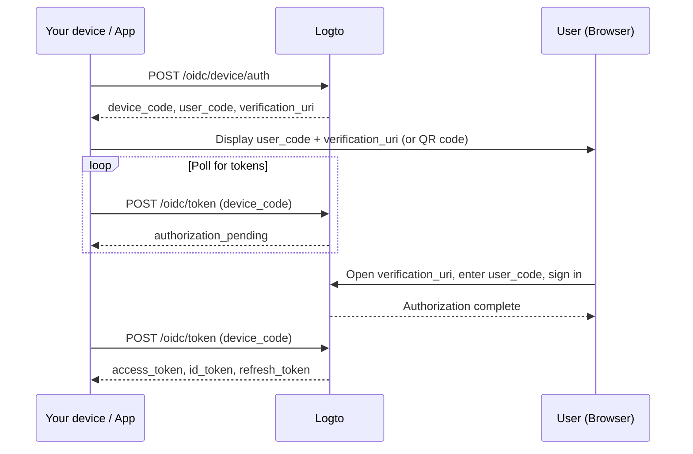

import ApiResourcesDescription from '../../fragments/_api-resources-description.md';
import FurtherReadings from '../../fragments/_further-readings.md';
import ScopeClaimList from '../../fragments/_scope-claim-list.md';
import ScopesAndClaimsIntroduction from '../../fragments/_scopes-claims-introduction.md';

# Device flow: Auth with Logto

:::note
This guide assumes you have created an Application of type "Native" with device flow as the authorization flow in the Logto Console.
:::

## Introduction \{#introduction}

The [OAuth 2.0 device authorization grant](https://auth.wiki/device-flow) (device flow) is designed for devices with limited input capabilities, such as smart TVs, game consoles, CLI tools, and IoT devices. It allows users to start the sign-in process on the device but complete authentication on a separate device with a browser, like a phone or laptop.

Since the device itself cannot handle a browser-based sign-in flow, the device displays a short code and a URL. The user visits that URL on another device, enters the code, and signs in. Meanwhile, the original device polls Logto until the authorization is complete.



## Get application credentials \{#get-application-credentials}

In your Logto Console, navigate to your application details page to get the following credentials:

- **App ID**: The unique identifier of your application (also known as `client_id`).
- **Logto endpoint**: Your Logto authorization server endpoint. You can find it in the Logto Console under "Application details".

For Logto Cloud, the endpoint is `https://{your-tenant-id}.logto.app`.

:::note
Device flow apps are public clients, so no App Secret is required.
:::

## Request a device code \{#request-a-device-code}

Start the device flow by sending a `POST` request to the device authorization endpoint:

```bash
curl --request POST 'https://your.logto.endpoint/oidc/device/auth' \
  --header 'Content-Type: application/x-www-form-urlencoded' \
  --data-urlencode 'client_id=your-application-id' \
  --data-urlencode 'scope=openid offline_access profile'
```

The response includes:

| Field                       | Description                                                                                                                                                                  |
| --------------------------- | ---------------------------------------------------------------------------------------------------------------------------------------------------------------------------- |
| `device_code`               | A unique code for your app to use when polling the token endpoint.                                                                                                           |
| `user_code`                 | A short code to display to the user for them to enter in the browser.                                                                                                        |
| `verification_uri`          | The URL where the user enters the `user_code`.                                                                                                                               |
| `verification_uri_complete` | A URL with the `user_code` pre-filled. Users can visit this URL directly to skip manual code entry — you can present it as a QR code, a clickable link, or any other method. |
| `expires_in`                | The lifetime in seconds of `device_code` and `user_code`. Stop polling after this expires.                                                                                   |

## Display the verification URL to the user \{#display-verification-url}

Show the `user_code` and `verification_uri` on your device screen.

Alternatively, you can use `verification_uri_complete` which has the code pre-filled — the user only needs to confirm. How you present it is up to you: a QR code, a clickable link, etc.

## Poll for tokens \{#poll-for-tokens}

While the user completes authentication in the browser, your device should poll the token endpoint. Your app should wait at least **5 seconds** between polling requests:

```bash
curl --request POST 'https://your.logto.endpoint/oidc/token' \
  --header 'Content-Type: application/x-www-form-urlencoded' \
  --data-urlencode 'client_id=your-application-id' \
  --data-urlencode 'grant_type=urn:ietf:params:oauth:grant-type:device_code' \
  --data-urlencode 'device_code=DEVICE_CODE'
```

Replace `DEVICE_CODE` with the `device_code` value from the device authorization response.

**Stop polling** when:

- You receive a successful token response.
- The `expires_in` time from the device code response has elapsed.
- You receive a non-retryable error such as `expired_token` or `access_denied`.

### Token response \{#token-response}

After the user approves, the response includes:

| Field           | Description                                                                                                                            |
| --------------- | -------------------------------------------------------------------------------------------------------------------------------------- |
| `access_token`  | The access token. This is an opaque string by default; when a `resource` is requested, it is a JWT with `aud` set to the resource URI. |
| `id_token`      | The ID token containing user identity claims. Only present when `openid` scope is requested.                                           |
| `refresh_token` | Used to obtain new tokens without re-authentication. Only present when `offline_access` scope is requested.                            |
| `token_type`    | Always `Bearer`.                                                                                                                       |
| `expires_in`    | Token lifetime in seconds.                                                                                                             |
| `scope`         | The scopes granted by the authorization server.                                                                                        |

## Checkpoint: Test your device flow \{#checkpoint}

Now, test your device flow integration:

1. Run your app and trigger the device flow to get a `device_code` and `user_code`.
2. Open the `verification_uri` in a browser and enter the `user_code`, or use `verification_uri_complete` to skip manual code entry.
3. Complete the sign-in process in the browser.
4. Verify that your app receives tokens after polling.

## Get user information \{#get-user-information}

### Decode ID token claims \{#decode-id-token-claims}

The `id_token` returned in the token response is a standard [JSON Web Token (JWT)](https://auth.wiki/jwt). You can decode the Base64URL-encoded payload (the second part of the JWT, split by `.`) to access basic user claims without an additional network request.

The decoded payload contains claims like `sub` (user ID), `name`, `email`, etc., depending on the scopes requested.

:::tip
For production use, you should validate the JWT signature before trusting its claims. Use the JWKS from your Logto endpoint (`https://your.logto.endpoint/oidc/jwks`) to verify the token.
:::

### Fetch from userinfo endpoint \{#fetch-from-userinfo-endpoint}

The ID token contains basic claims based on the requested scopes. Some extended claims (like `custom_data`, `identities`) are only available via the [OIDC UserInfo endpoint](https://openid.net/specs/openid-connect-core-1_0.html#UserInfo):

```bash
curl --request GET 'https://your.logto.endpoint/oidc/me' \
  --header 'Authorization: Bearer ACCESS_TOKEN'
```

Replace `ACCESS_TOKEN` with the opaque access token (not the JWT resource token) obtained from the token response. The response is a JSON object containing the user's claims based on the granted scopes.

### Request additional claims \{#request-additional-claims}

You may find some user information is missing in the ID token. This is because OAuth 2.0 and OpenID Connect (OIDC) are designed to follow the principle of least privilege (PoLP), and Logto is built on top of these standards.

<ScopesAndClaimsIntroduction />

To request additional scopes, include them in the `scope` parameter of the device authorization request. For example, to request the user's email and phone:

```bash
curl --request POST 'https://your.logto.endpoint/oidc/device/auth' \
  --header 'Content-Type: application/x-www-form-urlencoded' \
  --data-urlencode 'client_id=your-application-id' \
  --data-urlencode 'scope=openid offline_access profile email phone'
```

### Scopes and claims \{#scopes-and-claims}

<ScopeClaimList />

## API resources and organizations \{#api-resources-and-organizations}

<ApiResourcesDescription />

### Request access for API resources \{#request-access-for-api-resources}

To access a specific API resource, include the `resource` parameter in the device authorization request:

```bash
curl --request POST 'https://your.logto.endpoint/oidc/device/auth' \
  --header 'Content-Type: application/x-www-form-urlencoded' \
  --data-urlencode 'client_id=your-application-id' \
  --data-urlencode 'scope=openid offline_access' \
  --data-urlencode 'resource=https://your-api-resource-indicator'
```

Once the user completes authorization and you receive a refresh token, you can fetch JWT access tokens for the API resource:

```bash
curl --request POST 'https://your.logto.endpoint/oidc/token' \
  --header 'Content-Type: application/x-www-form-urlencoded' \
  --data-urlencode 'client_id=your-application-id' \
  --data-urlencode 'grant_type=refresh_token' \
  --data-urlencode 'refresh_token=REFRESH_TOKEN' \
  --data-urlencode 'resource=https://your-api-resource-indicator'
```

The response will contain a JWT `access_token` with `aud` set to your API resource indicator.

:::note
The `refresh_token` is only available when the `offline_access` scope is included in the initial device authorization request. Always store and use the latest `refresh_token`, as Logto uses token rotation.
:::

### Fetch organization tokens \{#fetch-organization-tokens}

If [organizations](/organizations) is new to you, please read [🏢 Organizations (Multi-tenancy)](/organizations) to get started.

To request organization-related information, add the `urn:logto:scope:organizations` scope in the device authorization request:

```bash
curl --request POST 'https://your.logto.endpoint/oidc/device/auth' \
  --header 'Content-Type: application/x-www-form-urlencoded' \
  --data-urlencode 'client_id=your-application-id' \
  --data-urlencode 'scope=openid offline_access urn:logto:scope:organizations' \
  --data-urlencode 'resource=urn:logto:resource:organizations'
```

Once the user is signed in, you can fetch organization tokens using the refresh token:

```bash
curl --request POST 'https://your.logto.endpoint/oidc/token' \
  --header 'Content-Type: application/x-www-form-urlencoded' \
  --data-urlencode 'client_id=your-application-id' \
  --data-urlencode 'grant_type=refresh_token' \
  --data-urlencode 'refresh_token=REFRESH_TOKEN' \
  --data-urlencode 'organization_id=your-organization-id'
```

The response will contain an access token scoped to the specified organization.

#### Organization API resources \{#organization-api-resources}

To fetch an access token for an API resource within an organization, include both the `resource` and `organization_id` parameters:

```bash
curl --request POST 'https://your.logto.endpoint/oidc/token' \
  --header 'Content-Type: application/x-www-form-urlencoded' \
  --data-urlencode 'client_id=your-application-id' \
  --data-urlencode 'grant_type=refresh_token' \
  --data-urlencode 'refresh_token=REFRESH_TOKEN' \
  --data-urlencode 'organization_id=your-organization-id' \
  --data-urlencode 'resource=https://your-api-resource-indicator'
```

## Further readings \{#further-readings}

<FurtherReadings />
