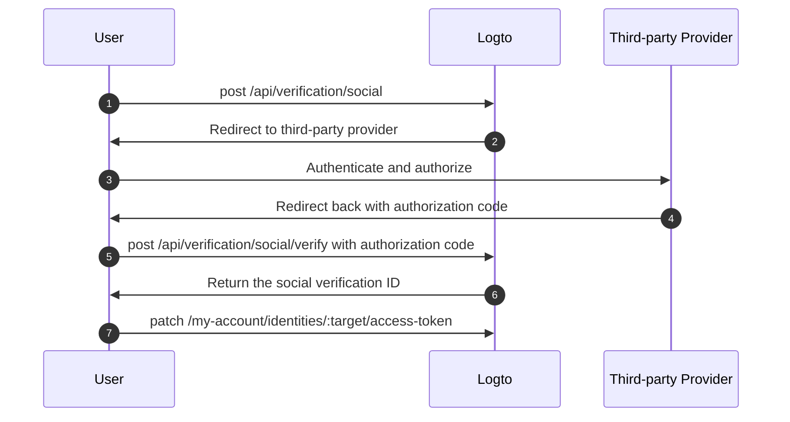

import Availability from '@components/Availability';

<Availability cloud oss={{ major: 1, minor: 31 }} />

Third-party token set (aka. federated token set) is a secret type stored in Logto's [secret vault](/secret-vault), used to securely manage access and refresh tokens issued by third-party identity providers. When a user authenticates via a social or enterprise SSO connector, Logto stores the issued tokens in the vault. These tokens can later be retrieved to access third-party APIs on the user's behalf, without requiring re-authentication.

## Common use cases \{#common-use-cases}

This capability is essential for modern applications such as AI agents, SaaS platforms, productivity tools, and customer applications that need to interact with third-party services on behalf of users. Here are some practical examples:

**📅 Calendar management apps**: After a user signs in with Google, your productivity app can automatically sync their calendar events, create new meetings, and send invitations without asking them to authenticate again.

**🤖 AI assistants**: An AI agent can access a user's GitHub repositories to analyze code, create pull requests, or manage issues. All with the user's one-time consent during sign-in or account linking.

**📊 Analytics dashboards**: SaaS platforms can pull data from users' connected social media accounts (Facebook, LinkedIn) to generate insights and reports without interrupting their workflow with repeated login prompts.

## Enable third-party token storage \{#enable-third-party-token-storage}

### Social connectors \{#social-connectors}

This feature is available for [social connectors](/connectors/social-connectors) that support token storage. Third-party tokens can be stored during [social sign-in](/end-user-flows/sign-up-and-sign-in/social-sign-in), [social account linking](/end-user-flows/account-settings/by-account-api#link-a-new-social-connection), and [when renewing tokens for third-party API access](/secret-vault/federated-token-set#reauthentication-and-token-renewal). Currently supported connectors include: [GitHub](/integrations/github), [Google](/integrations/google), [Facebook](/integrations/facebook), [Standard OAuth 2.0](/integrations/oauth2), and [Standard OIDC](/integrations/oidc). Support for additional connectors will be rolled out gradually.

1. Navigate to <CloudLink to="/connectors/social">Console > Connectors > Social Connectors</CloudLink>.
2. Select the social connector you want to enable third-party token storage for.
3. Follow the setup tutorials to configure the connector, including adding the necessary scopes to access specific third-party APIs.
4. In the "Setting" page, enable the **Store tokens for persistent API access** option.

### Enterprise SSO connectors \{#enterprise-sso-connectors}

Token storage is available for all OIDC [enterprise connectors](/connectors/enterprise-connectors). Access and refresh tokens can be stored during [enterprise Single Sign-On](/end-user-flows/enterprise-sso). Currently supported connectors include: [Google Workspace](/integrations/google-workspace), [Microsoft Entra ID (OIDC)](/integrations/entra-id-oidc), [Okta](/integrations/okta), and [OIDC (Enterprise)](/integrations/oidc-sso).

1. Navigate to <CloudLink to="/enterprise-sso">Console > Enterprise SSO</CloudLink>.
2. Select the enterprise SSO connector you want to enable third-party token storage for.
3. Follow the setup tutorials to configure the connector, including adding the necessary scopes to access specific third-party APIs.
4. In the "SSO Experience" tab, enable the **Store tokens for persistent API access** option.

Make sure to save your changes.

## Token storage \{#token-storage}

Once third-party token storage is enabled, Logto automatically stores the access and refresh tokens issued by the federated identity provider whenever a user authenticates through a social or enterprise SSO connector. This includes:

- [Social sign-in and sign-up](/end-user-flows/sign-up-and-sign-in/social-sign-in)
- [Enterprise SSO sign-in and sign-up](/end-user-flows/enterprise-sso)
- [Social account linking through account API](/end-user-flows/account-settings/by-account-api#link-a-new-social-connection)

The stored tokens are attached to the user's social or enterprise SSO identity, allowing them to retrieve the tokens later for API access without requiring re-authentication.

### Checking token storage status \{#checking-token-storage-status}

You can check a user's third-party token storage status in the Logto Console:

1. Navigate to <CloudLink to="/users">Console > Users</CloudLink>.
2. Click on the user you want to inspect. This will take you to the user’s detail page.
3. Scroll to the **Connections** section. This area lists all the social and enterprise SSO connections associated with the user.
4. Each connection entry shows a token status label indicating whether tokens are stored for that connection.
5. Click the connection entry to view more details, including the stored access token metadata and refresh token availability (if available).

You can also check user third-party identities and token storage status via the management API:

- `GET /api/users/{userId}/identities/{target}?includeTokenSecret=true`: Retrieve a user's social identity and token storage status associated with the identity by a given connector target (e.g., `github`, `google`, etc.).
- `GET /api/users/{userId}/sso-identities/{ssoConnectorId}?includeTokenSecret=true`: Retrieve a user's enterprise SSO identity and token storage status associated with the identity by a given SSO connector ID.

### Token storage status \{#token-storage-status}

- **Active**: The access token is stored and active.
- **Expired**: The access token is stored but has expired. If a refresh token is available, it can be used to obtain a new access token.
- **Inactive**: No access token is stored for this connection. This can happen if the user has not authenticated through this connection or if the token storage has been deleted.
- **Not applicable**: The connector does not support token storage.

### Token metadata \{#token-metadata}

For data integrity and security, all tokens are encrypted before being stored in the secret vault. The actual token values are only accessible to the end user with proper authorization. Developers, on the other hand, can only retrieve the token set metadata to understand the state of the stored tokens without exposing sensitive content.

- `createdAt`: The timestamp when the connection was first established and the token set was initially stored in the secret vault.
- `updatedAt`: The last time the token set was updated.
  - If no refresh token is available, this value will be the same as **createdAt**.
  - If a refresh token is present, this value reflects the most recent time the access token was refreshed.
- `hasRefreshToken`: Indicates whether a refresh token is available.
  If the connector supports offline access and the authorization request is properly configured, Logto stores the refresh token when it is issued by the identity provider alongside the access token.
  When the access token expires and a valid refresh token exists, Logto automatically attempts to obtain a new access token using the stored refresh token whenever the user requests access to the connected provider.
- `expiresAt`: The estimated expiration time of the access token in **seconds**.
  This is calculated based on the `expires_in` value returned by the identity provider’s token endpoint. (This field is only available if the provider includes `expires_in` in the token response.)
- `scope`: The scope of the access token, indicating the permissions granted by the identity provider.
  This is useful for understanding what actions can be performed with the stored access token. (This field is only available if the provider includes `scope` in the token response.)
- `tokenType`: The type of the access token, typically "Bearer".
  (This field is only available if the provider includes `token_type` in the token response.)

## Token retrieval \{#token-retrieval}

Once token storage is enabled and tokens are securely stored in Logto’s secret vault, end users can retrieve their third-party access tokens from your client application by integrating with Logto’s [User Account API](/end-user-flows/account-settings/by-account-api).

- `GET /my-account/identities/:target/access-token`: Retrieve the access token for a social identity by specifying the connector target (e.g., github, google).

- `GET /my-account/sso-identities/:connectorId/access-token`: Retrieve the access token for an enterprise SSO identity by specifying the connector ID.

:::info
Learn how to [enable](/end-user-flows/account-settings/by-account-api#how-to-enable-account-api) and [access](/end-user-flows/account-settings/by-account-api#access-account-api-using-access-token) the Account API using the Logto issued access token.
:::

### Token rotation \{#token-rotation}

The token retrieval endpoints return:

- `200` OK: If the access token is successfully retrieved and is still valid.
- `404` Not Found: If the user does not have a social or enterprise SSO identity associated with the specified target or connector ID, or if the access token is not stored.
- `401` Unauthorized: If the access token is expired.

If the access token is expired and a refresh token is available, Logto automatically attempts to refresh the access token and returns the new access token in the response. The token storage in secret vault is also updated with the new access token and its metadata.

## Token storage deletion \{#token-storage-deletion}

Third-party token storage is directly tied to each user’s social or enterprise SSO connections. This means the stored token set will be automatically deleted in the following cases:

- The associated social or enterprise SSO identity is removed from the user’s account.
- The user account is deleted from your tenant.
- The social or enterprise SSO connector is deleted from your tenant.

### Revoking tokens \{#revoking-tokens}

You can also manually delete a user’s third-party token set to revoke access:

- From the Console:
  Navigate to the user's identity details page. Scroll to the **Access token** section (if token storage is available) and click the **Delete tokens** button at the end of the section.
- Via management API:
  - `DELETE /api/secret/:id`: Delete a specific secret by its ID, which can be obtained from the user identity details.

Revoking the token set will force the user to re-authenticate with the third-party provider to obtain a new access token before they can access third-party APIs again.

## Reauthentication and token renewal \{#reauthentication-and-token-renewal}

In scenarios where a stored access token has expired or when an application needs to request additional API scopes, end users can reauthenticate with the third-party provider to obtain a fresh access token—without needing to sign in to Logto again.
This can be achieved through Logto’s [Social Verification API](https://openapi.logto.io/operation/operation-createverificationbysocial), which allow users to reinitiate a federated social authorization flow and update their stored token set.

:::note
Reinitiating federated authorization is currently limited to social connectors.
For enterprise SSO connectors, reauthentication and token renewal require the user to initiate a full Logto authentication flow again, as direct reauthorization with the Enterprise SSO provider is not currently supported post sign-in.
:::



1. The user initiates a social verification request by calling the `POST /api/verification/social` endpoint. The user may specify custom scopes to request additional permissions from the third-party provider.

   ```sh
   curl -X POST https://<your-logto-domain>/api/verification/social \
     -H "Authorization: Bearer <access_token>" \
     -H "Content-Type: application/json" \
     -d '{
       "state": "<state>",
       "connectorId": "<logto_connectorId>",
       "redirectUri": "<redirect_uri>",
       "scope": "<custom_scope>"
     }'
   ```

   - **authorization header**: The user's access token issued by Logto.
   - **connectorId**: The social connector ID in Logto.
   - **redirectUri**: The URI to redirect the user back to your application after authentication. You will need to register this URI in the provider's application settings.
   - **scope**: (Optional) Custom scopes to request additional permissions from the third-party provider. If not specified, the default scopes configured in the connector will be used.

2. Logto creates a new social verification record and returns the social verification ID along with the authorization URL to redirect the user to the third-party provider for authentication.

   The response will look like this:

   ```json
   {
     "verificationRecordId": "<social_verification_id>",
     "authorizationUri": "<authorization_url>",
     "expiresAt": "<expiration_time>"
   }
   ```

3. Redirect the user to the authorization URL. The user authenticates with the third-party provider and grants permissions.

4. The third-party provider redirects the user back to your client application with an authorization code.

5. Handle the authorization callback by forwarding the authorization code to Logto's verification endpoint:

   ```sh
   curl -X POST https://<your-logto-domain>/api/verification/social/verify \
     -H "Authorization: Bearer <access_token>" \
     -d '{
       "verificationRecordId": "<social_verification_id>",
       "connectorData": {
         "code": "<authorization_code>",
         "state": "<state>",
         "redirectUri": "<redirect_uri>"
       }
     }'
   ```

   - **authorization header**: The user's access token issued by Logto.
   - **verificationRecordId**: The social verification ID returned in the previous step.
   - **connectorData**: The authorization code and any other data returned by the third-party provider during the callback.

   :::note
   Don't forget to validate the `state` parameter to prevent CSRF attacks.
   :::

6. Logto verifies the authorization code and exchanges it for a new access token and refresh token from the third-party provider, then returns the social verification ID in the response.

7. Finally, update the user's token storage by calling the `PATCH /my-account/identities/:target/access-token` endpoint with the social verification ID:

   ```sh
   curl -X PATCH https://<your-logto-domain>/my-account/identities/<target>/access-token \
     -H "Authorization: Bearer <access_token>" \
     -H "Content-Type: application/json" \
     -d '{
       "socialVerificationId": "<social_verification_id>"
     }'
   ```

   - **authorization header**: The user's access token issued by Logto.
   - **socialVerificationId**: The verified social verification record ID returned in the previous step.

   This will update the user's token set storage in Logto's secret vault with the new access token and refresh token, allowing the user to access third-party APIs without needing to sign in to Logto again.

   The updated access token will be returned.
