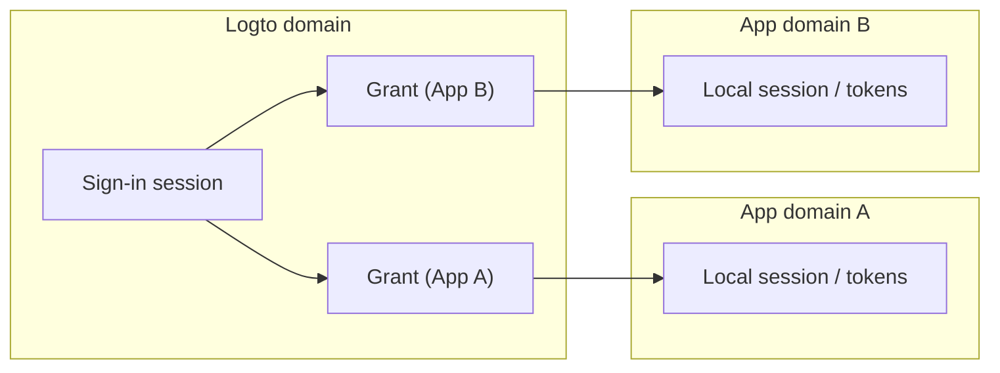
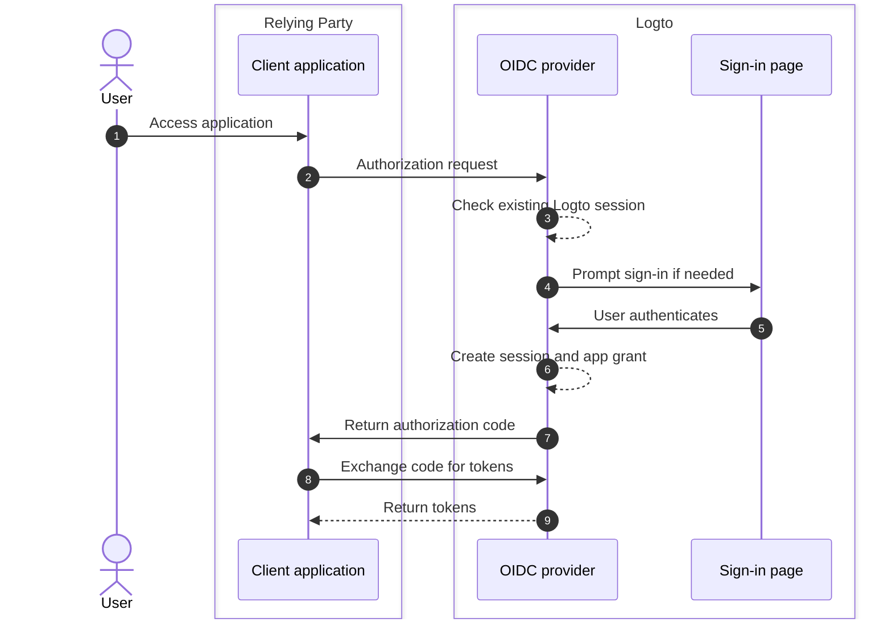
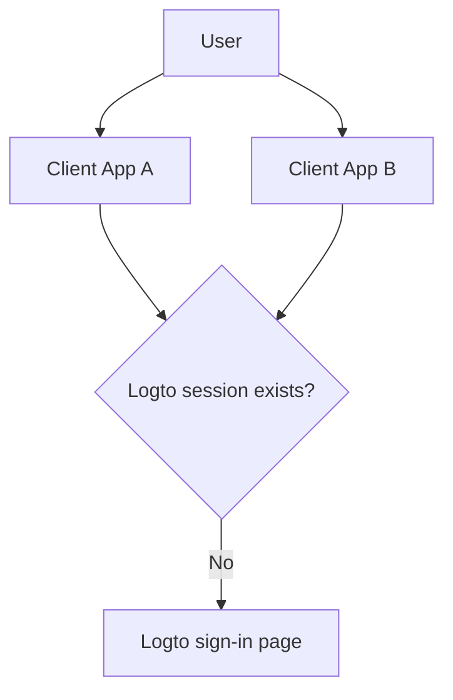

# Sessions

Sessions in Logto define how authentication state is created, shared, refreshed, and revoked across apps, browsers, and devices.

In practice, users experience "signed in" as one state, but the system state is split into multiple layers. Understanding these layers is the key to designing predictable SSO, token renewal, and sign-out behavior.

## Session model in Logto \{#session-model-in-logto}

- **Logto sign-in session**: Centralized sign-in state stored as Logto-domain cookies. This controls SSO availability in the current browser context.
- **Grant**: App-specific authorization state for `user + client app`. Grants are the bridge between centralized sign-in and app token issuance.
- **App-local session/tokens**: Local authentication state in each app (ID/access/refresh tokens, app session cookie, etc.).

## Core concepts \{#core-concepts}

### What is a Logto session? \{#what-is-a-logto-session}

A Logto session is the centralized authentication state created after successful sign-in. If it is still valid, Logto can authenticate users silently for other apps in the same tenant. If it does not exist, users must sign in again.

### What are grants? \{#what-are-grants}

A grant is app-level authorization state tied to a specific user and client app.

- One Logto session can have grants for multiple apps.
- Tokens for an app are issued under that app's grant.
- Revoking a grant affects that app's ability to continue token-based access.

### How session, grants, and app auth state relate \{#how-session-grants-and-app-auth-state-relate}

- **Session** answers: "Can this browser do SSO with Logto right now?"
- **Grant** answers: "Is this user authorized for this client app?"
- **App-local session** answers: "Does this app currently treat user as signed in?"

## Sign-in and session creation \{#sign-in-and-session-creation}

## Session topology across apps and devices \{#session-topology-across-apps-and-devices}

### Same browser: shared Logto session \{#same-browser-shared-logto-session}

Apps in the same browser can share centralized Logto session state, so SSO can happen without repeated credential input.

### Different browsers or devices: isolated Logto sessions \{#different-browsers-or-devices-isolated-logto-sessions}

Each browser/device has separate cookie storage. A valid session on Device A does not imply a valid session on Device B.

## Session lifecycle \{#session-lifecycle}

### 1. Create \{#1-create}

After user authentication, Logto creates a centralized session and an app-specific grant.

### 2. Reuse (SSO) \{#2-reuse-sso}

As long as session cookies are valid in the same browser, new authorization requests can often complete silently.

### 3. Renew tokens \{#3-renew-tokens}

App access usually continues through token refresh flows (when enabled). This is app-level continuity, separate from whether centralized Logto session still exists.

### 4. Revoke/expire \{#4-revokeexpire}

Revocation can happen at different layers:

- Local app sign-out removes app-local tokens/session.
- End-session removes centralized Logto session.
- Grant revocation removes app-level authorization continuity.

## Design recommendations \{#design-recommendations}

- Keep app-local session handling explicit in your app code.
- Treat Logto session, grants, and app-local session as separate layers.
- Choose whether sign-out should be app-local only or global.
- Use [back-channel logout](/end-user-flows/sign-out#federated-sign-out-back-channel-logout) when multi-app consistency is required.
- For sign-out behavior and implementation details, see [Sign-out](/end-user-flows/sign-out).

## Best practices for revoking access \{#best-practices-for-revoking-access}

Use different revoke strategies based on your goal:

- **Revoke access from your first-party apps**:
  Revoke the target session with `revokeGrantsTarget=firstParty`.
  This signs the user out across first-party apps associated with that session, which creates a consistent logout experience.
  At the same time, grants for third-party apps that have `offline_access` granted can remain available for ongoing integrations.
  See [Manage user sessions](/sessions/manage-user-sessions) for session revoke details.

- **Revoke access to third-party apps**:
  Choose one of the following:

  - Revoke the session with `revokeGrantsTarget=all` to revoke all grants associated with that session.
  - Revoke specific grants directly through grant management APIs to remove third-party app authorizations without forcing full session sign-out.
    See [Manage user authorized apps (grants)](/sessions/grants-management) for grant-specific revoke strategies.

- **When using Logto Console**:
  On the user details page, Logto provides both session management and authorized third-party app management out of the box.
  - Revoking a session revokes first-party app grants as well, to keep first-party logout behavior consistent.
  - Revoking a third-party app authorization revokes grants for that third-party app while keeping the original session status unchanged.

## Related resources \{#related-resources}

<Url href="/sessions/manage-user-sessions">Manage user sessions</Url>
<Url href="/sessions/grants-management">Manage user authorized apps (grants)</Url>
<Url href="/sessions/session-configs">Session configuration</Url>
<Url href="/end-user-flows/sign-out">Sign-out</Url>
<Url href="/end-user-flows/sign-up-and-sign-in">Sign-up and sign-in</Url>
<Url href="/integrate-logto/integrate-logto-into-your-application/understand-authentication-flow">
  Understand authentication flow
</Url>
