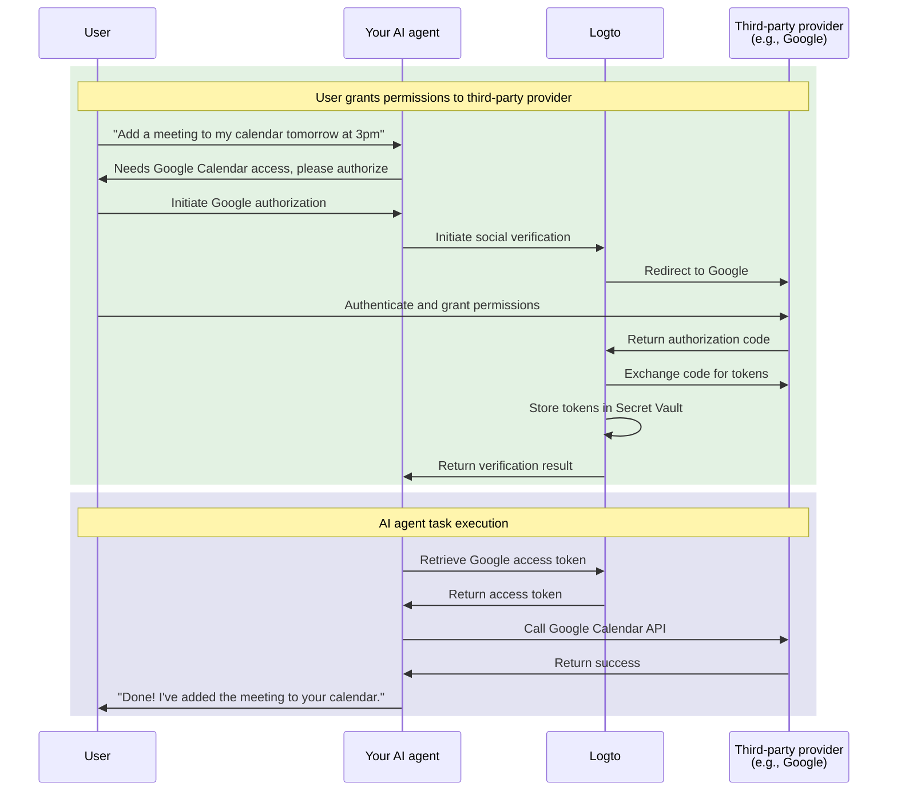

# Connect your AI agent to third-party APIs

This guide walks you through enabling your AI agent to access third-party APIs (e.g., Google Calendar, GitHub, etc.) on behalf of users. By leveraging Logto's social connectors and Secret Vault, you can securely store and manage access tokens, allowing your agent to perform automated tasks without repeatedly asking users to re-authenticate.

You'll learn how to:

- Configure social connectors with third-party token storage.
- Request minimal permissions during initial sign-in.
- Progressively request additional permissions as needed.
- Retrieve and use stored tokens to access third-party APIs.

## Why your AI agent needs third-party API access \{#why-your-ai-agent-needs-third-party-api-access}

AI agents are increasingly being used to automate tasks that require interaction with external services. For example:

- **📅 Calendar management**: Your AI agent can automatically schedule meetings, add events, or adjust appointments on Google Calendar.
- **📧 Email automation**: Send follow-up emails, organize inboxes, or draft responses using Gmail APIs.
- **💻 Code management**: Create GitHub issues, review pull requests, or manage repositories.
- **📁 File management**: Upload, organize, or share files on Google Drive or Dropbox.

To perform these tasks, your AI agent needs secure access to user-authorized third-party APIs, which means handling OAuth tokens correctly and securely.

## How it works \{#how-it-works}

Here's a quick overview of the flow:



1. **User requests a task**: The user asks the AI agent to perform a task that requires third-party API access (e.g., adding a calendar event).
2. **Authorization prompt**: The agent detects the need for third-party access and prompts the user to authorize.
3. **Tokens stored**: After user authorization, Logto securely stores the access and refresh tokens in the Secret Vault.
4. **Task execution**: The agent retrieves the stored token and calls the third-party API to complete the task.

Once authorized, the user can perform multiple tasks without re-authorizing. Logto stores the tokens securely and automatically refreshes them when needed, providing a seamless experience for ongoing AI agent interactions.

## Prerequisites \{#prerequisites}

Before you begin, ensure you have:

- A [Logto Cloud](https://cloud.logto.io) (or self-hosted Logto v1.31+) tenant
- A third-party provider account with API access (e.g., [Google Cloud Console](https://console.cloud.google.com))
- An AI agent application integrated with Logto SDK (users can sign in to your AI agent)

## Set up social connector with token storage \{#set-up-social-connector-with-token-storage}

To enable your AI agent to access third-party APIs, you need to configure a social connector with token storage enabled. This allows Logto to store and manage access tokens when users authorize third-party services during their interaction with your AI agent.

Let's use Google as an example:

1. Navigate to <CloudLink to="/connectors/social">Console > Connectors > Social connectors</CloudLink>.
2. Click **Add social connector** and select **Google**.
3. Follow the [Google connector setup guide](/integrations/google) to configure your OAuth client credentials.
4. In the connector settings:
   - Enable **Store tokens for persistent API access** to store tokens in the Secret Vault.
   - Set **Prompts** to include `consent` to ensure users see the permission request.
   - Enable **Offline access** to receive refresh tokens for long-lived API access.
5. Save your changes.

:::info
You don't need to add this connector to your sign-in experience. The connector will be used for on-demand authorization when your AI agent needs to access third-party APIs, not for user sign-in.
:::

## Request authorization and access third-party APIs \{#request-authorization-and-access-third-party-apis}

When your AI agent needs to access a third-party API (e.g., Google Calendar), it should first check if the user has already authorized access. If not, prompt the user to authorize.

:::info Enable Account API
Before proceeding, enable the Account API at <CloudLink to="/sign-in-experience/account-center">Console > Sign-in experience > Account center</CloudLink>. Learn more about [enabling the Account API](/end-user-flows/account-settings/by-account-api#how-to-enable-account-api).
:::

### Step 1: Check for existing authorization \{#step-1-check-for-existing-authorization}

First, try to retrieve the stored access token to see if the user has already authorized:

```tsx
async function getGoogleAccessToken(userAccessToken: string) {
  const response = await fetch(
    'https://[tenant-id].logto.app/my-account/identities/google/access-token',
    {
      headers: {
        Authorization: `Bearer ${userAccessToken}`,
      },
    }
  );

  if (response.ok) {
    return response.json(); // { accessToken: "...", expiresAt: 1700000000 }
  }

  if (response.status === 404) {
    return null; // User hasn't authorized Google yet
  }

  throw new Error('Failed to retrieve access token');
}
```

### Step 2: Request authorization if needed \{#step-2-request-authorization-if-needed}

If no token exists, use Logto's [Social Verification API](/secret-vault/federated-token-set#reauthentication-and-token-renewal) to initiate the authorization flow:

```tsx
async function requestGoogleAuthorization(userAccessToken: string, scopes: string) {
  // Initiate social verification
  const response = await fetch('https://[tenant-id].logto.app/api/verification/social', {
    method: 'POST',
    headers: {
      Authorization: `Bearer ${userAccessToken}`,
      'Content-Type': 'application/json',
    },
    body: JSON.stringify({
      connectorId: '<google_connector_id>',
      redirectUri: 'https://your-ai-agent.com/callback',
      scope: scopes,
    }),
  });

  const { verificationRecordId, authorizationUri } = await response.json();

  // Store verificationRecordId for later use
  sessionStorage.setItem('verificationRecordId', verificationRecordId);

  // Redirect user to Google for authorization
  window.location.href = authorizationUri;
}
```

### Step 3: Handle the authorization callback \{#step-3-handle-the-authorization-callback}

After the user grants permissions, Google redirects back to your app. Complete the verification and store the tokens:

```tsx
async function handleAuthorizationCallback(
  userAccessToken: string,
  callbackParams: URLSearchParams
) {
  const verificationRecordId = sessionStorage.getItem('verificationRecordId');
  const code = callbackParams.get('code');
  const state = callbackParams.get('state');

  // Verify the authorization
  await fetch('https://[tenant-id].logto.app/api/verification/social/verify', {
    method: 'POST',
    headers: {
      Authorization: `Bearer ${userAccessToken}`,
      'Content-Type': 'application/json',
    },
    body: JSON.stringify({
      verificationRecordId,
      connectorData: {
        code,
        state,
        redirectUri: 'https://your-ai-agent.com/callback',
      },
    }),
  });

  // Store the tokens in Logto's Secret Vault
  await fetch('https://[tenant-id].logto.app/my-account/identities/google/access-token', {
    method: 'PUT',
    headers: {
      Authorization: `Bearer ${userAccessToken}`,
      'Content-Type': 'application/json',
    },
    body: JSON.stringify({
      socialVerificationId: verificationRecordId,
    }),
  });
}
```

### Step 4: Call the third-party API \{#step-4-call-the-third-party-api}

Now your AI agent can retrieve the token and call the API:

```tsx
async function addCalendarEvent(userAccessToken: string, eventDetails: EventDetails) {
  // Get the stored Google access token
  const tokenData = await getGoogleAccessToken(userAccessToken);

  if (!tokenData) {
    // User hasn't authorized, request authorization with calendar scope
    await requestGoogleAuthorization(
      userAccessToken,
      'https://www.googleapis.com/auth/calendar.events'
    );
    return; // Will continue after redirect
  }

  // Call the Google Calendar API
  const response = await fetch('https://www.googleapis.com/calendar/v3/calendars/primary/events', {
    method: 'POST',
    headers: {
      Authorization: `Bearer ${tokenData.accessToken}`,
      'Content-Type': 'application/json',
    },
    body: JSON.stringify(eventDetails),
  });

  return response.json();
}
```

Logto handles token refresh automatically. If the access token is expired but a refresh token exists, Logto will obtain a new access token transparently when you call the retrieval endpoint.

## Request additional permissions \{#request-additional-permissions}

As your AI agent takes on more tasks, you may need to request additional permissions. For example, if the user initially authorized read-only calendar access but now wants to create events, you need write permissions.

### Why incremental authorization? \{#why-incremental-authorization}

- **Better user experience**: Users are more likely to grant permissions when they understand why they're needed in context.
- **Higher conversion rates**: Fewer upfront permissions mean less friction.
- **Trust building**: Users trust applications that only ask for what they need.

### Example: Upgrading from read to write access \{#example-upgrading-from-read-to-write-access}

```tsx
async function createCalendarEvent(userAccessToken: string, eventDetails: EventDetails) {
  const tokenData = await getGoogleAccessToken(userAccessToken);

  if (!tokenData) {
    // No authorization yet, request calendar write permission directly
    await requestGoogleAuthorization(userAccessToken, 'https://www.googleapis.com/auth/calendar');
    return;
  }

  // Try to create the event
  const response = await fetch('https://www.googleapis.com/calendar/v3/calendars/primary/events', {
    method: 'POST',
    headers: {
      Authorization: `Bearer ${tokenData.accessToken}`,
      'Content-Type': 'application/json',
    },
    body: JSON.stringify(eventDetails),
  });

  if (response.status === 403) {
    // Insufficient permissions, request additional scope
    await requestGoogleAuthorization(
      userAccessToken,
      'https://www.googleapis.com/auth/calendar' // Full calendar access
    );
    return;
  }

  return response.json();
}
```

:::tip
When requesting additional scopes, the user will see a consent screen showing only the new permissions being requested. Their existing permissions will be preserved.
:::

## Manage token status \{#manage-token-status}

Logto Console provides visibility into token status for each user:

1. Navigate to <CloudLink to="/users">Console > User management</CloudLink>.
2. Click on a user to view their details.
3. Scroll to the **Connections** section to see all linked social accounts.
4. Each connection shows the token status:
   - **Active**: The access token is valid and ready to use.
   - **Expired**: The access token has expired. If a refresh token exists, it will be refreshed automatically on next retrieval.
   - **Inactive**: No tokens are stored for this connection.

## Security best practices \{#security-best-practices}

When building AI agents that access third-party APIs, keep these security practices in mind:

- **Request minimal scopes**: Only request the permissions your agent actually needs.
- **Use incremental authorization**: Request additional permissions in context, not all at once.
- **Handle token expiration gracefully**: Always handle cases where tokens may be expired or revoked.
- **Secure user access tokens**: The user's Logto access token is the key to retrieving third-party tokens. Protect it accordingly.
- **Audit API access**: Log when your AI agent accesses third-party APIs for troubleshooting and compliance.

## Related resources \{#related-resources}

<Url href="/secret-vault/federated-token-set">Third-party token storage</Url>
<Url href="/connectors/social-connectors">Social connectors</Url>
<Url href="/end-user-flows/sign-up-and-sign-in/social-sign-in">Social sign-in</Url>
<Url href="/end-user-flows/account-settings/by-account-api">Account API</Url>
